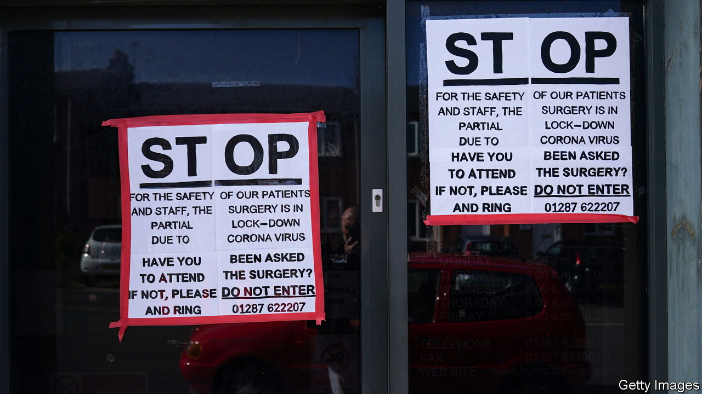

###### Medicine

# Primary care’s problems go well beyond stay-at-home doctors 

##### GPs are miserable. Patients are angry 

 

> Sep 18th 2021 

GENERAL PRACTITIONERS are miserable. “We like to see patients face to face. That’s what we trained for, that’s what we want to do, that’s what we prefer to do, and that’s how we know we are making the best decisions,” says Caroline Taylor, who runs a surgery in Halifax, Yorkshire. The situation “is emotionally very challenging for everyone. It’s very draining.”

Patients are angry. Doctors at one practice in London received text messages calling them “Nazi bastards”; a receptionist in the Tees Valley was told, “If I die, it will be your fault.” Most understand the situation when you speak to them, says Dr Taylor. “But we do have abusive patients, much more than we had them in the past.”


During the worst of the covid-19 pandemic, patients were advised to stay away from GPs’ surgeries, both to ease pressure on the health service and to avoid infection. But as the country has reopened, doctors have struggled to cope with demand, upsetting both them and patients unable to receive treatment.

The angst reflects the peculiar position occupied by GPs: closer to their patients than in most countries, but distant from the National Health Service, having resisted becoming fully salaried employees on its foundation in the late 1940s. “When a patient has to wait for two years to have their hip replaced, they don’t blame the orthopaedic surgeon,” sighs Martin Marshall, chair of the Royal College of General Practitioners, which has more than 50,000 family doctors as members.

That resistance maintained their independence, and preserved a cottage industry. Today there are almost 7,000 GP practices in England of varying quality, and with varying covid-19 protocols. According to official figures, which undercount online activity, 57% of appointments are in person—more than in January, but also 20 percentage points below pre-pandemic levels. Angry patients argue GPs are keeping themselves healthy at their expense.

In some places, this is not without foundation. According to a survey by Pulse, a trade magazine, more than a fifth of GPs were “very concerned” about their health. Local service commissioners ought to prod them to open their doors, where appropriate, says Beccy Baird of the King’s Fund, a think-tank. But the role of commissioners is being reinvented, and many are busy applying for new jobs.

Moreover, not every consultation is best done face to face. AskmyGP, an online-triage service used by around 220 surgeries, allows patients to express a preference for their appointment. Since covid-19 struck, only one in ten has selected face to face. “They don’t want to sit in a crowded waiting room,” says Steve Black, the firm’s chief analyst. Even before the pandemic, a large majority preferred the convenience of a telephone or video call.

Many surgeries lack the infrastructure to accommodate these preferences. Others turned to digital services in the pandemic, but implemented them poorly and frustrated patients (requiring, say, lengthy form-filling or trying to push everyone online regardless of preferences). “Patients don’t like that, so their uptake, their voluntary use, is low,” says Mr Black.

Beneath all this lies a mismatch between supply—online, telephone and in person—and demand. As the country emerged from lockdown in spring, demand surged. In Yorkshire, Dr Taylor reports a big increase in the sort of activity that would not be picked up in official data: chronic-disease reviews put off during the pandemic, inquiries about secondary care, questions regarding covid-19 vaccination and more difficult consultations for patients who have delayed treatment.

And surgeries are short of family doctors. In 2014 the government pledged to hire 5,000 extra GPs. Although more are entering training, the rise has not been sufficient to make up for an ageing workforce, as well as growing numbers quitting or going part-time.

In the long run, health officials hope to tweak the job itself, for example by using pharmacists to deal with questions about medication and physiotherapists to deal with back pain. But this will not provide quick relief. The health service is girding itself for winter, when demand normally jumps. This one could be particularly bad, thanks to the combined threat of covid-19 and resurgent influenza. A small bright spot for GPs is that it may make patients unable to book an appointment a little more sympathetic. ■

Dig deeper

All our stories relating to the pandemic and the vaccines can be found on our . You can also find trackers showing ,  and the virus’s spread across .

