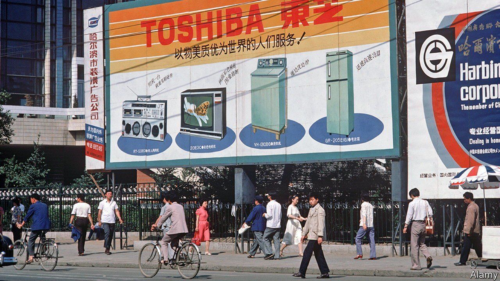

###### Asian supply chains

# Japanese companies try to reduce their reliance on Chinese manufacturing 

##### But only a bit 

 

> Sep 18th 2021 

AT THE END of the month the production line of a Toshiba factory in Dalian will come to a halt, 30 years after the Japanese electronics giant opened it in the north-eastern Chinese city. Once a totemic example of global supply chains expanding into China, the closure exemplifies how these are being reconfigured. The short answer is: delicately and at the margin.

Toshiba’s plant in Dalian has spanned a sea change in Asian business patterns. When it opened, Japan was the undisputed linchpin of the region’s trade and manufacturing networks. By 2019 Japan’s $390bn in intermediate-goods trade with big Asian economies was vying for runner-up status with South Korea and Taiwan. China, with $935bn-worth, was way ahead.


Hourly wages commanded by Chinese workers have risen tenfold in nominal terms this century, to $6.20. That is still a quarter of Japanese rates but twice the pay of Thai workers, who were at parity with Chinese ones as recently as 2008. If that were not enough, geopolitical tensions are souring relations between the increasingly heavy-handed Chinese Communist Party and the world’s rich democracies.

These trends help explain why China’s share of Japan’s new outbound foreign direct investment has steadily declined since 2012. The number of manufacturing affiliates that Japanese companies have in China stopped growing almost a decade ago, while new affiliates elsewhere in Asia—notably India, Indonesia, Thailand and Vietnam—have continued to mushroom. Toshiba will offset some of the forgone capacity with expansion in some of its 50 factories back home and also in Vietnam, one of its 30 overseas facilities. It is tapping the Japanese government’s year-old subsidy scheme to encourage reshoring and diversification of supply chains (and whose unspoken aim is to reduce reliance on China).

Many other Japanese firms find themselves in a similar situation. This month OKI Electric Industry, a smaller Japanese electronics-maker, announced that its factory in Shenzhen, set up 20 years ago, would stop making printers. That capacity would move to existing factories in Thailand and Japan. Still, most are not rushing to exit China altogether. A survey last year for the Japan External Trade Organisation, a government body, found that 8% of Japanese companies said they were planning to reduce or eliminate their Chinese presence, less than the average for Japanese firms in other countries. Many global companies, from Hasbro (an American toymaker) to Samsung (a South Korean technology giant) are making a similar calculation. Toshiba itself will maintain a second, part-owned factory in Dalian.

Even the most tub-thumpingly patriotic executive would  with the world’s second-biggest economy. This would disrupt profitable relationships with Chinese suppliers and manufacturing know-how. Such things take years to forge. But at the margin, where companies find themselves pressed by the imperatives to cut costs and guarantee stable future supplies, China no longer looks like the place to be. ■

For more expert analysis of the biggest stories in economics, business and markets, , our weekly newsletter.

