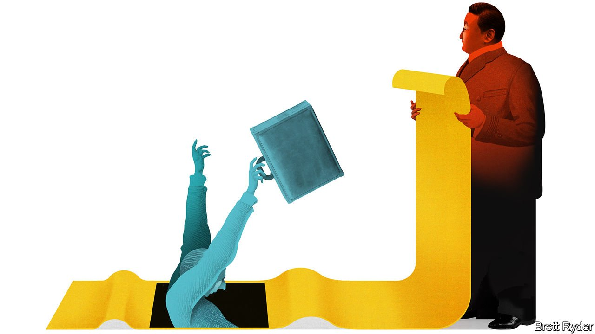

###### Schumpeter

# The vanishing allure of doing business in China 

##### Who will be next? 

 

> Sep 18th 2021 

IT IS NOTHING new for foreign firms to endure shakedowns by the Chinese Communist Party. As far back as revolutionary times, Chairman Mao’s victorious troops did not directly confiscate foreign-owned assets as their Bolshevik forerunners had done in Russia. Instead, they wore them down with higher taxes and fines so big that eventually companies gave away their assets for nothing. In one memorable case dug up by Aron Shai, an Israeli academic, a British industrialist in 1954 professed to be handing over everything to the Communists from “large blocks of godowns (warehouses) down to pencils and paper”. And yet, he complained, Comrade Ho, his opposite number, continued to haggle “like a pre-liberation shopkeeper”.

Though multinationals have flocked back to China since, the government’s nit-picking has continued, encompassing everything from technology transfer to how freely firms can invest. There have been big improvements, but the pettifoggery is a constant reminder, as one American puts it, that companies should not get “too big for their britches”. Western firms operate in China on sufferance and one day the country may seek to replace them.


As a result, some may have felt a sense of Schadenfreude that Chinese firms, not Western ones, have been the main victims of President Xi Jinping’s recent effort to socially engineer a new type of economy. In the past week alone the government has taken steps to reduce barriers between tech giants Alibaba and Tencent, and, according to the Financial Times, ordered the break-up of Alipay, a financial super-app owned by Alibaba’s sister company, Ant. Some go so far as to draw flattering comparisons between Mr Xi’s efforts to emasculate China’s tech “oligarchs” and the way governments in America and Europe are going after Western tech giants.

The heavy-handedness, though, is chilling to an unusual degree. So is the capriciousness. Kenneth Jarrett, a veteran China watcher in Shanghai for the Albright Stonebridge Group, a consultancy, says the question on everyone’s lips is “who might be next?” The crackdowns occur against the backdrop of rising tensions between China and the West that leave multinationals stranded in a sort of semilegal limbo. For many the lure of China remains irresistible. But the perils are catching up with the promise.

Besides banks and asset managers, some of whose investments in China have taken a big hit in recent months, several types of multinational firm are at risk. One group includes those that make most of their money in China from pandering to a gilded elite who flaunt their $3,000 handbags and sports cars. Another encompasses companies that irritate their customers for what can be construed as Western arrogance; Tesla, the electric carmaker, is an example. A third category includes European and American makers of advanced manufacturing equipment and medical devices that China feels it should be producing itself.

As usual, the threats come in the form of policy announcements that sound deceptively bland. One, “common prosperity”, is a catch-all phrase extending from a reduction in social inequality to more coddling of workers and customers to the nannying of overstressed youngsters. Its most obvious impact is on Chinese tech, tutoring and gaming firms, which have lost hundreds of billions of dollars in market value as a result of government crackdowns. Yet multinationals, too, have been caught in the fallout. In a few days in August the valuation of European luxury brands, such as Kering, purveyor of Gucci handbags, and LVMH, seller of baubles and bubbles, tumbled by $75bn after investors finally took Mr Xi’s common-prosperity agenda seriously.

Mr Xi does not intend to force Chinese consumers back into Mao suits. But his war on flamboyance, especially among the rich who may spend at least $100,000 each a year on foreign brands, threatens the most lucrative end of the market. It also imperils luxury marques that charge consumers in China more than they do in their outlets in, say, Milan. Flavio Cereda of Jefferies, an investment bank, expects the government to keep supporting a growing middle-class luxury market, since aspirational purchases reflect economic success. If China were to mess up the experiment, the shock could be huge. Its consumers account for 45% of the world’s spending on luxury, he says. “No China, no party.”

“Dual circulation” is another buzz phrase with troubling overtones. It is an attempt to promote self reliance in natural resources and technology, partly in response to fears that a dependence on Western suppliers could make China vulnerable to geopolitical and trade pressures. But it also poses a threat to Western multinationals in China by reducing imports of technology and creating a “buy Chinese” mentality. Friedolin Strack of BDI, a German industrial federation, notes that state firms in China have reportedly been given procurement guidelines that mandate domestic supply of devices such as X-ray machines and radar equipment.

Between a bloc and a hard place

It is all becoming a catch-22. On the one hand, America, Europe and allies are in a geopolitical contest with China, which they accuse of human-rights abuses in places like Xinjiang, home to the oppressed Uyghur minority. The West wants to restrict what technologies its firms sell to China and what materials, such as cotton, they source there. On the other hand, China asserts its right to retaliate against companies it thinks are wading into geopolitics.

Jörg Wuttke, president of the EU Chamber of Commerce in China, says the size of China’s market makes it worth the discomfort. “The biggest risk is not to be in China,” he insists. Yet anyone with a long-term perspective might see Mr Xi’s undisputed personal authority, his gamble to reshape the Chinese economy, and the dark geopolitical backdrop as more than enough reasons to ponder an exit. It may never come to that. But as in post-revolutionary days, sometimes all it takes is one too many shakedowns to convince even the hardiest industrialist to throw in the towel. ■

