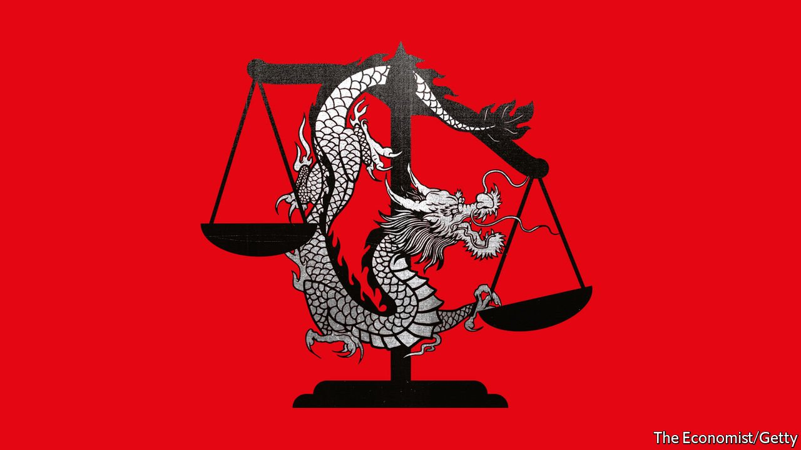

###### Courting influence

# China is becoming more assertive in international legal disputes 

##### Party leaders are using such cases to reshape legal and regulatory norms 

 

> Sep 18th 2021 

IN EARLY JANUARY the Communist Party published a five-year plan for the development of “socialist rule of law with Chinese characteristics”. Most of the document is domestically focused, but one section is devoted to foreign matters. It calls on China to help shape international law, to turn itself into the first choice of jurisdiction when resolving cross-border disputes and to encourage the use of Chinese law abroad.

The party’s goal, the plan says, is to promote “fair and reasonable” international rules. But in the past year it has become increasingly clear that the party means to take a legal fight to the world. President Xi Jinping wants China’s legal apparatus to grow bolder when dealing with international matters, and to reshape international legal and regulatory norms. In areas such as patents, maritime rights, cyber-security, sanctions and extradition battles, the Communist Party is using its legal system to safeguard and advance China’s interests in ways it has not previously done.


The most visible part of this push has been the party’s aggressive response to Western sanctions imposed for the repression of ethnic Uyghurs, a Muslim minority. China imposed retaliatory sanctions on Western officials and academics. It then authorised the seizure of assets and blocking of transactions made by firms complying with foreign sanctions. (In August the legislature delayed a vote on extending the same provision from mainland China to Hong Kong.)

China is also advancing its conception of the rule of law—one that exists under the unquestioned leadership of the party—beyond its borders in other areas, such as intellectual property. At a Politburo meeting last November Mr Xi called for greater assertiveness in cross-border disputes, saying China should “promote the extraterritorial application” of its intellectual-property laws. Mr Xi was in effect “weaponising the judiciary” to defend China’s interests abroad, says Mark Cohen, a scholar of Chinese intellectual-property law at the University of California, Berkeley.

In the past year Chinese courts have issued sweeping orders on behalf of Chinese smartphone-makers that seek to prevent lawsuits against them in other countries over the use of foreign companies’ intellectual property. The Chinese courts have ordered these “anti-suit injunctions” so that they (rather than foreign courts) can decide how much Chinese firms should pay in royalties to the holders of patents that their products use. Jorge Contreras at the University of Utah says this marks an unusual escalation in the use of judicial power globally.

The assertion by China’s courts of a right to set global rates in patent disputes is not unprecedented; a British court did something similar in 2017. But China’s courts have become much more activist than others in claiming this authority. The stakes are high. Chinese courts typically grant a fraction of what might be ordered by a Western court. And China typically has leverage over the foreign parties in these cases. Those that manufacture goods in China or sell to the Chinese market must heed such rulings or face big penalties.

In the past year Huawei, Oppo and Xiaomi have all won anti-suit injunctions against foreign patent-holders. Out-of-court agreements on royalty rates are typical in such cases. Experts say the Chinese injunctions helped Huawei and Xiaomi win better settlements, and may do the same for Oppo.

Another focus for the courts has been the Belt and Road Initiative (BRI), Mr Xi’s sprawling effort to finance and build physical and digital infrastructure all around the world. It has spawned numerous disputes between foreign entities and Chinese contractors and banks. China has set up a special international commercial court to resolve some disputes. In 2019 the Supreme People’s Court called for the strengthening of Chinese courts’ capacity to hear international commercial cases and for the improvement of arbitration, the better to settle such matters in China.

Foreign experts say such cases would normally be handled in the country where the work was done. “It would be unbelievable for any foreign company that’s doing business in their country, not in China, to accept dispute resolution in China unless they’re politically coerced or economically coerced into doing it,” says Jerome Cohen of New York University.

The party would argue that it has merely begun to take a more active role in shaping international law. China entered international treaties and bodies, such as the UN and the World Trade Organisation (WTO), under rules it had no hand in writing, after years during which the Communist Party was either hostile to such institutions or followed the advice of Deng Xiaoping, a former leader, to keep a low profile in international affairs. Mr Xi has shed that caution.

Foreign companies have begun to note the willingness of the Chinese courts to claim more authority in matters beyond their borders. At least one, Samsung Electronics of South Korea, has tried to benefit from it. In December a court in Wuhan granted an injunction to Samsung, forbidding Ericsson, a Swedish telecoms firm, from going to any other court in the world to resolve a global dispute over the use of Ericsson’s patents in Samsung’s hardware. A judge in Texas, at Ericsson’s request, tried to rebuff the Chinese ruling with an “anti-interference order”, which some have called an “anti-anti-suit injunction”. The Texas judge ruled that Ericsson deserved a hearing in America on a royalty rate for use of its patents in the American market. But the Wuhan court had pre-emptively included an “anti-anti-anti-suit injunction” in its original ruling. Samsung and Ericsson agreed on a global settlement in May, the Wuhan court having strengthened Samsung’s negotiating position.

Judges, officials and business people have bristled at the new aggressiveness of China’s courts. In July the European Union filed a request with the WTO that China be more transparent about such cases. Its rulings are often not made public, yet Chinese judicial authorities have tended to view these cases as important guideposts for future rulings. The office of the US Trade Representative has also registered concern about China’s use of anti-suit injunctions.

Mr Xi might argue that the playing field has for too long been skewed against China. Mr Contreras says Chinese officials now see judicial assertiveness as an important new tool that can help tilt things in their direction. ■

