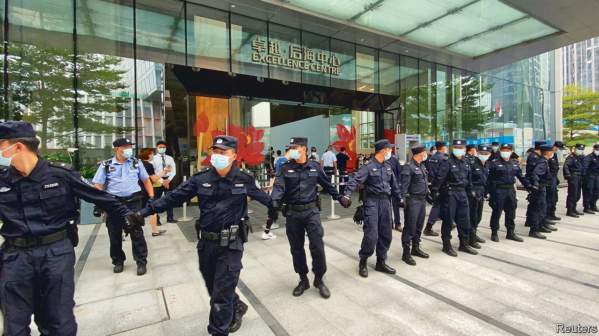

###### Rising damp

# Protesters in China besiege an indebted property developer 

##### Angry investors have flocked to several of Evergrande’s offices 

 

> Sep 18th 2021 

PROTESTS BY ANGRY investors are common in China. Average folk who have been deceived by online lenders or other scam artists have few outlets for redress. They occupy office lobbies until a senior executive appears to calm their nerves. It is rare, however, for demonstrators to target well-known companies, and rarer still for connected protests to crop up all across the country. Events such as these have made Evergrande, a massive property developer on the brink of default, something of a spectacle in recent days.

The company has debts of around $300bn, the most of any property group in the world. On September 13th its headquarters in the southern city of Shenzhen (pictured) were besieged by investors who were demanding that their money be returned. Similar scenes were witnessed at Evergrande offices in several other cities. In one video circulating online a woman yells into a loudspeaker, demanding answers from Evergrande staff. In another, an executive attempts to field questions in a cramped hallway, only to be shouted down by protesters.


Since 2020 the Chinese government has sought to limit property developers’ borrowing. Rule changes that are part of a wider campaign against indebtedness have nudged several real-estate groups into default, or to the cusp of it. That is where Evergrande, once thought too big to fail, now finds itself. The company has hired advisers to help it resolve its financial difficulties and warned on September 14th that it could default. Many analysts who follow the group say that such an outcome, followed by a restructuring, is beginning to look unavoidable.

Many of the people who have been protesting have put cash into financial products managed by Evergrande. Others are suppliers and contractors owed payment for their work on projects that have stalled all across China. In recent weeks the company has tried to sell off some of its unfinished housing developments in order to pay down its debts. Some videos also purport to show frustrated employees berating their bosses (Evergrande has well over 100,000 staff).

The single largest group of people fearing harm are homebuyers who have already paid for their flats. China’s property market has long relied on people coughing up before their homes are completed, in order to generate working capital for developers. Of Evergrande’s roughly $300bn in liabilities, about 1.3trn yuan ($200bn) is cash that customers have put down for homes that have yet to be finished, estimates Capital Economics, a research firm. That is equivalent to the value of 1.4m individual properties.

Chinese authorities are adept at managing small protests, which they often refer to as “mass incidents”. When China’s 1trn-yuan peer-to-peer lending boom came to an end in 2018, tens of thousands of ordinary people turned up on the doorsteps of companies that had swallowed their savings instead of providing the promised returns. These incidents were diffuse. It was rare for more than 100 people to protest at any given site. But the problem became so acute in Hangzhou, a hub for online-lending firms, that the local government was eventually forced to convert two stadiums into venues that could receive complaints from aggrieved investors.

Xi Jinping, China’s president, has vowed to narrow the yawning chasm that divides China’s haves from its have-nots. High house prices are a particular focus. It is not yet clear whether this campaign will send prices lower. But it could very well bring to an end two decades of unbridled increases. House-price growth in China’s four largest cities eased slightly in August, compared with the month before.

Footage of indignant investors, suppliers and employees, which has been shared widely on local social media, underscores the risks that Mr Xi runs as he orders state regulators to curb speculation in housing and clamp down on market excesses in the name of greater income equality or, as he calls it, “common prosperity”. Then again, Mr Xi and his team may draw another moral from those angry smartphone videos: that too little state control is the greatest risk of all. ■

