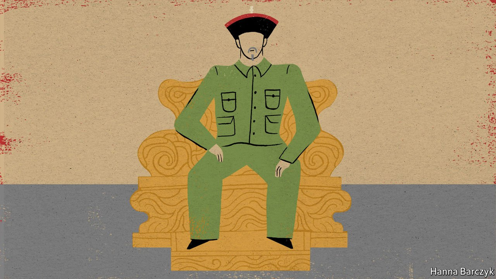

###### Chaguan

# The Chinese Communist Party’s model emperor 

##### A Qing dynasty ruler is praised for pacifying China’s borderlands 

 

> Sep 18th 2021 

WHAT WITH his dozens of concubines, his obsession with collecting precious jade and his penchant for inscribing his own (not very good) poems onto ancient paintings, the Qianlong emperor makes an unlikely hero for the Communist Party of China, especially one led by Xi Jinping, a stern ascetic. Qianlong was a man of formidable intellect and will, whose long reign from 1736-95 marked a high point of the Qing dynasty. But he was also a conservative aristocrat, from his passion for genealogy to his love of bowhunting on horseback, an archaic pastime even then.

Chaguan was surprised, then, to hear an official historian praise Qianlong in terms that would make a Politburo member blush. The scholar, Wang Xudong, heads the Palace Museum in Beijing, as the Forbidden City is formally known. During a government-organised press tour, Mr Wang described past emperors as hard-working statesmen who “wanted their empire to be stable and prosperous”. Unbidden, Mr Wang denied that the geomantic design of the Forbidden City, with a hill behind it and a river in front, is a form of superstition. Feng shui is a commonsense tradition, he argued: everyone wants shelter from the wind and sustaining water nearby. As for palace temples devoted to ancestor worship, “China is a country devoted to families,” he soothed, as if duty-bound to play down any contradiction between imperial wonders and modern-day rule by an atheist party. Your columnist asked about two wildly popular drama series set in Qianlong’s court, which were booted from state television channels in 2019 after official media grumbled about the “negative impact” of imperial sagas filled with poisonings, betrayals and extravagant living. Such so-called Qing dramas are “cultural pollution”, sniffed Mr Wang. Why can’t they show examples of good governance by the emperor, or that princes and princesses were diligent and studious, he asked? “Those are lessons that our children can learn.”


Tributes to favoured emperors are not new. As the party replaced Maoist fervour with Chinese nationalism in the 1980s and 1990s, Qianlong was rehabilitated as a nation-builder. Through a mix of diplomacy, wars and campaigns to crush far-flung rebellions, Qianlong added vast territories to his empire, notably in Tibet and Xinjiang. His reign was declared a heyday of the Qing dynasty before—as textbooks put it—the empire declined into decadence, subjected China to a century of humiliations at the hands of foreign powers, and collapsed in 1912. Recalling past shames remains useful for official historians, who praise the party for making China strong at last. But accounts of late-Qing weakness are increasingly offset by tributes to earlier glories. Today’s party sees value in presenting itself as heir to a uniquely wise—and distinctively Chinese—civilisation that can be traced back 5,000 years. For Mr Wang, an official of vice-ministerial rank, the Forbidden City is proof, in timber and stone, of that cultural exceptionalism. “If you did not have 5,000 years of civilisation, you would not have socialism with Chinese characteristics,” he declared, calling the party “a loyal inheritor and protector” of that glorious past.

On August 24th Mr Xi, the party’s supreme leader, visited a site dear to Qianlong, an imperial summer retreat at Chengde, in cool, wooded hills north of Beijing. Mr Xi toured Puning Temple, a Buddhist complex built in a mix of Tibetan and Han Chinese styles. That architecture celebrates Qianlong’s crushing of a revolt by Mongol nomads who practised Tibetan Buddhism. Inspecting Puning’s red-pillared halls, Mr Xi stressed one of his priorities, the need to “sinicise” religions, meaning to make them Chinese in orientation so that, in his words, they better conform to and serve the needs of a socialist society. Then Mr Xi explored a new exhibition at the Chengde Museum that praises Qianlong in language that could come straight from the People’s Daily. Museum signs explain that Qianlong “improved the Qing central government’s management of Tibet, quelled multiple bouts of conflict by separatists in Xinjiang, and further unified this multi-ethnic country”.

Chaguan visited the museum a few days later. It presents Qianlong as the epitome of a virtuous, Chinese ruler, whether that meant honouring ancestral rites by holding autumn hunts, or introducing policies to “unify all ethnicities”. There are reproductions of his Mandarin-language calligraphy and images of him in Chinese imperial robes. In fact Qianlong was a member of the Manchu nationality, like all Qing emperors. The Qing won the throne by toppling a Chinese dynasty, the Ming. Qianlong intended his hunt to preserve the traditions of his martial, nomadic ancestors, calling it “the best way to train Manchus”. It was open to Manchu nobles and soldiers, and some Mongol allies. Like many sacred Qing institutions, the hunt was essentially closed to the Han, the majority Chinese nationality. Han Chinese lived as subjects in a Manchu-led empire, barred by law from marrying Manchus and often living in separate city districts.

Rebranding the multi-ethnic Manchu empire as “China”

Such ethnic divisions and hierarchies complicate boasts about 5,000 years of continuous Chinese civilisation. Official historians respond by claiming that the Qing so admired Han culture that they instantly assimilated into it, becoming the latest in an unbroken line of Chinese rulers. Manchu-language imperial archives make clear that is too neat: the Qing retained a hybrid identity.

The exhibit in Chengde is a puzzle. Important enough to draw Mr Xi, it rests on easily debunked history. The solution lies in another wall sign, which praises Chengde as a monument to the Qing dynasty’s “historic feats” of “pacification and consolidation of the border regions”. Two intensely political ideas lurk in that scholarly statement. First, the term “consolidation” reflects the party’s claim that Tibet and Xinjiang have always been Chinese and so were reclaimed, not conquered, by the Qing. Second, to the security-obsessed hard men who run China, pacifying restive regions is a supremely patriotic act. That makes Qianlong a model worker. ■

