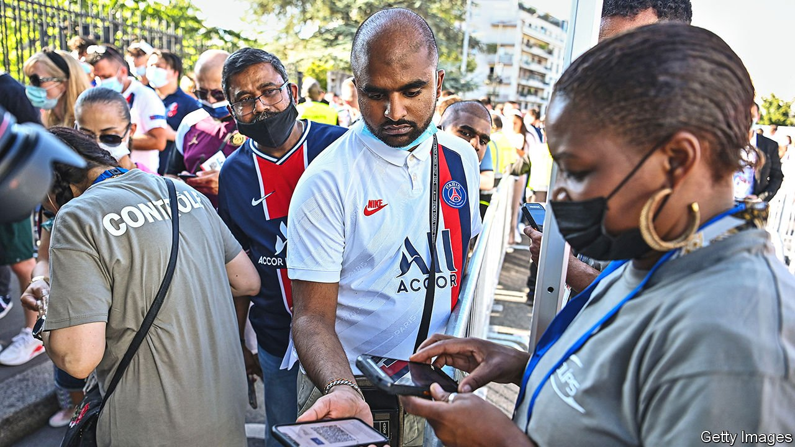

###### French covid-19 passports

# How France tackled vaccine hesitancy 

##### Covid-19 passports have proved efficient, and surprisingly popular 

 

> Sep 18th 2021 

ACROSS EUROPE this summer, vaccine take-up began to slow after the willing got their covid-19 shots. Persuading the hesitant was always going to be harder. Few places looked more challenging than France. In December 2020 61% of the French said they would not get jabbed—twice the share in America. Yet what happened this summer has become a case study in how to nudge a reluctant population.

On July 12th, to general surprise, President Emmanuel Macron announced the introduction of a covid-19 passport. Only those who were fully vaccinated, or had a negative test result, would be allowed into cinemas, sports stadiums, restaurants, bars, shopping centres and nightclubs, or on long-distance trains and flights. Employees in such places would also need the pass sanitaire—a QR code, in either digital or paper form—or face suspension. Vaccination would be compulsory for health-care workers. Mr Macron was taking a big gamble. He risked further dividing the country, and provoking the sort of national rebellion for which the French are famed.


The outcry was indeed instant. Politicians of all stripes denounced the measure as discriminatory. Marine Le Pen, who has remodelled herself as a champion of liberty (though she is not an anti-vaxxer), called it a “serious violation of individual freedom”, and voted against in parliament. A Green politician likened the covid-19 pass to apartheid. In the National Assembly, a heated debate on the measure lasted until dawn. On successive Saturdays throughout the summer, up to 240,000 demonstrators took to the streets, accusing Mr Macron of running a dictatorship, and worse.

Yet despite this rumpus the majority of the French masterfully demonstrated that it is usually a mistake to believe what they say in polls. In the hours following Mr Macron’s announcement, over 1m people booked vaccination appointments. In the four weeks that followed, when the French are usually lying on the beach, nearly 10m extra people got a first jab. Even the controversy proved short-lived. By the end of August 77% of the French told a poll they approved of the pass for travel, and 64% did for access to restaurants and bars. Only 34% supported the anti-pass demos.

Mr Macron’s bet was only partly about the intrinsic value of a covid-19 pass. Indeed anecdotal evidence suggests that checks on implementation have been light, rather than punitive. Nor is it a full vaccine mandate: tests remain an alternative to a jab, although from October 15th these will no longer be free. The hope rather was that the pass would provide un nudge to accelerate vaccination take-up, in order to ease pressure on hospitals as the Delta variant spread. In this sense, it has been spectacularly successful. By September 15th 74% of the population (and 88% of the over 12s) had received at least one dose, up from 54% on the day of Mr Macron’s announcement. This figure is now higher than in America, Britain and Germany.

France is not the only European country to use a covid-19 pass both as a public-health measure and a boost to vaccine rollout. Denmark introduced a compulsory coronapas in April, for access to such places as restaurants, sports centres and hairdressers. Italy, like Greece, has made vaccination compulsory for health workers. It is now extending the list of jobs which require a “green pass” from teachers to other school workers and nursing-home staff.

So far Germany has been an outlier. Vaccination take-up there has stalled at a lower level than in other countries, whereas daily deaths are on the rise. Yet the authorities are reluctant to impose unpopular vaccine mandates in the heat of a federal election campaign. Two leading candidates for the chancellorship, Armin Laschet and Olaf Scholz, publicly oppose them, even for health-care workers.

If acute cases continue to rise once the election is over, however, Germany may find it has to think again. France shows what covid passports can do for jabs. Denmark also demonstrates that they need not last for ever. With 86% of over-12s now fully vaccinated, and the daily caseload manageable, the Danes decided on September 10th to suspend the requirement to show a coronapas altogether. ■

Dig deeper

All our stories relating to the pandemic and the vaccines can be found on our . You can also find trackers showing ,  and the virus’s spread across .

