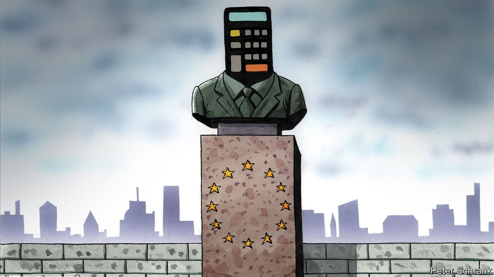

###### Charlemagne

# The Dull Man theory of history 

##### A row about fiscal policy has far more than just numbers at stake 

 

> Sep 18th 2021 

EVEN THE hardiest of EU veterans find the gatherings of its finance ministers tough-going. “Soul-crushing” is the verdict of one regular attendee. The EU’s bean-counters are not given their roles for their personalities. When EU leaders meet, there is a sense of history being made; when finance ministers gather, there is a sense of life ebbing away.

Yet it is the dull men and women of Europe’s finance ministries who hold the continent’s fate in their hands. A debate on reforms to the Stability and Growth Pact, which regulates government finances in the bloc, will set the path of the club for decades. It will reveal where power in the EU truly lies, how it will cope with the climate crisis and even whether the EU can retain any global clout. “The history of the world is but the biography of great men,” wrote Thomas Carlyle, a 19th-century historian. The future of the EU will be the biography of dull ones. Call it the Dull Man theory.


The crux of the debate is simple. As it stands, EU countries should have government debt no greater than 60% of GDP and a budget deficit no larger than 3% of it. If breached, a government must come up with a plan to return to fiscal sobriety. When the principles were first outlined in the 1990s, this seemed a worthy goal. In 2021 it is a bizarre joke. The average debt to GDP in the euro area is about 100%. In Italy it is 160%. Even Germany busts through the limit with 70%. Europe’s fiscal corset has no strings.

There are a few ways of changing it. The first involves altering the EU’s treaties and entering targets more appropriate for economies battered by a financial crisis, a euro-zone crisis and a pandemic in just over a decade. The second would keep 60% and 3% as the ultimate destination, but change the speed at which countries must hit their targets. The third option is a wily sleight of hand. The European Commission, the referee when it comes to spending, could be allowed to alter its interpretation of the rules. A final option is not to change it all, but allow rule-busting spending in certain areas, such as environmental policy.

Just as history’s Great Men once did battle, the EU’s Dull Men are set for a long bureaucratic trench war. Who comes out on top in the coming year will say a great deal about the union. An alliance of countries is opposed to loosening the rules too much. A group of eight of these frugal types, including the Netherlands and Austria, along with a mishmash of Scandinavians, Latvians and Czechs, have signed a letter demanding that strict rules are retained. These countries, spread across the continent’s north and east, pride themselves on healthy finances.

Their debts are small but so are they. Combined, the eight have a population only the same as France. Yet the EU has historically boosted the power of Europe’s tiddlers. When it comes to changing the EU’s treaty, a single country can veto it. Even if the vote is settled by a qualified majority, as the more technical tweaks would be, a charge of the Lilliputians can still hamper progress.

On the other side of the debate, the biggest Brobdingnagians are slowly starting to assert their will. A recovery fund of €750bn ($890bn), including €390bn in grants—in effect, cash transfers from rich EU countries to poorer ones—was seen as a victory for Europe’s south. A gang of countries led by France, Italy and Spain pushed hardest for it. (Germany permitted it, rather than supported it.) It was, however, the first time for ages that southern Europe had its way, fiscally at least. If they manage the same trick with the spending rules, it will suggest a more permanent shift.

Dull Man theory has a bias towards compromise. Officials and wonks have a solution: rather than alter the rules, bypass them. A “green fiscal pact” would let governments spend freely on environmental measures, argues Bruegel, a think-tank in Brussels. It would provide wiggle-room for the likes of Olaf Scholz, perhaps Germany’s next chancellor, who has ruled out rewriting the rules.

Such deals are how the EU functions, via compromises where everyone can claim victory. The hawks can say the rules have not changed; the doves can go and spend the money anyway. Neither would this mark a wild shift of competence for the commission. It has already taken on a role as a fiscal Greta Thunberg, giving a yay or nay to government spending plans in the €750bn recovery fund based in part on whether they are green enough.

The grey men go green

A carve-out for greenery would enjoy wider support than previous attempts to get around the rules. France often argued, to no avail, that since its military adventures were for the benefit of all Europe, such spending should be exempt. Not all EU countries send soldiers to the Sahel, but all face big bills if they are to slash emissions to 55% of levels in 1990, as promised. A deal on green spending can surely be done without anyone getting too excited.

But a trickier debate will emerge as climate science and economics collide. If the costs of the green transformation are limited, then any fiscal leeway should be small. If they are large, then a more fundamental shift in EU fiscal policy is needed. A paper by Bruegel suggested annual government spending of an extra 0.5% to 1% of GDP would be necessary; others suggest much more will be needed. The planet’s future rests in part on a fight over a few percentage points on a spreadsheet.

It it this dull battle that will determine the EU’s role in the world. EU leaders may fret about the club’s global influence, focusing on sexier topics such as the Indo-Pacific and the bloc’s future military capability. But the debate about spending will be more consequential. Whatever power the EU wields is, ultimately, because of its economic weight. Italy, its third-largest economy, has struggled to grow for two decades, partly because of a fiscal straitjacket. Fixing the EU’s internal economic problems—whether via green spending or diplomatic struggle—will do more for the EU’s global power than its geopolitical schemes. In the EU, dullness is destiny— and it is the Dull Men who shape it. ■

