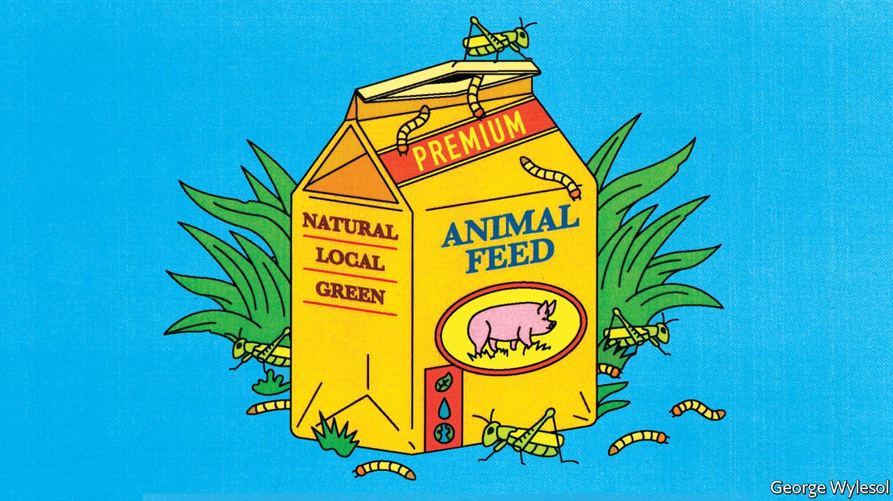

###### A bug’s life

# The EU lets farm animals and people eat insects 

##### But they are pricey 

 

> Sep 18th 2021 

FIRST IT WAS pets, then fish. Now it’s poultry and pigs. The list of animals allowed to feed on insects is growing. A new EU law authorising the use of insect protein in poultry and pig feed came into force earlier this month, a significant milestone for an industry keen to worm its way into the animal-feed business.

Since a ban on processed animal protein was imposed in 2001 in the wake of the “mad cow” crisis, soy and fishmeal have become the bedrock of animal feed in Europe. But their production needs lots of space and can be harmful to the environment, so feed manufacturers are looking for alternatives.


Insects are just the ticket. They are reared in vertical farms that require little land or water, and they can be fed on agricultural by-products or food waste such as rotting fruit and vegetables. They’re also a natural fit. Most wild fish, birds and pigs eat insects.

The one thing going against them is price: insect protein is two to three times more expensive than fishmeal, and many times pricier than soy. Scaling up production may help reduce the disparity. Rabobank, a Dutch lender, predicts that global insect production will reach 500,000 tonnes a year by 2030, up from just 10,000 tonnes currently, and that prices will tumble.

Insect companies have worked hard on their pitch. Research suggests insects may be more than mere feed, boosting growth rates and immune systems as well as filling stomachs. They also offer the prospect of a green, local protein.

Poultry and pig feed are by far the largest animal-feed markets, but they’re more competitive than food for pets or fish. For that reason, says Antoine Hubert, CEO of Ÿnsect, a mealworm (beetle larvae) firm, insect protein will probably be used only in premium meat at first.

This year the European Food Safety Agency has ruled that three species of insects (yellow mealworm, locusts and house crickets) are safe for humans to eat as well. Oddly, people seem less keen on the idea than chickens and pigs.

