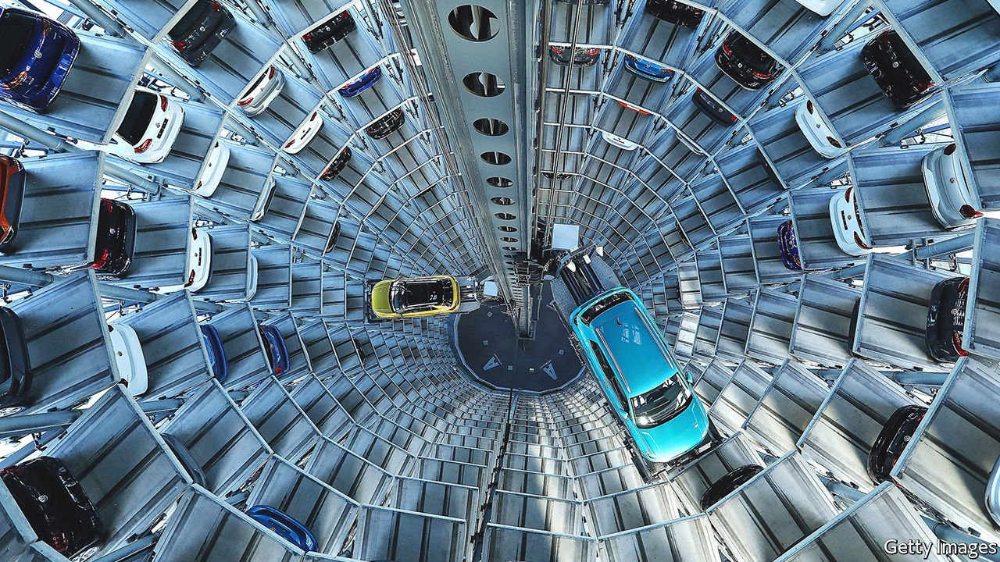
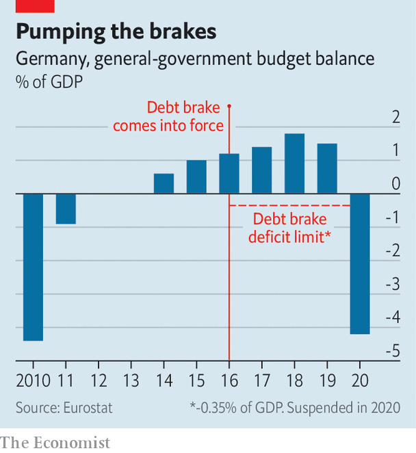

###### Spinning the wheels

# The warring parties’ plans for Germany’s economy are full of holes 

##### The post-election coalition talks are likely to be extremely arduous 

 

> Sep 18th 2021 

“I HOPE YOU never have to see it like this again,” says Markus Quint, communications chief for Frankfurt’s Messe (exhibition centre), as he surveys 440,000 square metres of empty halls from a 22nd-floor terrace. When the pandemic struck last spring the Messe, which had welcomed nearly 2.5m visitors in 2019, had to shut for all business bar the digital sort. Worldwide revenues (the Messe has 29 subsidiaries) plunged from €736m ($870m) to €257m. Most of the 1,000-odd Frankfurt staff went on Kurzarbeitergeld, Germany’s much-imitated furlough scheme.

As Germans prepare to go to the polls on September 26th, recovery is glinting. Mr Quint says he could have “cried with joy” in July when the Messe reopened for its first physical exhibition, a trade fair for bike-part manufacturers. Bigger shows are in the works, including a return of the famous Frankfurt Book Fair next month.


Yet the threat from covid-19 has not evaporated. In the Messe’s case, border restrictions and quarantine rules make it near-impossible for what was once a large contingent of Asian and American visitors to attend the shows. Other businesses fear the return of some contact restrictions amid a fourth wave of infections and Germany’s worryingly low vaccination rate.

Hiccups in supply chains present a more serious drag on Germany’s recovery, says Clemens Fuest of the Ifo Institute in Munich. The global semiconductor shortage is crippling Germany’s mighty carmakers. Fully 70% of all German manufacturers say they are running low on everything from aluminium to paper. Highly globalised Germany—its total trade was equivalent to 88% of GDP in 2019—is particularly exposed. Having previously forecast that the economy would reach its pre-crisis level at the end of 2021, Ifo has grown more pessimistic.

No wonder German firms are watching the election campaign with keen interest—and in some cases grave concern. Jürgen Vormann, CEO of Infraserv Höchst, a chemicals-service provider based in Frankfurt, says he fears that the next government will be zealous about climate change and so wrap business in red tape. Germany’s electricity prices, Europe’s highest, are a huge burden on industry. Some of Germany’s influential family businesses fear tax raids. “You need not be a pessimist to anticipate that we’re going in the wrong direction,” says Mr Vormann.

In consensus-oriented Germany, none of the likely coalition configurations will bring economic rupture. But differences between the party platforms will make for tricky post-election negotiations, especially as polls suggest that only ideologically muddled three-way coalitions will be viable. The pro-business Free Democrats (FDP) and the conservative Christian Democratic bloc (CDU/CSU), for example, vow not to increase the tax burden, whereas the Social Democrats (SPD) and the Greens want a wealth tax and higher income taxes on the rich. All parties agree on the need to speed up climate protection, but differ strongly on the balance between market mechanisms and regulation.

 


This problem will interact with a more familiar one: the parties’ sums do not add up. The German Economic Institute (IW) reckons that by 2025 growing demands on the state-pension system, extra defence spending and a few other fresh expenses could reach a cumulative €263bn. But of the main parties, only the Greens have made pledges that they say will be revenue-neutral. The FDP’s tax cuts could add €75bn, roughly 2% of GDP, to the deficit. No party’s manifesto will survive coalition talks. But Germany’s constitutional brake on public debt, which took effect in 2016, limits annual deficits to 0.35% of GDP. All main parties bar the Greens say they wish to abide by it, yet growth alone will not generate enough cash to do so.

Parties always make dodgy claims on taxation and spending, says Thomas Obst of the IW. He is more alarmed by their failure to confront Germany’s demographic challenges. As the baby-boomers retire en masse throughout the 2020s, subsidies to the pension system, which already gobbles up 30% of the federal budget, will rocket in the absence of reform. At a televised debate on September 12th only Armin Laschet, the CDU/CSU candidate, acknowledged the urgency of the problem. Olaf Scholz, the SPD frontrunner, brushed it aside, placing his faith in expanding the labour force.

Another test will be to meet the investment demands presented by Germany’s climate targets, including extending power grids and insulating buildings. The private sector can take up much of the slack; revamping Germany’s planning rules and municipal working practices will help. But some estimates put the demand on the federal budget at close to €50bn a year.

If that also seems incompatible with the constraints of the debt brake, there may be room for a political fix. True, the tweak to the brake sought by the Greens is a non-starter, as it needs a two-thirds majority in each of the two parliamentary chambers. And months before the European Commission is due to begin a review of the EU’s , the CDU/CSU fears that assenting to German profligacy now could encourager les autres (see Charlemagne).

But most parties would probably stomach what Mr Obst calls the “second-best solution” of establishing off-budget investment funds that could circumvent the debt brake. And there are signs of a subtle shift. Some CDU/CSU figures have upset colleagues by questioning the rigidity of the debt brake in an era of cheap money and pressing investment needs. And while the FDP remains committed to it, Christian Lindner, the party’s leader, has lately emphasised that he is not ideologically wedded to a balanced budget—a move interpreted as an overture to the SPD, currently leading the polls, and the Greens. The trio could assemble a left-leaning “traffic-light” coalition—the most plausible outcome if current polling is borne out on election day.

That illustrates a broader shift in Germany’s economic debate. “Everyone knows that we have to transform Germany…and for digitalisation and decarbonisation, it’s all about investment,” says Otto Fricke, an FDP budget expert. The divisions between parties on budgetary planning, monetary policy and European spending seem less rigid than in the past. The public debate is more tolerant of what used to be outlandish views. As ever, the theatrics of the campaign before the election will not preclude the compromises that will, eventually, be made after it. ■

For more coverage of the German elections, visit our dedicated 

