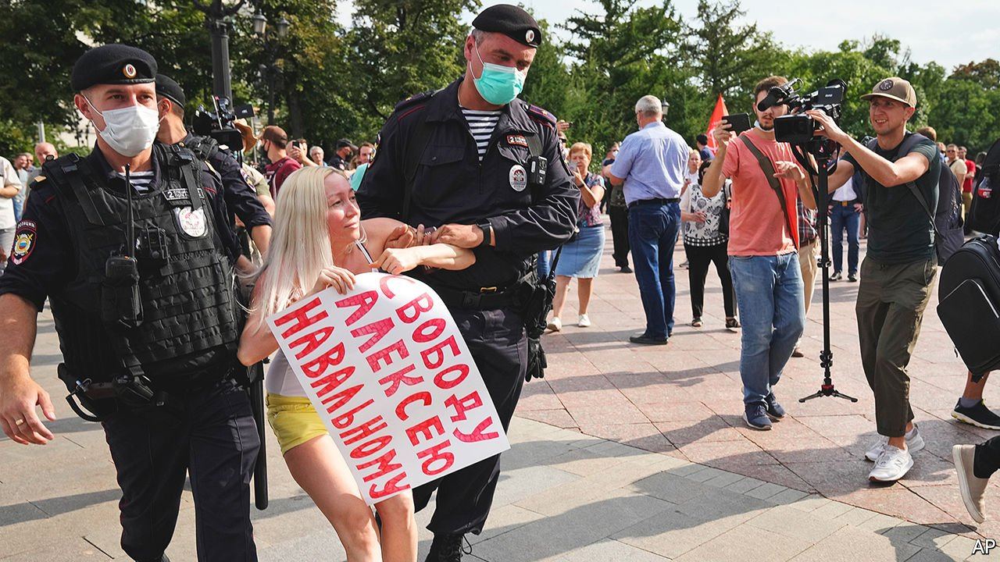

###### Smart voting: Russia’s new party

# Vladimir Putin is still rattled by Alexei Navalny 

##### The online opposition is too savvy to be entirely crushed 

 

> Sep 18th 2021 

PRESIDENT VLADIMIR PUTIN has every reason to be angry. He has tried to poison Alexei Navalny, Russia’s opposition leader. He has locked him up in one of Russia’s harshest penal colonies. He has outlawed his anti-corruption foundation. He has chased his comrades out of the country and barred his allies from standing in elections. And yet, after all this, Mr Navalny and his movement are still featuring at the heart of the elections to Russia’s Duma (its parliament) on September 19th.

On the surface, the political field is entirely Mr Putin’s. The only parties allowed to run, including the Communists and Yabloko, an innocuous liberal outfit, have been sanitised by the Kremlin. With the media muzzled and repression and censorship the main tools of campaigning, the Kremlin-backed United Russia’s win is a given. Yet under the surface a drama is unfolding, as the Kremlin frantically fights Mr Navalny’s effort to awaken and co-ordinate voters


The Kremlin has been hoping that most Russians, assuming the election is a foregone conclusion, will take no interest in it. If they stay at home, United Russia should win hands down, since a solid bloc of state workers, pensioners and members of the armed forces will be cajoled into voting for it. If the turnout is low, the need for blatant rigging would be avoided, along with the risk of mass protests.

At the same time, the Kremlin is urging people, especially in Moscow where United Russia is particularly weak, to vote online, making it easier for the authorities to snoop on them and to control the process. It even appears to have hacked into the database of an online liberal media organisation, sending its readers a message telling them to boycott the elections.

Yet Mr Navalny’s campaign to stir up and consolidate a protest vote, from his prison cell, is hurting Mr Putin. Pollsters give United Russia less than 30% of the vote. The Kremlin is particularly rattled by Mr Navalny’s call for people to follow his strategy of “smart voting”. Half the Duma seats are allocated by party list, so the opposition leader is calling on his supporters to vote for any parliamentary party other than United Russia, to knock them back.

The other half of the seats are first-past-the-post, so here the smart-voting team, using its own polling data and analysis, has endorsed the likeliest candidate to beat the United Russia one, regardless of their views. Its main aim is to deprive United Russia of a big majority, and so weaken its control over electoral commissions across Russia. That would allow more leeway to the opposition in places where it is relatively strong, such as Khabarovsk, in the far east. Smart voting has worked in various local elections, including in Moscow in 2019, when United Russia did poorly.

Russia’s internet censor has duly blocked the smart-voting website and ordered Google and Yandex, Russia’s main search engine, to block the combination of two words—smart voting—in its searches. Yandex has obeyed but Google has not, incurring a fine. The Kremlin has accused it of “interfering in Russia’s elections”.

Anticipating such blockages, the Navalny team has created a smart-voting app. The internet censor has ordered tech giants, including Apple, to remove it from their stores. It has even ordered VPN and website-security providers to prevent downloads, apparently to little avail.

Journalists are being arrested for reposting mentions of smart voting in their social-media accounts. Human-rights lawyers are being targeted. Popular bloggers are being threatened with house arrest for breaking covid-related rules which almost nobody follows. There is Soviet-style intimidation offline, too. Hundreds of people across Russia have reported visits by plain-clothes police asking questions about Mr Navalny and warning of dire consequences if they support him.

Kirill Rogov, a political analyst, says that smart voting has, in effect, become a political party. “It’s not the name or registration that defines a party, but its ability to consolidate voters and influence the outcome of the elections,” he says. The Kremlin’s power has rested on two pillars: its monopoly of information and the threat of repression. But the spread of fast mobile internet has changed Russian politics. The Liberal Mission Foundation, a think-tank based in Moscow, reckons that the share of people who get their news online has shot up from 18% to 45% in the past five years. Hence 70% of Russians know about Mr Navalny. His YouTube channel has about as big an audience as the news on a large state-run TV channel. Whatever the result of the election, the war over the internet is only going to get nastier.■

