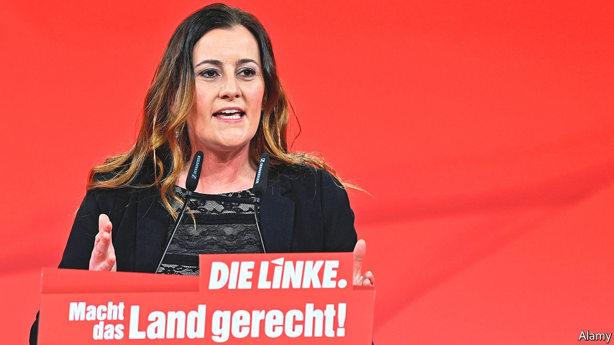

###### Germany’s coalition kabuki

# What to make of Die Linke 

##### The ex-Communists could end up in government—but probably won’t 

 

> Sep 18th 2021 

EVERY TIME Olaf Scholz or Annalena Baerbock is asked about a coalition with Die Linke (The Left), a party that emerged in 2007 from the ashes of East Germany’s Communist Party, they furiously beat around the bush. Mr Scholz, the Social Democratic Party’s (SPD) candidate for the chancellorship, says that he needs a clear commitment to NATO from any future coalition partner. Ms Baerbock, the Green Party’s candidate, says that she will talk to all democratic parties—and Die Linke is a democratic party too.

At the beginning of this month, leaders of Die Linke seemed to be courting the SPD and the Greens with an offer of a “progressive alliance” that could achieve leftist policy goals such as higher taxes on the rich and rent caps. The party even struck its oft-repeated demand to abolish NATO from its Sofortprogramm, its immediate policy measures. Yet in recent days the party has dispelled any impression of a more moderate course. At a televised debate on September 13th, Janine Wissler, the co-head of Die Linke, proclaimed again that her party wants to dissolve NATO and turn it into a collective security alliance that includes Russia. When asked how the Left could possibly be part of a coalition government while holding such a policy, she replied that foreign policy consisted of more than just NATO.


The reason Mr Scholz, a moderate who is Germany’s finance minister and vice-chancellor, is not categorically excluding a coalition with Die Linke is strategic: it could be a useful chip in talks with the Free Democrats (FDP,) a liberal party, about a “traffic-light” coalition with the SPD and the Greens. But if his party gets more votes than any other party, as the polls predict, Mr Scholz will need the approval of the SPD’s 400,000 members for any coalition he might put together. And the party faithful are more favourable to Die Linke than he is. In 2019 Mr Scholz was soundly defeated in the race for the SPD chair by Saskia Esken and Norbert Walter-Borjans, who both belong to the party’s left wing.

Ms Esken, in particular, is a fan of a potential coalition of her party with Die Linke and the Greens. She is rarely in the limelight: the SPD is doing much better than expected by focusing the campaign solely on Mr Scholz, who is by far the most popular of the candidates for the chancellorship. The Berlin commentariat even speculated that the SPD is hiding Ms Esken after she cancelled an appearance on a popular talk show at the last minute, but was spotted at a chip stand next to the studio.

Even so, after an election victory the left of the SPD will presumably want its pound of flesh. Those who advocate a coalition with Die Linke argue that the SPD has far more domestic policies in common with it than with the FDP, in particular over economic and fiscal matters. And the SPD has already, after all, found itself in coalition with a party that at the time demanded the abolition of NATO, when in 1998 it got into bed with the Greens. Not long after that first federal red-green coalition government was formed, Germany joined NATO’s deployment in Yugoslavia, after a lot of soul-searching by the Greens’ leader at the time, Joschka Fischer.

At the previous general election Die Linke got 9% of the vote. This time it is again forecast to cross (but perhaps only just) the 5% hurdle needed for representation in the Bundestag. It is riven by infighting between more moderate “reformers” and more radical factions.“I am very sceptical that Die Linke will compromise enough to be part of the next government,” says Julia Reuschenbach, a political scientist at Bonn University. No one ever said that coalition-building was easy. ■

For more coverage of the German elections, visit our dedicated 

