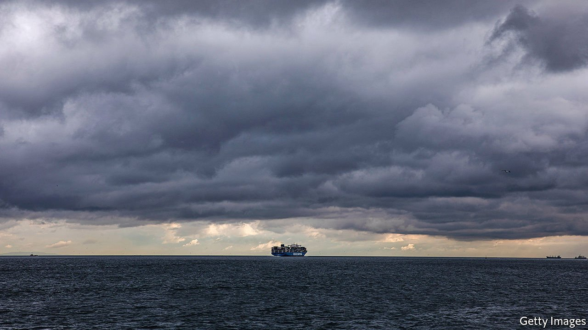
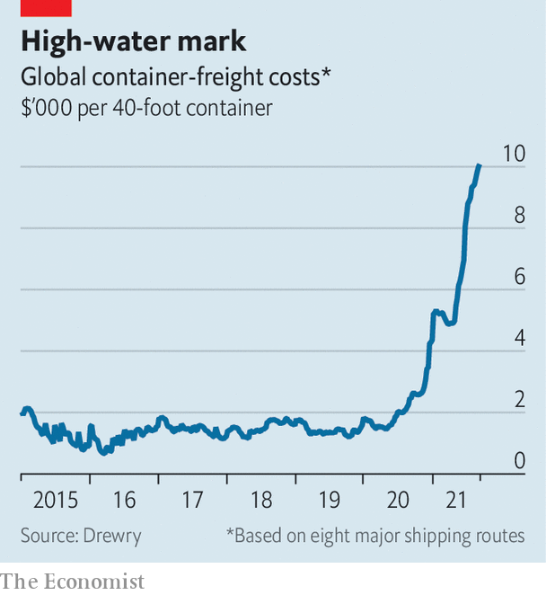
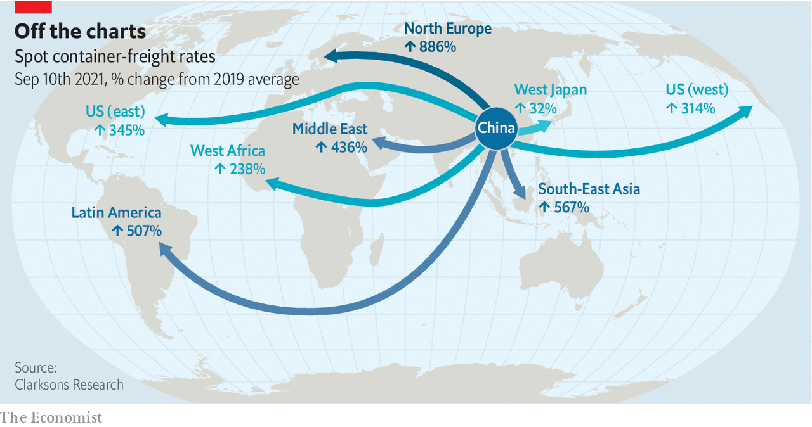

###### Turbulent waters

# A perfect storm for container shipping 

##### Will prolonged disruptions shift the pattern of trade? 

 

> Sep 16th 2021 

A  wedged across the Suez canal, , armadas of vessels waiting outside ports, covid-induced shutdowns: container shipping has rarely been as dramatic as it has in 2021. The average cost of shipping a standard large container (a 40-foot-equivalent unit, or FEU) has surpassed $10,000, some four times higher than a year ago (see chart). The spot price for sending such a box from Shanghai to New York, which in 2019 would have been around $2,500, is now nearer $15,000. Securing a late booking on the busiest route, from China to the west coast of America, could cost $20,000.

 


In response, some companies are resorting to desperate measures. Peloton, a maker of pricey exercise bikes, is switching to air freight. But costs are also sky-high as capacity, half of it usually provided in the holds of passenger jets, is constrained by curbs on international flights. Home Depot and Walmart, two American retailers, have chartered ships directly. Pressing inappropriate vessels into service has proved near-calamitous. An attempt in July to carry containers on a bulk carrier, which generally carts coal or iron ore, was hastily abandoned when the load shifted, forcing a return to port. More containers are travelling across Asia by train. Some are even reportedly being trucked from China to Europe then shipped across the Atlantic to avoid clogged Chinese ports.


Trains, planes and lorries can only do so much, especially when it comes to shifting goods halfway around the planet. Container ships lug around a quarter of the world’s traded goods by volume and three-fifths by value. The choice is often between paying up and suffering delays, or not importing at all. Globally 8m TEUS (20-foot-equivalent units) are in port or waiting to be unloaded, up by 10% year-on-year. At the end of August over 40 container ships were anchored off Los Angeles and Long Beach. These serve as car parks for containers, says Eleanor Hadland of Drewry, a shipping consultancy, in order to avoid clogging ports that in turn lack trains or lorries to shift goods to warehouses that are already full. The “pinch point”, she adds, “is the entire chain”.


For years container shipping kept supply chains running and globalisation humming. Shipping was “so cheap that it was almost immaterial”, says David Kerstens of Jefferies, a bank. But disruption after disruption means that the metal boxes are losing their reputation for low prices and reliability. Few experts think things will get better before early next year. The dislocations could even hasten a reordering of global trade.

Shipping is so strained in part because the industry, which usually steams from short-lived boom to sustained bust, was enjoying a rare period of sanity in the run-up to the pandemic. Stephen Gordon of Clarksons, a shipbroker, notes that by 2019 it was showing self-discipline, with the level of capacity and the order book for new ships under control. Then came covid-19. Shipping firms, expecting a collapse in trade, idled 11% of the global fleet. In fact,  and shipping rates started to climb. And, flush with stimulus cash, Americans started to spend.

In the first seven months of 2021, cargo volumes between Asia and North America were up by 27% compared with pre-pandemic levels, according to BIMCO, a shipowners’ association. Port throughput in America was 14% higher in the second quarter of 2021 than in 2019. There has been little growth elsewhere: throughput in northern Europe is 1% lower. Yet rates on all routes have rocketed (see map), because ships have set sail to serve lucrative transpacific trade, starving others of capacity.

 


A system stretched to its limits is subject to a “cascading effect”, says Eytan Buchman of Freightos, a digital-freight marketplace. Rerouting and rescheduling would once have mitigated the closure of part of Yantian, one of China’s biggest ports, in May and then Ningbo, another port, in August after covid-19 outbreaks. But without spare capacity, that is impossible. “All ships that can float are deployed,” remarks Soren Skou, boss of Maersk, the world’s biggest container-shipping firm. Empty containers are in all the wrong places. Port congestion puts ships out of service. The average door-to-door shipping time for ocean freight has gone from 41 days a year ago to 70 days, says Freightos.

Some observers think normality may return after Chinese new year next February. Peter Sand of BIMCO says disruptions could even take a year to unwind. Lars Jensen of Vespucci Maritime, an advisory firm, notes that a dockers’ strike on America’s west coast in 2015 caused similar disruption, albeit only in the region. It still took six months to unwind the backlog.

On the demand side much depends on whether the American consumer’s appetite for buying stuff continues. Although retail sales fell in July, they are still 18% above pre-pandemic levels, points out Oxford Economics, a consultancy. But even if American consumer demand slackens, firms are set to splurge as they restock inventories depleted by the buying spree and prepare for the holiday season at the end of the year. And there are signs that demand in Europe is picking up.

In a sea of uncertainty, one bedrock remains. The industry, flush with profits, is reacting customarily, setting an annual record for new orders for container-ship capacity in less than eight months of this year, says Mr Sand. But with a two-to-three-year wait, this release valve will not start to operate until 2023. And the race to flood the market may not match torrents of the past. There are far fewer shipyards today: 120 compared with around 300 in 2008, when the previous record was set. And shipping, responsible for 2.7% of global carbon-dioxide emissions, is under pressure to clean up its act. Tougher regulations come into force in 2023.

The upshot is that the industry “will remain cyclical”, but with rates normalising at a higher level, says Maersk’s Mr Skou. Discipline in both ordering and managing capacity may prove more permanent, aided by consolidation within the industry.

The impact of higher shipping costs depends on the good being transported. Those hoping to import cheap and bulky things like garden furniture might be in for a long wait. Mr Buchman notes that current spot rates might add $1,000 to the price of a sofa travelling from China to America. The effects on product prices so far may have been dampened: around 60% of goods are subject to contractual arrangements with shipping rates agreed in advance and only 40% to soaring spot prices.

Boxed in

Nonetheless, for most products, shipping costs tend to be a small percentage of the overall cost. The boss of a large global manufacturer based in Europe says the extreme costs now are “bearable”. Nor might shipping rates rise much more even if disruptions continue. CMA CGM, the third-largest container-shipping firm in the world, stunned industry watchers on September 9th when it said that it would cap spot rates for ocean freight. Hapag-Lloyd, the fifth-largest, rapidly followed suit.

Decarbonisation costs mean rates will eventually settle at higher levels than those before the pandemic. Yet research by Maersk suggests that this may not affect customers much. Even if sustainable fuel cost three times as much as the dirty stuff, increasing per-container fuel costs to $1,200 across the Pacific, for a container loaded with 8,000 pairs of trainers, the impact on each item would be minimal.

Instead it is the problem of reliability that may change the way firms think. “Just in time” may give way to “just in case”, says Mr Sand, as firms guard against supply shortages by building inventories far above pre-pandemic levels. Reliability and efficiency might also be hastened by the use of technology in an industry that has long resisted its implementation. As Fraser Robinson of Beacon, another digital freight forwarder, points out, supply chains can be made sturdier by using data to provide better “visibility” such as over which suppliers and shipping companies do a better or worse job of keeping to timetables and ordering goods earlier.

There is so far little evidence of “nearshoring”, except in the car industry, says Mr Skou. But the combination of trade war, geopolitics and covid-19 may together lead trade patterns to tilt away from China. Some Chinese firms and the companies they supply are relocating production to lower-cost countries to diversify supply chains and circumvent trade barriers. Mr Kerstens of Jefferies notes that after America under President Donald Trump imposed tariffs on China the volume of trade from China to America fell by 7% in 2019, but American imports remained stable overall as places like Vietnam and Malaysia took up the slack. Hedging against covid-19 shutdowns, particularly given China’s zero tolerance for infections, could provide another reason to move away.

For their part, shipping firms may be preparing for more regionalised trade. The order book is bulging for ships of 13,000-15,000 TEU, smaller than the mega-vessels that can only be handled at the biggest ports. Vietnam opened a new deepwater terminal in January, which can handle all but those largest ships.

Finding new manufacturers is hard, however, especially for complex products. And building buffers into supply chains is costly. But conversations about deglobalising are said to be starting among some makers of low-cost clothing and commodity goods. If high costs and delays persist, some will judge that the benefits of proximity to suppliers outweigh the costs of bringing in goods made far away. With few alternatives to ships, the only choice will be to move the factories that make them. ■

Correction (September 13th 2021): The figures on port throughput in America and northern Europe have been corrected since publication.

For more expert analysis of the biggest stories in economics, business and markets, , our weekly newsletter.

