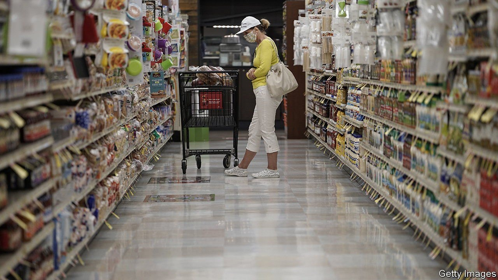
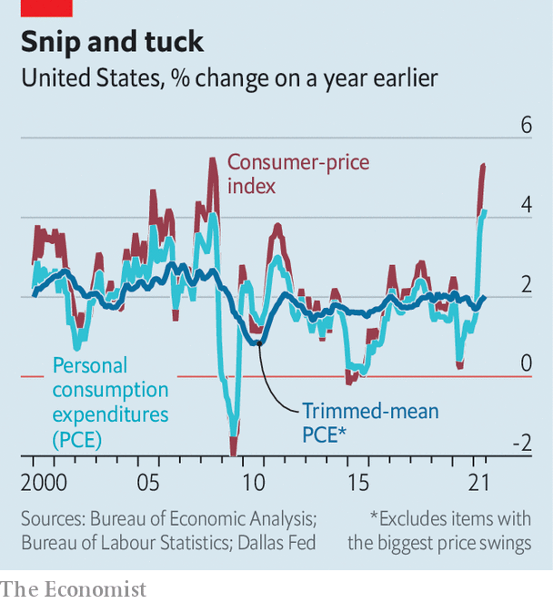

###### Fighting trim

# America’s consumer-price inflation stays above 5% in August 

##### “Trimmed means” are less alarming than headline gauges, but reveal widespread pressures 

 

> Sep 16th 2021 

IT IS HARD to overstate the time that goes into calculating a consumer-price index. In America statisticians survey nearly 10,000 people every quarter, construct a sample of 80,000 things they buy, and then monitor their prices by ringing up thousands of shops, restaurants and offices. So the hard-working boffins might be miffed that the Federal Reserve thinks it wise simply to lop off the things with the biggest price swings. The result that emerges is known as “trimmed mean” inflation. With America facing its most sustained price pressure since 1990, this narrower measure is more than an academic exercise.

 


In August the headline consumer-price index was 5.3% higher than a year ago, according to data published on September 14th. It was the third consecutive month of inflation at roughly that pace. By contrast the trimmed-mean rate—using the Fed’s preferred measure, the personal consumption expenditures (PCE) price index—has remained at just about 2%, in line with the central bank’s inflation target (see chart).


The gap between the headline scare and the subdued alternative gets to the heart of the debate about whether the burst of inflation is transitory or persistent. Those taking the former view argue that a small number of things have driven the jump, almost all traceable to pandemic-related disruptions. The price of flights, for example, soared as air travel roared back, but in August ticket prices slumped as the Delta variant of covid-19 dampened enthusiasm for travel. The trimmed index is appealing because it strips out such outliers.

Jerome Powell, the Fed’s chairman, has pointed to the measure as evidence that price pressures are not yet broad-based. A similar story can be told in other countries. In Britain consumer-price inflation soared to 3.2% year-on-year in August from 2% in July. But that largely stemmed from a low base of comparison a year earlier, when the government subsidised restaurant meals for a month. A trimmed mean, calculated by the National Institute of Economic and Social Research, a think-tank, indicates that Britain’s underlying inflation was just 1.6% in August, barely higher than in July.

There are two possible objections to the trimmed measure. The first is that it is cherry-picking. Central bankers often highlight narrower “core” inflation in order to capture deeper trends. In the past the Fed would point to the PCE index excluding food and energy prices. But this measure rose to 3.6% year-on-year in July, a three-decade high. Hence the suspicion that the trimmed mean is a handy substitute.

That, though, is unfair to the Fed. Central bankers have been tracking the trimmed measure since well before the pandemic. The Dallas Federal Reserve has published a version since 2005. A research note by Fed economists released in 2019 found that trimmed-mean gauges are less volatile than headline indices and better predictors of future price changes.

By focusing on the middle of the pack, the trimmed mean reveals just how widespread pressures are. (The Dallas Fed orders all items from the highest price increase to the lowest, and lops off the top 31% and the lowest 24%, as judged by expenditure weights.) Trimming also answers a standard complaint about gauges that exclude food or energy prices: that people spend so much money filling their bellies and their petrol tanks that it makes little sense to ignore these costs. Food and energy are included in trimmed indices, so long as their price swings are not wild.

The second objection is more damaging: that the trimmed mean flatters less than Mr Powell would have it. Economists at the Dallas Fed say that when headline inflation exceeds the trimmed mean by one percentage point, it feeds through to roughly a quarter point of extra trimmed-mean inflation in a year’s time. On this basis the trimmed-mean rate may hit 2.5% next year. A different trimmed mean calculated by the Cleveland Fed, which snips less, has already jumped, climbing to 3% from 2% at the start of the year.

However you trim, the conclusion seems clear enough. Inflation is not as bad as the headlines suggest. But price pressures are steadily spreading. ■

For more expert analysis of the biggest stories in economics, business and markets, , our weekly newsletter.

An early version of this article was published online on September 14th 2021

