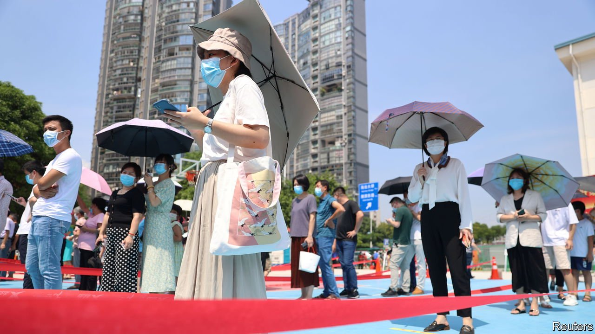

###### Lion dance

# China takes on Delta and its property developers at the same time 

##### New activity figures reveal the economic cost of recent covid outbreaks 

 

> Sep 16th 2021 

FOR SUCH a small place, Singapore has exercised an outsized influence on China’s economy. The city-state proved to reformers in China that a government could open up the economy without losing control. “Society in Singapore is quite orderly,” said Deng Xiaoping, China’s paramount leader, in 1992. “They managed things very strictly. We ought to use their experience as a model and…manage things even better than they do.”

Unfortunately Singapore has not managed covid-19 as strictly as China would like. A resident of China’s Fujian province, who recently returned from Singapore, tested positive earlier this month for the Delta variant. He is thought to have passed it on to his son, from whom it soon spread through his school. Fujian has now recorded over 200 cases since September 10th. Exchanges between Singapore and China’s coastal provinces (the ancestral homelands for many Singaporeans) have brought many benefits. But this outbreak belongs in the other column.


In response, officials in Putian (a city with a population of 3m) and Xiamen (5m) have shut schools, bars and other high-risk venues. Economists worry that if the outbreak persists, it will disrupt travel and shopping during China’s week-long holiday beginning on October 1st. That would delay the recovery from a similar outbreak that ended only last month. The cost of that scare became clearer with the release of economic data on September 15th. One casualty was retail sales, which rose nationwide by only 2.5% (in nominal terms) in August, compared with a year earlier, far weaker than expected. Based on the data so far, GDP in the third quarter is on course to shrink compared with the previous three months, suggests a “tracking” estimate by Morgan Stanley, a bank.

Singapore’s strictly managed property market is another model China’s reformers often admire but have failed to emulate. But the government in Beijing is belatedly cracking down on indebted developers, imposing curbs on their borrowing, even as mortgage costs rise and potential homebuyers think twice. Property firms sold 17.6% less residential floor space in August than a year earlier, and the price of new homes fell in ten out of 70 big cities tracked by the National Bureau of Statistics. Developers are now less willing and less able to build. Investment in real estate was only 0.3% higher in August than a year ago.

China’s exports have so far proved resilient: they were 25% higher in August than a year ago. Indeed, China’s manufacturers may have gained at the expense of countries that are struggling with worse covid-19 outbreaks of their own. Moreover, for as long as inflation remains subdued, China has scope to ease monetary and fiscal policy to support growth. It may thus combine tight control of infections, property and other unruly industries with an easing of its macroeconomic stance, a juggling act characterised as “micro takes, macro gives” by analysts at Goldman Sachs, another bank.


The question is whether macro can give enough. Analysts at China International Capital Corporation (CICC), an investment bank, point out that China’s official fiscal deficit has been negligible so far this year. The government therefore has room to spend more without revising its deficit target. Sure enough, bond issuance picked up last month and the government’s deposits with banks fell. CICC reckons that China might increase spending on infrastructure at an annual rate of 5% in the last three months of the year, compared with the same period in 2019, before the pandemic.

China’s rulers hope that tighter regulations will help make housing more affordable and a less dominant part of the economy. It is part of the “new development dynamic” touted by Xi Jinping, China’s ruler. But as this year wears on, China’s development pattern is beginning to look wearily familiar: weak consumption, strong exports and additional public investment to save the economy from past speculative excess. Whatever might be said for this growth dynamic, it is anything but new. ■

For more expert analysis of the biggest stories in economics, business and markets, , our weekly newsletter.

An early version of this article was published online on September 15th 2021

