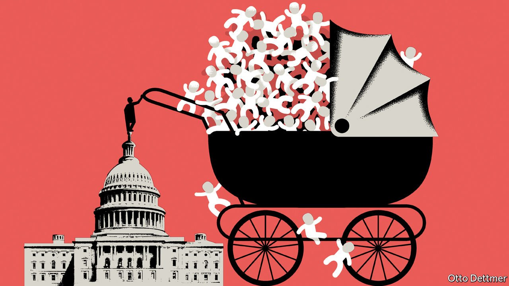

###### Free exchange

# How America should spend on child care 

##### More money is not a guarantee of success 

 

> Sep 18th 2021 

UNLIKE MOST rich European countries, America lacks a coherent public child-care regime. But it has come surprisingly close to having one. During the second world war Congress set up federal child-care centres to encourage women to work in factories; these were later dismantled. In 1971 Congress passed a comprehensive child-care plan. But President Richard Nixon vetoed the bill, calling it “the most radical piece of legislation” to have crossed his desk, and arguing that “good public policy requires that we enhance rather than diminish both parental authority and parental involvement with children.” Now Democrats in Congress are trying again, fashioning a child-care system as part of an enormous social-spending package. It is expected to consist of a universal pre-kindergarten programme for three- and four-year-olds and free or heavily subsidised child care for most Americans. The potential gains from more systematic support are large. But there are trade-offs around its design, too.

The case for some sort of state intervention is straightforward. As any new parent will readily confirm, child care across the rich world is eye-wateringly expensive. Women are disproportionately likely to stay at home to look after their children, so encouraging them to work in the formal sector could increase gender equality. For some children, formal care doubles up as education, helping overcome the disadvantages associated with their family circumstances. Some public spending on child care has such vast benefits in later life that in broad terms it is an investment that pays for itself. Research led by James Heckman of the University of Chicago, for instance, has found that spending on some high-quality programmes for children from birth until their fifth year generated an internal rate of return of 14%.


Once convinced that there is a case for intervention, governments must consider how to design their schemes: who should be eligible, and what sort of care to provide. The system must not only free up parents to work and be good for children; the benefits must also exceed the costs to the public purse. There is clear evidence that mothers gain from child-care policy. Many studies find that universal schemes (ie, those that apply to families of all incomes) boost labour-force participation. In 1997 the Canadian province of Quebec implemented a full-time universal scheme, costing parents just C$5 (and later C$7, $4-5.50) a day. This raised mothers’ participation rates by nearly eight percentage points.

When it comes to children’s outcomes, however, the results are mixed. The available research on existing schemes is often patchy. The large returns on investment identified by Mr Heckman and his colleagues, for instance, relate to targeted programmes for poor families. The outcomes of universal schemes, though, are less glowing. One meta-analysis published in 2018 by Thomas van Huizen and Janneke Plantenga of Utrecht University examined 30 studies of such programmes. Only a third found a positive effect of the schemes on children’s outcomes, and a fifth found negative effects. Though the scheme in Quebec raised mothers’ participation substantially, a study by Michael Baker of the University of Toronto, Jonathan Gruber of the Massachusetts Institute of Technology and Kevin Milligan of the University of British Columbia found that children suffered worse cognitive and health outcomes.

The literature review also found that poor children gained the most from universal programmes. One oft-cited study by Tarjei Havnes, then at the University of Oslo, and Magne Mogstad of the University of Chicago examined what happened to Norwegian children born in the late 1960s and early 1970s, as a heavily subsidised child-care scheme began expanding. They found strong positive effects on future earnings for poor children, but negative effects on rich ones, whose parents would otherwise have provided better child care than the state. The researchers conclude “that the benefits of providing subsidised child care to middle and upper-class children are unlikely to exceed the costs”.

Added to this, universal care could be regressive. Across rich European countries, low-income families are a third less likely to use early child-care schemes than richer ones. In America poorer families are more likely to tell surveys that they prefer informal, family-based child care to formal care. That suggests that a universal offering would direct public funds to those who do not need it, and that means-testing is a more efficient way to target support.

Having decided who should receive help, the next question is how to deliver it. Here the evidence suggests that quality matters a lot for children’s outcomes. Full-time programmes do not necessarily deliver better results than part-time ones. The disappointing results from Quebec are often attributed to wildly disparate standards. By contrast, a study by Mr Havnes and Nina Drange of Statistics Norway of a lottery to enter toddlers into a care scheme in Oslo—where quality is closely regulated by the state—found big improvements in standardised tests taken at age seven.

Child’s play

Left-leaning American politicians like Elizabeth Warren tend to talk in terms of “underinvestment” and “child-care deserts”. But if existing child-care arrangements are low-quality, then spending alone will not improve outcomes for children. A framework that weighs up the benefits of spending on child care for families and setting that against the costs is essential, if the policy is to help the most in need. Without it, child care in America also risks becoming subject to an unseemly mess of regulations: the same tangle of subsidies, supply restrictions and poor quality that afflicts higher education and health care.

As America attempts to Europeanise its safety-nets, the question is not whether a more coherent child-care regime ought to exist, but how it should be designed. Fifty years after Nixon vetoed universal child care, the search is still on for a truly effective American nanny state. ■

For more expert analysis of the biggest stories in economics, business and markets, , our weekly newsletter.

