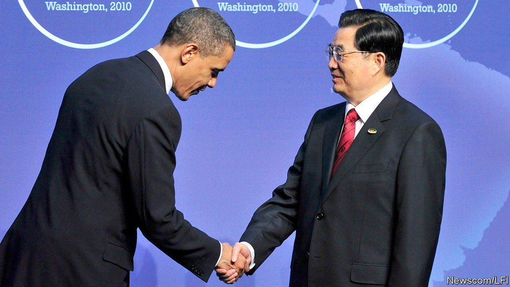
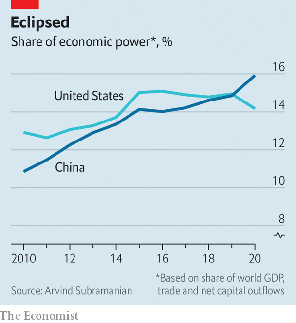

###### The Thales of economics

# Is China already the world’s most dominant economy? 

##### By one measure, yes 

 

> Sep 18th 2021 

IN 2010, WHEN President Barack Obama welcomed his Chinese counterpart to a summit in Washington, DC, he greeted him with a handshake and a swift, shallow dip of the head. The image of America’s president bowing before China made an arresting cover photo for the book “Eclipse”, published the following year. The book, written by Arvind Subramanian of the Peterson Institute for International Economics, a Washington-based think-tank, predicted that China would soon come to dominate the world economy and that America could do precious little about it. Your correspondent once included the cover image in a presentation at the Central Party School in Beijing. It caused quite a frisson.

To gauge a country’s economic “dominance” Mr Subramanian combined its share of world trade, net capital exports and global GDP (measured at both market exchange rates and purchasing-power parities, which try to correct for international differences in the price of similar goods). He gave each attribute a weight loosely based on the IMF’s formula for allocating votes to its members. His index, he argued, successfully captured Britain’s economic hegemony in 1870, its rivalry with Germany in 1913 and its eclipse by America in the subsequent decade.

 


According to this measure, Mr Subramanian predicted, China would become the world’s most dominant economy by 2020. In the ten years since that forecast, China has faced a trade war with America, its growth has slowed and its currency has suffered bouts of volatility, obliging it to tighten controls on capital outflows. Yet Mr Subramanian’s central prediction has come true. Based on the book’s original formula, China became the world’s most dominant economy last year (see chart). Its growth slowdown has been no worse (so far) than Mr Subramanian expected and the covid-19 pandemic has helped increase its share of global trade.


Mr Subramanian successfully predicted how his own index would evolve. But does his index successfully capture economic dominance? Other authors have included wealth, GDP per person and other proxies for economic sophistication, as well as scale. (Our favourite index of a country’s global influence, put together by Francesc Pujol of the University of Navarra, counts the number of times a country appears in the charts of The Economist.) These measures give America a bigger edge.

For the sake of tractability, Mr Subramanian’s measure gives every dollar of exports equal weight. But some of America’s high-tech exports appear to give it an economic “chokehold” over China that is worth more than their market value. Mr Subramanian thought that China’s growing share of GDP and trade could soon elevate its currency into a rival to the dollar. But China’s yuan has made little headway. That is partly because China has tightened capital controls, a possibility that Mr Subramanian acknowledged. But he thought that if China clung to such controls it would be to keep the yuan cheap (by preventing capital inflows) not to prop the yuan up (by deterring capital outflows). Still, given the sorry record of most economic predictions, the book’s author deserves a handshake and a bow. ■

For more expert analysis of the biggest stories in economics, business and markets, , our weekly newsletter.

