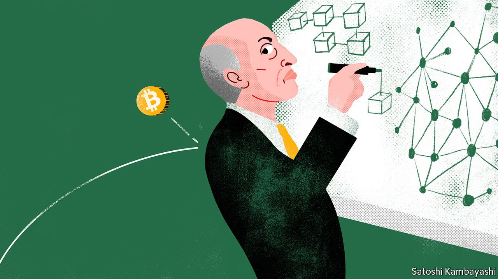

###### Buttonwood

# Operation Tame Finance 

##### Gary Gensler has big ambitions for the SEC, but may not have the big bucks 

 

> Sep 18th 2021 

GARY GENSLER’S students at MIT Sloan were an appreciative bunch. Their nominations secured him the business school’s “Outstanding Teacher” award for the 2018-19 academic year. Now that he is the chairman of the Securities and Exchange Commission (SEC), America’s main markets watchdog, his constituents are rather more unruly. Finance has been upended by an explosion of raucous innovation, and Mr Gensler has to work out how, and to what extent, to police it all. Forget diligent undergraduates; it is rather like trying to run the world’s largest, noisiest kindergarten.

The drive for more adult supervision is already under way in crypto. The SEC recently threatened to sue Coinbase, a large cryptocurrency exchange, if it launches a lending product without first registering it as a security. And this week the regulator extracted $539m from three media firms charged with illegal offerings of stocks and digital assets.


Crypto-believers may have expected a friendlier stance from a man whose courses at MIT included one on the uses of blockchain technology. But since taking the SEC’s reins Mr Gensler has been at pains to point out that, while he is “neutral” on technology, he is anything but when it comes to investor protection and market stability. And that means beefing up regulation of the $2.2trn crypto market, which, he told a Senate committee this week, is a “Wild West...rife with fraud, scams and abuse”.

His agenda stretches beyond the seething cryptoverse. He is also warily eyeing other newfangled corners of finance, from trading apps like Robinhood that use “digital engagement practices” to encourage retail punters to trade more often, to special-purpose acquisition companies (SPACs) that push the envelope of what securities laws allow (an early victim was SPAC-king Bill Ackman’s complex plan to invest in Universal Music Group). Other targets include the kinds of derivatives that blew up Archegos, a family office, and the shell-company structures used by many Chinese firms that list in America.

For all the focus on finance’s cutting edge, Mr Gensler’s SEC may end up having just as big an impact on more established markets. He thinks stock trading needs an overhaul; too much flows to “dark”, off-exchange venues, where small investors can more easily be stiffed. They may also, he suspects, be short-changed by potential conflicts of interest such as the “payment for order flow” that brokers get for routing trades to particular marketmakers. He wants to force corporate disclosure of everything from climate risks to how firms treat their workers.

Quite a to-do list, then; policy reviews are under way in at least 50 areas. And quite a change from President Donald Trump’s era, when the commission seemed happy to drag its feet on implementing post-financial-crisis reforms.

The obvious question is whether Mr Gensler is biting off more than he can chew. His background, equal parts poacher and gamekeeper, should help him. After 18 years at Goldman Sachs, the last ten as a partner, he worked in the Treasury and helped write the Sarbanes-Oxley reforms after the implosion of Enron, an energy firm, in 2001. As head of the Commodity Futures Trading Commission (CFTC), which regulates derivatives, he saw off an attack from the giant over-the-counter swaps industry, forcing it onto more highly regulated platforms.

Being a good communicator should also help. Mr Gensler understands that winning the argument means boiling the message down to simple analogies that most punters (and senators) can grasp. Under him, the SEC is even using social media to good effect. When the boss of Coinbase professed shock that a lending product could be classed as a security, the commission archly tweeted a 30-second guide to how bonds work.

Good one. But Mr Gensler can expect fierce lobbying against more red tape. He may also have to fight turf wars with other regulators; the CFTC wants a piece of the action in digital currencies. And then there are the politicians. Regulation-friendly Democrats have the upper hand in Congress but some people are queasy about a big expansion of the SEC’s authority, given its patchy record: think of all the scandals, from Enron to Bernie Madoff, unearthed not by the regulator but by outside sleuths. Mr Gensler also needs more money. At $2bn, his budget is smaller than JPMorgan Chase’s annual spending on marketing. But the increase pencilled in for 2022 is just 5%. Mr Gensler has big ambitions. His problem may be finding the big bucks to realise them.

