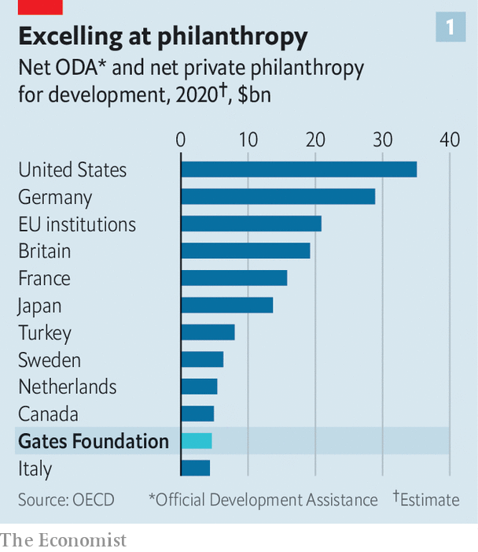
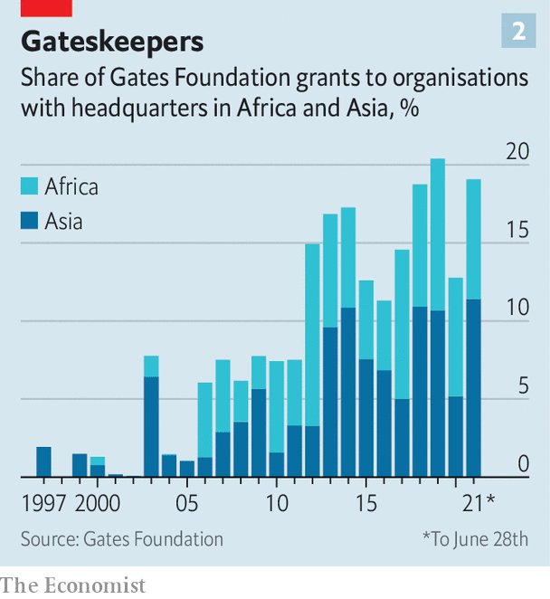

###### Shifting foundations

# The Gates Foundation’s approach has both advantages and limits 

##### Data isn’t everything, even for the world’s most powerful charity 

 

> Sep 18th 2021 

THE JANICKI OMNI PROCESSOR, a $2m machine paid for by the Bill &amp; Melinda Gates Foundation, turns human waste into water and electricity. In poor cities such as Dakar in Senegal, where it has been piloted, the hope is that people will send sewage to sanitation plants to be processed, rather than chucking it into the streets.

The Omni Processor exemplifies the Gates Foundation’s approach to philanthropy. Mr Gates likes to apply business principles to doing good, which means focusing on innovative, often technological, solutions with quantifiable results. The processor’s inputs and outputs can be counted. The first version, which arrived in Senegal in 2015, was not designed to deal with sewage filled with sand and rocks as it is in Dakar. It was made of materials that corroded quickly in the city’s sea air. These glitches have been fixed in the “OP 2.0”, which arrived in Dakar this year.


Mr Gates has championed the foundation’s data-driven style of philanthropy. But his ex-wife, now known as Melinda French Gates, is thought to have tempered his relentless focus on efficiency, arguing that number-crunching methods cannot resolve the complex causes of poverty on their own. That difference in emphasis, in turn, raises questions about whether the couple’s divorce, announced this year, will set the world’s most powerful charitable foundation on a novel course.

 


The foundation’s influence is immense. Its $50bn endowment comes from contributions from Mr Gates, the co-founder of Microsoft, Ms French Gates and Warren Buffett, a billionaire investor and friend. In 2019 it gave out $4.1bn, according to the OECD, a club of rich countries, more than 11 times as much as the next-largest private American development foundation. If it were a government, it would be the 12th-biggest disburser of foreign aid, between Italy and Switzerland (see chart 1).

The Gates foundation is the second-biggest donor to the World Health Organisation, behind only the American government. It is a founding member of Gavi, a public-private partnership that provides vaccination programmes in poor countries. It has committed more than $1.8bn to fighting covid-19.

It is not the first to embrace a businesslike approach to charitable giving. In 1889 Andrew Carnegie, a steel magnate, wrote in “The Gospel of Wealth”: “One of the serious obstacles to the improvement of our race is indiscriminate charity.” He cautioned against giving people money without scrutinising how they spent it. He and other industrialists such as Henry Ford and John D. Rockefeller set up large foundations with big boards to give away their money, mostly late in life.

In recent decades the centre of gravity for American philanthropy has shifted from the east coast to the west. Rich tech founders are giving away their wealth while young and taking a keen interest in how it is spent. Many take their cues from the Gates Foundation in terms of which causes to support and how to do so, says Nick Tedesco, a former Gates employee who is now head of the National Centre for Family Philanthropy in Washington, DC. “The influence of the Gates Foundation”, he says, “is outsized.”

Established in 2000, the foundation employs 1,750 people, mostly in Seattle. Mr Gates, who stepped down from his day-to-day role at Microsoft in 2008, takes a hands-on approach to its work. He and Ms French Gates pick causes on which they believe they can have the most impact, from improving education in America to eradicating diseases such as polio and malaria. They hire academics, former management consultants and mandarins to dish out grants, often referred to as “investments”. The return on grants is measured precisely. A malaria project might be judged on bed-nets distributed; one on education might track attendance rates or test scores. Unsuccessful ventures are dropped.

Not all rich benefactors operate in this way. Some simply give vast sums of money to charities they like, leaving them to spend it as they wish. MacKenzie Scott, the ex-wife of Jeff Bezos, founder of Amazon, has announced over $8bn in donations since July 2020 in an approach she calls “seeding by ceding”. She has hired Bridgespan Group, a consultancy, to help her pick grantees. Her gifts come without prescriptions or demands for reports on progress.

The Gates Foundation promotes data-driven, tech-based fixes for discrete problems. Mr Gates’s first charitable effort was to buy computers for libraries in poor parts of America and connect them to the internet. His work in health initially focused on technological solutions, like vaccines, for particular infectious diseases.

Philanthropic Outlook

In other areas, however, that hyper-efficient, outcomes-oriented approach gets you only so far. Counting vaccines is easy; putting a number on a woman’s freedom is not. Mr Gates and Ms French Gates expected global health to be the trickiest part of their portfolio, says Patrick Methvin, who works on education in America for the Gates Foundation. But they found that education projects were more complicated, in part because evaluating what children have learnt—and what they should learn—is far from straightforward. “Education is fundamentally a social-values-based enterprise,” Mr Methvin says.

As Adam Moe Fejerskov, author of “The Gates Foundation’s Rise to Power”, puts it: “Quantification is really about reducing the messiness of the world to formulae and numbers.” The trickiest problems cannot be solved by technology and numbers alone. When the first Omni Processor arrived in Dakar, almost a third of the city’s 3m inhabitants did not live in homes connected to sewers. Public understanding of sanitation is limited. Shortly after the machine appeared, rumours that water extracted from sewage was being added to the city’s drinking water caused uproar. Speak Up Africa, a Gates-funded policy-and-advocacy group, was called on to launch a public-information campaign.

The point of evaluating projects is to steer money away from those that do not work. The foundation says that it does so slowly, winding programmes down gradually. But this trial-and-error method can cause problems.

Early on, the foundation backed the small schools movement in America which suggested that students learn better in small groups getting more individual attention. But running extra-curricular activities and programmes for pupils who needed help with English or special needs was difficult with a smaller student body. With fewer teachers, small schools had to limit their curriculums. The foundation honoured existing grants but channelled new funds into other education reforms. Schools were left struggling for cash and children faced unnecessary upheaval. “We fell short,” Mr Gates wrote in 2009.

For grantees, the level of monitoring and evaluation marks a big difference between the Gates Foundation and other donors. Programme officers oversee their work. That can be helpful. At Speak Up Africa, which has been awarded some $33m in multiple grants since 2015, the team says its monthly virtual meetings with Gates staff in Seattle offer a chance to discuss new ideas and meet international experts.

But the administrative burden can be overwhelming for small groups unused to working with a demanding, global foundation. Askaan Santé, a non-profit organisation in Dakar focused on public health with a staff of 13, received $900,000 in funding after its founder, Fatou Fall Ndoye, met a Gates staffer at a conference. The foundation helped her craft her proposal. But the application took eight months. “It’s a long process,” Ms Ndoye says.

 


This explains in part why the foundation tends to fund organisations based in the rich world rather than those in developing countries where the money is needed most. An analysis of the foundation’s grants database by The Economist and David McCoy, a professor of global public health at Queen Mary University of London, suggests that grantees with headquarters in Africa and Asia have received just 5.3% and 5.6% of its grants respectively since 1999, though their share has risen (see chart 2).

There are many reasons for this asymmetry. Grantees based in America or Europe often have branches in poorer countries and pass funding on to sub-grantees elsewhere. Fewer people are doing cutting-edge research in sub-Saharan Africa. But it is also difficult for a small organisation in the poor world to get the attention of a Gates staffer. And the paperwork can be intimidating. Those that manage to win Gates funding often know someone at the foundation or have worked at an organisation backed by the foundation and so understand the process. Ms Ndoye had both.

Initially the thought was that the foundation would use its resources for innovation to come up with “breakthroughs”, and leave it to others to ensure they reached the right people, says Mark Suzman, its chief executive. “The wake-up call which hits a lot of people who come into philanthropy is that that doesn’t necessarily work.”

Instead the foundation is now focusing on making sure that its innovations work in the real world. This involves messy social changes that are difficult to track. It has invested $4bn in the Global Polio Eradication Initiative, including vaccines. But in Nigeria, the only African country where the disease remained endemic, it has also mapped villages in the conflict-ridden north which were missed in immunisation campaigns. The continent was declared free of wild polio last year.

In family planning the foundation is not simply distributing cheap contraceptives. Women in a low-income country, like India, might not feel comfortable going to a clinic to get condoms or a pill. The Gates-backed Centre for Social and Behaviour Change at Ashoka University near New Delhi tries to understand these social dynamics. It is supporting groups that help women build their confidence in such matters. Confidence is hard to quantify.

The unmeasurable side to philanthropy has drawn on the temperament and insights of Ms French Gates. Richard Horton, editor of the Lancet, a British medical journal, says she takes a “more holistic approach” to development, encompassing women’s rights and the capacity of health systems. “She humanised the foundation in a remarkable way,” he continues. Chris Eide, who founded Teachers United, an American advocacy group that received a Gates grant in 2011, describes two separate meetings with the pair. Ms French Gates, he says, asked him to bring a group of teachers and asked “open and earnest questions” about their work. Mr Gates met him one-on-one and grilled him on education policy. “The way he took notes from our conversation, it was almost like he was building a machine,” says Mr Eide.

The question now is whether Ms French Gates’s influence will outlast the pair’s divorce. If in two years they no longer want to work together, she will resign as a trustee and receive a payout from him to continue her philanthropic work elsewhere. That would require the foundation to find a new way to get the most out of Mr Gates’s data-driven method. ■

