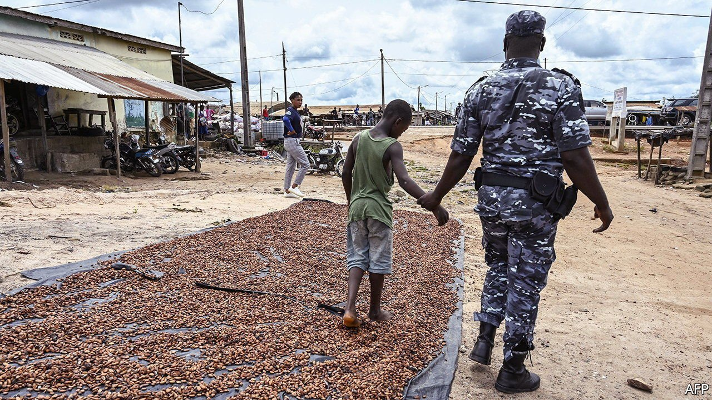

###### Child labour

# How to stop children working 

##### Focus on reducing poverty and helping parents instead of punishing them 

 

> Sep 18th 2021 

FEW SIGHTS are more pitiful than a child of three, hammer in hand, breaking big rocks into smaller ones to sell for pennies. Such scenes are considered so abhorrent in rich and poor countries alike that the convention of the International Labour Organisation (ILO) which outlaws “the worst forms of child labour” (including soldiering, slavery and prostitution) last year became the first to be ratified by all 187 of its members.

Between 2000 and 2016 the number of children working in factories, on farms and down mines fell by almost 94m, to 152m. Yet in the four years to 2020 progress has reversed, with an extra 8m children working, and some 6.5m more doing dangerous jobs. Sub-Saharan Africa accounts for all of the increase. The setback occurred before the covid-19 pandemic, but the ILO and Unicef, the UN children’s agency, reckon that the economic hit from the virus may push almost  into work by the end of next year. Many will not return to school after the temporary closures imposed in countries to curb transmission of the virus (see Middle East &amp; Africa section).


This increase in misery has prompted calls for tougher enforcement of child-labour laws. Prosecutors in Brazil are suing Olam, a commodities firm, over allegations it traded cocoa harvested by children (it denies the claim). In Ivory Coast judges have jailed dozens of people in recent months for putting children to work on cocoa plantations. And in Liberia the government said it is investigating the parents of children who are sent to work and planning to prosecute child-labour cases.

Rich countries, for their part, have been using their buying power to prevent child labour. In 2019 America halted imports of tobacco from Malawi because some of the crop was tended by children. In the same year it mulled a ban on cocoa from Ivory Coast, and the chocolate made from it, for the same reason. This impetus is natural: who would not want to take forceful steps to end cruelty to children? Yet stringent countermeasures, in many cases, may do more harm than good.

Take the rigorous enforcement of child-labour laws in poor countries. Although there are many child-traffickers who deserve to be put behind bars, most children in work are not enslaved and carted off by strangers, but instead toil alongside family members on small farms or tiny fishing vessels. In 2017, for example, Ghanaian police, egged on by Western charities, raided remote villages on Lake Volta, claiming they had rescued 144 children from slavery. Yet an investigation found that all but four had been snatched from their families. Well-meaning moves by rich countries to ban the import of tainted cocoa or tobacco may exacerbate the poverty that is the main reason why parents keep children home from school to help on the farm.

Instead of focusing on the symptoms, governments ought to help poor people become rich enough that they do not need to put their children to work in order to feed them. Over the longer run this means embracing policies that will help poor countries’ economies grow. But it will take time—time during which roughly 160m children will continue to miss the chance to learn and play.

Fortunately much can be done now. Schemes in which parents are paid modest sums to keep their children in school have proved effective at reducing child labour. An exhaustive review by the World Bank, which looked at 30 studies, found clear evidence that these tend to reduce child labour, with the biggest reductions among the poorest recipients.

Cash-strapped African countries may gripe that they cannot afford such handouts, and that borrowing or taxing to pay for them would curb economic growth and job creation. Yet such schemes are relatively cheap. Brazil’s flagship poverty programme, Bolsa Família, costs just 0.4% of GDP, a sum that even the poorest of countries could fund in a number of ways. One could be through cutting fuel subsidies that benefit mainly richer people, and which in half of sub-Saharan African countries cost more than 1% of GDP. Bilateral donors, which currently channel less than 1% of their aid into social safety-nets, could also play a big role. Few matters of public policy are as universally acclaimed as the drive to end child labour. But success will require pragmatism, not dogmatism. ■

