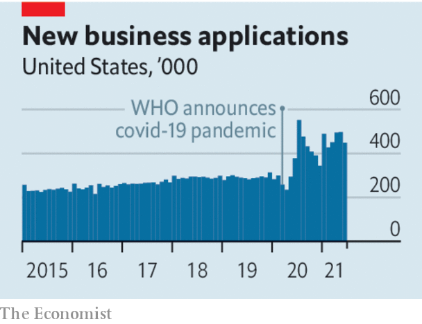

###### A dynamic do-over

# Rumours of the demise of American enterprise are exaggerated 

##### Policymakers must resist fixing its imagined problems 

 

> Sep 18th 2021 

SOMETHING IS ROTTEN with the state of American capitalism. That, at least, is the sentiment in Washington, DC. Democrats and Republicans argue over the rot’s causes. Progressives blame corporate fat cats. Conservatives finger feckless regulators. But there seems to be agreement across the ideological spectrum that American enterprise isn’t what it used to be: less dynamic and more monopolistic at home, and having its lunch unfairly nibbled by Chinese and other rivals abroad.

Not so fast. As our analysis this week shows, on many measures America Inc is  (see Business section). Not everything is perfect, obviously. But a misapprehension of the corporate reality risks ushering in myth-based policies that end up doing more harm than good.


Declinism about corporate America is hardly new. In some ways American business has indeed been less vivacious of late. The share of employment in new companies fell from 4% in 1980 to around 2% in the 2010s. Three in four American workers are employed by a company that is more than 16 years old, up from two in three 30 years ago. Over the past half century ever fewer people have switched jobs or moved across state lines. In the mid-1990s newly founded firms outnumbered those which folded by around 80,000 a year. By the mid-2010s corporate births were barely keeping up with corporate deaths. Given that new companies play a big role in creating jobs, this meant fewer opportunities for American workers and investors alike.

Cross-border mergers and acquisitions by American firms as a share of domestic M&amp;A activity declined from 16% in 2014 to 9% in 2019. American products were perceived as losing out to foreign rivals, from Toyotas to Tencent’s video games. At home, big incumbents’ growing market shares risked lulling them into complacency, or worse, enabling oligopolistic abuse. Between 1997 and 2012 two-thirds of the 900-odd sectors tracked by the five-yearly economic census became more concentrated, with the combined market shares of the top four firms rising from a quarter to a third.

 


Complacent or not, established companies’ spending on new factories, technologies, and research and development stagnated. Computing and the internet apparently lacked the transformative power of earlier breakthroughs such as the aeroplane or the telephone. The dictum that “you can see the computer age everywhere but in the productivity statistics” sounded almost as apt in 2017 as it had when Robert Solow, a Nobel-prize-winning economist, uttered it in 1987.

The disruption wrought by covid-19 could have made things worse. Instead workers, companies and investors have re-evaluated their priorities and prospects. Many of the American businesses that emerged have a spring in their step.

Between January and June entrepreneurs started 2.8m new firms, 60% more than in the same period in pre-pandemic 2019. More people are quitting their jobs, almost certainly because they believe they can find something better. A surge of initial public offerings rivals that of the dotcom era. American companies have raised nearly $350bn since the start of 2020, more than in the previous seven years combined. And they are investing as if there were no tomorrow—or rather, as if tomorrow is there for the taking. Investments by big firms in the S&amp;P 500 index are forecast to reach $1.2trn this year, 20% more than in the recent past, and to exceed that level in 2022.

America Inc’s global footprint remains deep and wide, with companies earning roughly as big a share of their revenues abroad and outsourcing about as much manufacturing as they had in the past five years, although most firms are slowly adjusting their plans to reflect Sino-American tensions. For all the talk of tech monopolies, Apple is taking on Amazon, Facebook, Google and Microsoft in some of their businesses—and vice versa. Overall market concentration across all industries appears to have plateaued since 2012. And although managers may debate whether IT-enabled remote work is as productive as the office kind, it is without a doubt more productive than no work at all, which would have been the case amid lockdowns were it not for broadband, Zoom and other digital marvels.

President Joe Biden seems not to have noticed. He wants to lavish subsidies on national champions, and reportedly levy fresh tariffs on their Chinese rivals, in a bid to help American companies that need no such leg-up. Two Democratic senators have proposed a tax on share buybacks aimed at encouraging firms to reinvest more of their earnings, which they are happily doing as it is. Trustbusters are pursuing America’s tech giants without a clear idea of which markets their targets are competing in, and with an outdated view of how rival firms are adapting.

Elements of American capitalism remain less competitive than in the past. But before jumping in, politicians and regulators should recognise that it has rediscovered some of its vim. ■

