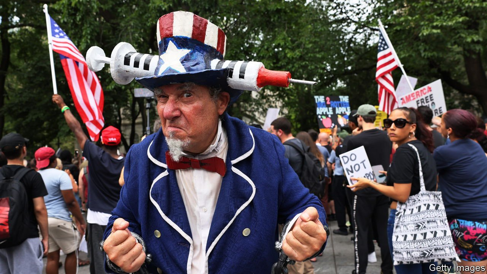

###### Needling

# Why America needs vaccine mandates 

##### State pressure has a role in public health. Covid-19 jabs are no exception 

 

> Sep 16th 2021 

ON SEPTEMBER 11TH 2001, when al-Qaeda attacked America, almost 3,000 people died. In response the government overhauled national security and, for better or worse, struck a new balance between liberty and security. On the 20th anniversary of 9/11 roughly 3,100 people in America died because of covid-19. Another 3,100 died on September 12th. And again on the 13th.

By , based on excess deaths, the pandemic has claimed 860,000 lives in America. Yet measures to curb the virus by , which the Biden administration announced on September 9th, are being treated by senior Republicans as a terrifying affront to liberty. “This is still America,” tweeted Tate Reeves, the governor of Mississippi, “and we still believe in freedom from tyrants.” That is fatally wrong-headed. The details of the Biden mandate could be improved on, but in democracies public health sometimes requires some coercion.


Across the world, governments from France to Australia are using pressure of one sort or another to boost vaccination. That should be no surprise. Ever since vaccines were invented, the state has asked some people to be jabbed to keep viruses such as yellow fever at bay. The justification for this intrusion was set out by America’s Supreme Court as long ago as 1905: even if in most cases you are free to refuse treatment, you are not thereby free to infect other people.

The question is whether each country’s requirement is proportionate. That depends on the threat and the costs and benefits of pressure. The calculus differs from one place to another.


What should not be in doubt is the danger posed by the Delta variant of covid-19. It is too infectious to be stopped simply by tracking cases. Vaccinated people, especially the elderly, gradually lose protection. If infected they can die, albeit at only one-tenth the rate of the unjabbed. Waves of infection overwhelm hospitals. Treating the unvaccinated cost $3.7bn in America, or $20,000 a patient, in August—a waste of resources.

For all these reasons, your choice over vaccination is everyone’s business. It matters that only 63% of Americans aged over 12 have had two doses of a vaccine, compared with 76% of French and 85% of Danes. Delta’s rapid spread through the population can be slowed by vaccination, sparing hospitals from overload and protecting vulnerable vaccinated people—for instance, the residents of old-people’s homes.

Academics worry that mandates merely sort the hesitant from the hardliners. You get a rapid increase in vaccination, but only to a level at or below what it would anyway have reached. One reason for this is that those convinced of a government plot see coercion as proof. That is why it is wise to keep punishments light and to offer free tests as an alternative to jabs—something the Biden plan fails to provide, but should.

However, the evidence from France is more encouraging. In July, to much grumbling, the state required a  or negative test for a range of activities, including visiting bars, restaurants, sports stadiums and shopping centres (see Europe section). A month later nearly 10m people had rushed to be vaccinated—and today the total share is 20 percentage points higher. Our World in Data reports that the share of French who say that they definitely will not be vaccinated fell from 35% in mid-June to 23% in mid-August, the most recent figures.

A survey of over 50 countries in August by Johns Hopkins, an American university, found that over half of unvaccinated respondents said they definitely or probably will not get a jab. Governments cannot rely on mandates alone to get them to change their mind. Instead they also need to focus on their country’s particular hang-ups: Turks doubt covid-19 vaccines will work, Czechs don’t like vaccines in general, Americans worry about side-effects. The one thing elected officials should not do is to reinforce vaccine hesitancy by falsely presenting all mandates as an attack on constitutional liberties. ■

Dig deeper

All our stories relating to the pandemic and the vaccines can be found on our . You can also find trackers showing ,  and the virus’s spread across .

