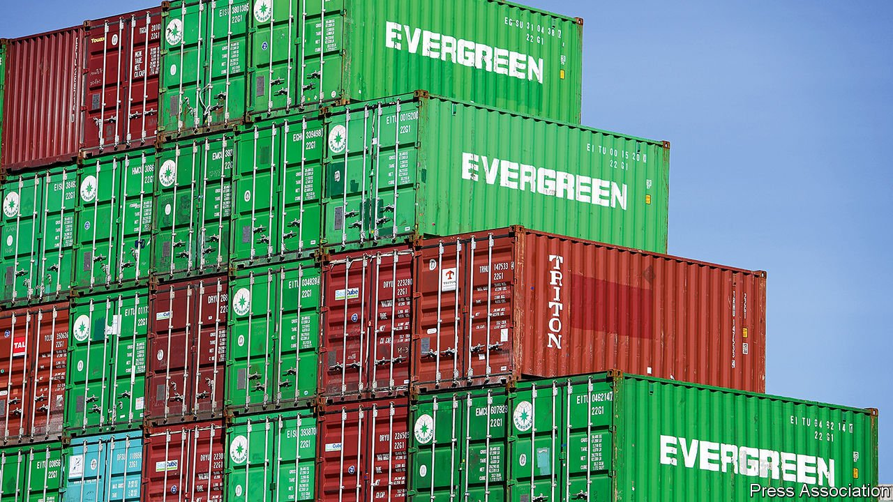

###### World trade

# Why skippers aren’t scuppered 

##### Supply chains are adapting, not failing 

 

> Sep 18th 2021 

MUCH OF THE time most people do not think about the complex choreography that makes modern shopping possible. You just click and wait—and not too long, mind—for a package or three to arrive on your doorstep. Over the past few months, however, the world’s supply chains have elbowed their way into the foreground, as surging demand for goods and  have restricted the flow of trade. At ports around the world, dozens of ships stacked high with containers wait at anchor for their turn to unload, while the cost to ship a box from China to America’s west coast has jumped roughly tenfold from the pre-pandemic level.

You may think the snafus represent the beginning of the end of globalisation. Consumers are learning how infections half a world away or a ship stuck in the Suez Canal can disrupt the near-instant access to goods they take for granted. Manufacturers are discovering that lean supply chains can mean inadequate access to essential components as well as low costs. The disruptions are one reason inflation is high in America, Britain and elsewhere. But amid the logistics blues, markets are working as they tend to do, and firms are finding routes around blockages. Under intense pressure, global supply chains are not in fact failing; they are, rather, adapting.


The troubles began in 2020, when firms that had idled production in the expectation of a slump instead faced heavy demand for cars, electronics and home-exercise equipment. Generous stimulus, in America especially, kept order books full while the pandemic skewed spending toward goods rather than services. Producers of computer chips have been unable to keep up with the rush. The shipping industry had no spare capacity and has faced a series of disruptions, from the saga of the stuck ship Ever Given, to the closing of ports amid outbreaks of covid-19 and storms like Hurricane Ida. With the system stretched thin, a mishap anywhere affects the movement of goods everywhere. Experts reckon it may take a year or more for conditions to return to something like normal.

In the meantime, firms are neither twiddling their thumbs nor abandoning global supply chains. Instead, they are improvising. Some retailers, like Walmart, have taken to chartering entire ships exclusively for their own cargo. Passenger aircraft are being refitted for freight. Chipmakers are weighing their priorities: TSMC, from Taiwan, is supplying some carmakers and Apple before producers of computer servers, say. Soaring shipping fees themselves help adjust the flow of goods. Higher freight costs scarcely affect the price of expensive electronics which can be crammed into containers, but matter more for bulky, low-value goods like garden furniture. Some consumers may be disappointed, but this means that shipping tangles depress the value of trade by less than might otherwise be the case.

The strains on supply chains will leave their mark. This year capital expenditure will be exceptional—global investment is likely to be 15% above the pre-pandemic level by the end of 2021, reckons Morgan Stanley, a bank. Firms are aware of the risk from shipping disruptions and trade disputes and are tailoring their investment programmes accordingly. In places like America and Japan they have been encouraged by government policies to incentivise the “reshoring” of production. Toshiba, a Japanese electronics firm, is  a long-standing factory in China. A number of carmakers are bringing bits of their supply chains in-house or at least closer to home, especially for chips. New orders for smaller container ships may reflect the view that production will become more regionalised.

Shipshape

Global supply chains will survive this trial. Indeed, the adjustments and investments made in response to recent woes are likely to make them better able to cope with disruptions—by ensuring adequate supplies of critical components, for example. That should allow them, eventually, to fade once more out of sight and out of mind. ■

