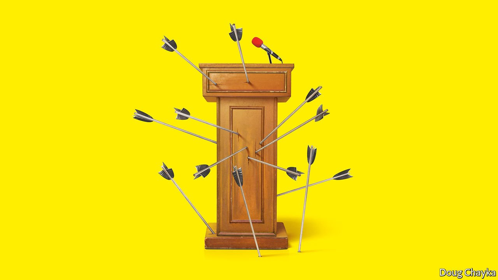
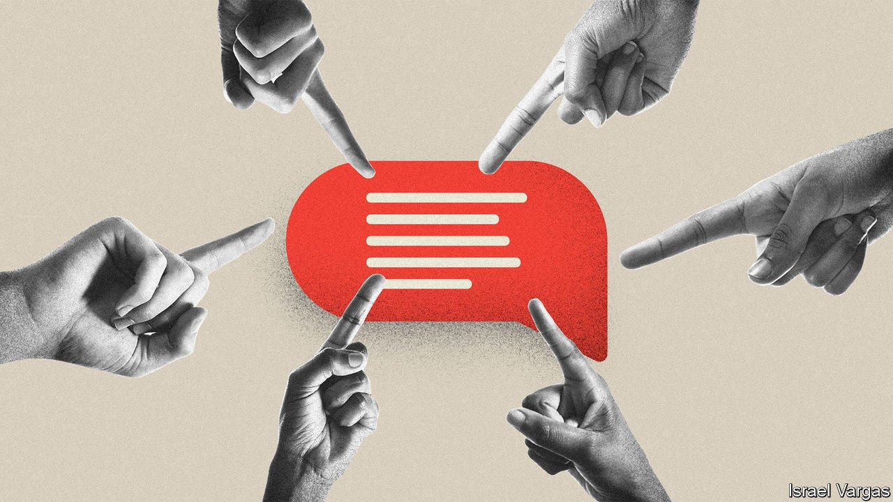

###### On the rise of illiberalism

# Letters to the editor 

##### A selection of correspondence 

 

> Sep 18th 2021 


The woking class

Your warning on the dangers of wokeism would leave many of the old thinkers on the left turning in their graves (“”, September 4th). The stunt pulled by the illiberal left is their assertion that they are the champions of the marginalised. I do not doubt many are sincere, just as the leaders of the Catholic church were sincere in the Inquisition. Religious fundamentalists of all sorts are sincere. But thinking you know best does not qualify for making a better world. Unless you are willing to debate your ideas openly, you are by definition an authoritarian conservative.


The modern-day book-banners, no-platformers, deniers of free speech and opponents of universalism in the name of identity politics are not of the left, the liberal left or even the New Left of the 1960s. As a student in the 1960s, I marched to demand free speech, the end of the war on Vietnam and civil rights. We were condemned as communists and beaten if unlucky to be near a police baton. Voltaire and John Stuart Mill inspired us. This is what Eric Hobsbawm, a British Marxist, had to say on identity politics:

The political project of the left is universalist, it is for all human beings…It isn’t liberty for shareholders or blacks, but for everybody…It is not fraternity only for old Etonians or gays, but for everybody. And identity politics is essentially not for everybody but for members of a specific group.

The Economist has got the ball rolling in the right direction.

TOR HUNDLOE

Emeritus professor

University of Queensland

Brisbane, Australia

 


The rise of the illiberal left is something I have watched with alarm during 40 years in academia. There are many reasons for this, but the greatest has been the sustained attack on the ideals of the Enlightenment which, ironically, were embraced by Karl Marx. He would almost certainly have treated woke-folk with contempt.

The problem lies in our failure to understand properly the original premises of our Enlightenment heritage. The ideals you refer to (“”, September 4th) are those mostly developed fully by Adam Smith as a moral philosopher (not as an economist). Smith’s mentor and teacher was Francis Hutcheson, whose influence is most clearly seen in Smith’s first book “The Theory of Moral Sentiments”. Here, Smith builds on Hutcheson’s arguments against greed and self-interest. The original reasoning in favour of individual freedom and liberty was to enable people to develop their talents both for their own self-worth and for the good of the community.

Hutcheson was equally scathing on rights, which could quickly become a cover for greed and selfishness. Hence Hutcheson posited that rights must always be balanced against the virtue of an act, or its effect on others. This is an important moral corrective that is continually ignored in our pursuit of narrow individual or identity-group rights.

JAMES DINGLEY

Chairman

Francis Hutcheson Institute

Belfast

Free and open debate is great, in theory. In practice we tend to hear rather more of what the billionaire with a megaphone has to say than the young single mother.

ALEX CAMPBELL

Brighton

Your articles exposing illiberal progressives are singular in today’s mainstream media, and hopefully will inspire the slackers to join in. In explaining why the woke plague has broken out from dormancy you concentrate on academia. But locus is not cause, and although you are right to point to students and college administrators, we must also ask how they became infected.

The virus springs from a new class, a “meritocracy” based on test scores, a New Elite. Previous elites were based on force or wealth, but today’s feels that its wisdom has been “proven”, and so abridges all dissent.

DAVID LEBEDOFF

Minneapolis

Loyalty oaths are not a novel, “woke” development at the University of California. Loyalty oaths were imposed on its employees in the 1950s, when a right-wing state legislature got caught up in the Red Scare and tried to flush out closet Marxists. This utterly failed. To put it mildly, there are quite a few Marxist dons in California’s university system today. In a twist of irony Ernst Kantorowicz, a scholar of medieval studies and strident anti-communist, lost his job when he refused to take the McCarthyite oath on principle. Woke oaths will fail, too.

ELIJAH GRANET

San Diego

Oh, Economist, I thought you'd got past all this. Saving the liberal order is a defensible, if quixotic, goal, but sniping at progressive excesses and dismissing the critique as restlessness doesn't help. Objectivity begins at home.

Consider just economics and the mantra that businesses must not be sheltered from the gales of creative destruction. Fair enough. If you want to win you accept the rules. But liberalism sees only the game and its players. What about collateral damage? The costs of capitalism’s creativity are being paid in chronic disease, family stress, community upheaval, social scapegoating, political dysfunction and climate disaster. Impatience is warranted.

DOROTHY NOYES

Professor of English and comparative studies

Ohio State University

Columbus, Ohio

 


I am not a supporter of blind wokeness, but your arguments were so one sided that I realised that the woke have a point when they champion greater diversity at powerful institutions like The Economist.

Moreover, it was not the woke who drove Brexit in Britain, or the insurrection of January 6th in America. It was not the woke who have enabled the resurgence of covid-19, not the woke who plotted to kidnap and execute the governor of Michigan, or convinced millions of Americans that the election of 2020 was stolen, or stifled any honest American confrontation with climate change.

It is true that the woke do too often stifle debate and end careers, but they are not the threat to democracy and reason that the warriors and profiteers on the right are.

MICHAEL COLLINS

College Station, Texas

It is important to stand up for what you believe in and defend your beliefs, but we should also strive for humility. It would be beneficial for all to remember the words attributed to Bertrand Russell:

The whole problem with the world is that fools and fanatics are always so certain of themselves, and wiser people so full of doubts.

EWAN HICKLING

Stellenbosch, South Africa

One thinks of Michael Macy’s sociology experiments illustrating how, when faced with an illogical group consensus, individuals tend to publicly agree and even condemn dissenters, while privately expressing concern.

Unsupported theories, such as those of the illiberal left, that have taken root in societies require brave individuals to break the cycle and express their disagreement, regardless of the condemnation. But someone else can go first.

ANONYMOUS

New York

