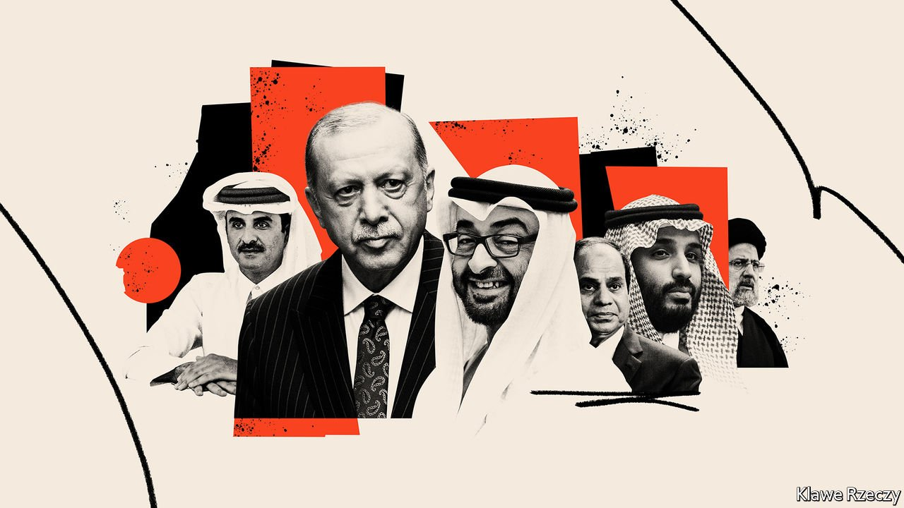

###### Less battle, more banter

# Middle Eastern foes are giving diplomacy a shot 

##### Exhausted from years of conflict and eager for growth, rivals are talking 

 

> Sep 18th 2021 

IT WAS A surprising choice for a summer holiday. On August 18th Tahnoon bin Zayed, the national-security adviser of the United Arab Emirates (UAE), turned up in Ankara to meet Recep Tayyip Erdogan, the president of Turkey. The countries have been at odds for years over Mr Erdogan’s support for Islamist groups around the Middle East. Turkish officials accused the UAE of abetting a failed coup in 2016. But none of that was mentioned in the official statement after their meeting, which talked instead of economic co-operation.

A week later Sheikh Tahnoon met the emir of Qatar, becoming the most senior Emirati official to visit Qatar since the UAE and three other Arab states imposed an embargo on it in 2017. Again, there was cheery language about co-operation. The sheikh is one of the UAE’s most influential figures, a brother of Muhammad bin Zayed, the de facto ruler. His visits were a sign of a shift in Emirati foreign policy. It is not the only country changing course.


There are two main faultlines in today’s Middle East. One pits the Gulf states and Israel against Iran and its allies. The other runs between countries such as Turkey and Qatar, which are sympathetic to Islamists, and Egypt and the UAE, which are not. These schisms have fuelled conflict in the Levant, Libya and Yemen, and less bloody disputes elsewhere.

Over the past five months, though, long-standing foes have embarked on a rush of diplomacy. Saudi Arabia and Iran started a dialogue in April. Turkey has sought to repair ties with Egypt, which soured after the Egyptian army overthrew an Islamist-led government in 2013 (Mr Erdogan was a vocal critic of the coup). Qatar and Egypt, which fell out for the same reason, are back on speaking terms. Egypt even allowed Al Jazeera, a Qatari satellite television network with an often pro-Brotherhood stance, to reopen its Cairo bureau, which was closed after the coup.

The capstone was a summit in Baghdad on August 28th that brought together officials from Egypt, Iran, Qatar, Saudi Arabia, Turkey and elsewhere. Though it ended with no concrete agreements, the act of talking was a breakthrough in itself: many participants would have been loth to attend such a gathering not long ago. Optimists hope these meetings may signal a thaw and a possible end to the region’s ruinous disputes. The Middle East is a cruel place for optimists—but in this case, their hopes may not be entirely misplaced.

The Saudi-Iranian feud, which reshaped the region after 1979, has settled into a frozen conflict over the past four years. In part that is because of Iran’s success, and Saudi Arabia’s failure, at exerting influence abroad. The Saudi crown prince, Muhammad bin Salman, made a series of foreign-policy blunders during his early days in power and has since shifted focus to transforming the oil-bound economy.

After pursuing its own aggressive foreign policy, the UAE has also begun to seek detente. Officials in Abu Dhabi, the capital, say this was a side-effect of covid-19. “It made us understand… that we had to turn back home and let go of certain kinds of engagements in the broader Middle East,” says an Emirati diplomat.

Introspective as it may sound, that is an ex post facto justification: the UAE began withdrawing troops from Yemen in 2019, months before the pandemic. The war had become a quagmire, while Emirati support for an anti-Islamist warlord in Libya ended in defeat (largely thanks to Turkish intervention). An activist foreign policy yielded few gains; better to focus on an economy which, although more diversified than those of its neighbours, is still unprepared for a looming energy transition away from oil. Ahead of the country’s 50th anniversary in December, officials are busy announcing a raft of economic initiatives.

Turkey has reached similar conclusions. Its economy has been hamstrung by 19% inflation, weak foreign investment and a long currency crisis. Regional feuds, not to mention disputes with America, the EU and Greece, are not helping. “The economy needs de-escalation,” says Galip Dalay of Chatham House, a think-tank in London. It also needs cash. Emirati investors might provide some. The lira’s devaluation means foreigners can snatch up Turkish assets at bargain prices.

Turkey also hopes to cash in on normalisation with Egypt. Despite their estrangement, trade between the countries reached nearly $5bn last year. Turkish officials say the potential is much higher. But mending fences with Egypt would also pay political dividends. Egypt, together with the EU, America and Israel, has sided with Greece and Cyprus in a dispute with Turkey over drilling rights in the eastern Mediterranean. Mr Erdogan’s government thinks a deal with Egypt can help it break out of its isolation, so it is trying to negotiate one.

All of this would be quite a U-turn. Yet by now there are hardly any Islamists left to support. Abdel-Fattah al-Sisi, Egypt’s dictator, has ruthlessly dismantled the Brotherhood. Even in countries where Islamists are free to compete in politics, their popularity is . For Turkey and Qatar, the costs of continued confrontation with Egypt and the UAE are great, the benefits slim.

Disputes with Iran are harder to solve. The regime in Tehran will not negotiate away its hard-won influence in the Arab world. Instead the Gulf states may seek only to secure their own backyard. They became keenly aware of their vulnerability after Donald Trump’s “maximum pressure” campaign led Iran to sabotage oil tankers in the Persian Gulf and supply drones and missiles for a surprise strike on Saudi oil facilities in 2019. A wider conflict would be ruinous. Officials fret, for example, that a well-placed salvo of missiles aimed at desalination plants could render the Gulf unlivable within days.

In their own ways, then, everyone enters these talks from a position of some weakness. The Gulf states are wealthy but brittle, whereas Iran and Turkey are muscular but broke. The Baghdad summit ended with a joint statement pledging “non-interference in the internal affairs of countries”—ironic, since the participants are notorious for interfering. They are unlikely to stop. Regional diplomacy is thus little comfort for citizens of places like Lebanon and Iraq, which barely exist as sovereign states. These are talks between autocrats keen to protect their own grip on power and boost their economies: not peace in our time, only within our borders. ■

