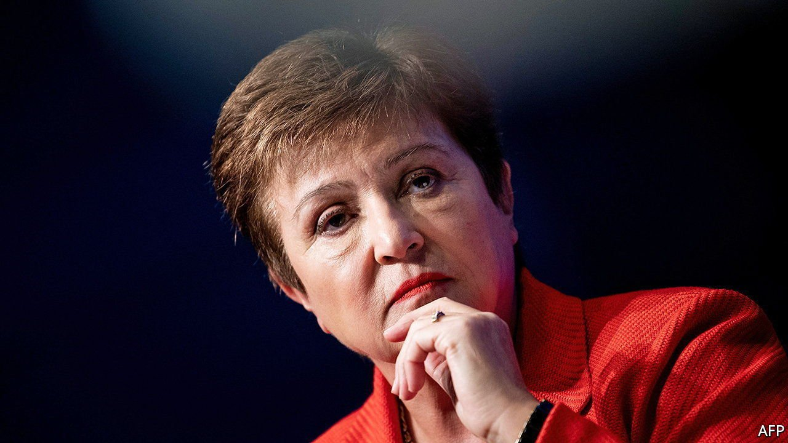

###### Withdrawal declined

# The IMF is growing more picky about who it funds 

##### Ageing autocrats have to clean up before cashing out 

 

> Sep 18th 2021 

MANY AFRICANS still harbour a grudge against the IMF that dates back to the 1990s, when it became known for the bitter medicine it administered. Before any bail-outs, the fund would insist that countries agree to painful structural-adjustment programmes that included cutting government spending and liberalising economies. Since then the IMF has worked hard to present itself as a cuddlier lender than the cold-hearted fund of old. These days it attaches far fewer conditions to loans and sometimes overlooks even those.

Yet recent events in west and central Africa suggest it is being forced to find some of its old mettle, at least in private, as it tries to balance the sometimes competing goals of getting emergency pandemic money out quickly while also fighting corruption. Take oil-rich Equatorial Guinea, a family-run kleptocracy that struck a three-year $283m bail-out agreement with the IMF in 2019. Although the fund handed over some cash immediately, it has since rather quietly stopped signing cheques. An IMF spokesman blamed covid-19 and an explosion at an army base for the country’s slow pace of reform. The programme, which is due to expire next year, looks set to follow the fate of one in nearby Congo-Brazzaville.


The IMF agreed in 2019 to lend $449m to Congo-Brazzaville, whose president, Denis Sassou Nguesso, a sprightly 77-year-old, has been in power almost uninterrupted since 1979. The IMF released some cash immediately. But after that its purse stayed closed until the programme expired in April. This was officially because of “debt sustainability challenges”. But the fund made clear its frustration at the slow pace of anti-corruption reforms.

Bigger tests lie ahead. In July the IMF approved loans to Gabon and Cameroon, which are also run by ageing autocrats. Many of those who once accused the fund of being too bossy in the 1990s would quite like to see it being still bossier now. Human Rights Watch, an American watchdog, has asked the IMF to make its $690m programme with Cameroon conditional on the country meeting human-rights commitments and auditing covid-19 spending amid allegations that money has been stolen. It’s not a bad idea.

