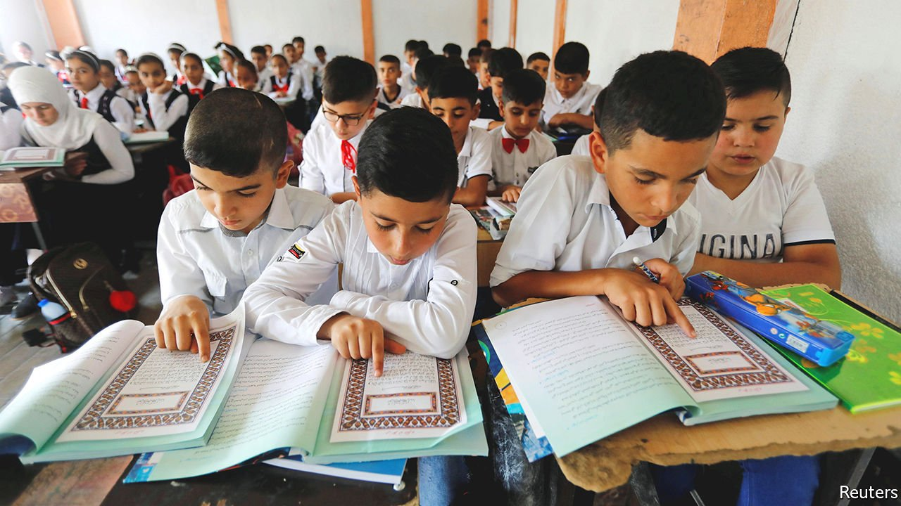

###### No book at bedtime

# The travails of teaching Arabs their own language 

##### New methods of education may be deemed subversive 

 

> Sep 18th 2021 

GOD, SAYS the Koran, chose Arabic for his revelation because it is easy to understand. But many of the world’s 470m Arabic-speakers beg to differ. According to a report by the World Bank, almost 60% of ten-year-olds in Arabic-speaking countries (and Iran) struggle to read and understand a basic text. Despite decades of investment in education, the Middle East and north Africa still suffer from what the report calls “learning poverty”. “School systems don’t see the importance of engaging kids in reading—or don’t know how,” says Hanada Taha-Thomure, one of the authors. “It creates a gap between children and their language. Many can’t read or write an essay.”

The root of the problem is bad teaching. Arabic lessons are dull and focus on fiddly grammar. Classrooms often have no printed material. Few schools have libraries. Teachers tend to lack “sufficient mastery of the language itself”, says the report. In universities across the region, Arabic departments, along with religious studies ones, attract students with the lowest grades.


In Morocco almost 60% of teachers of ten-year-olds have no higher education. Only Bahrain has a teacher-training college that specialises in teaching Arabic. Teachers tend to be traditionalists, sometimes resorting to beating. Children “don’t love the Arabic language because not even 1% of teachers are reading stories to their students for pleasure,” said Ms Taha-Thomure, a professor at Zayed University in the United Arab Emirates (UAE).

Some blame the language itself. Pupils are taught Modern Standard Arabic (MSA), the formal tongue of officialdom, yet they grow up speaking a native dialect. The dialect closest to MSA is spoken by Palestinians, yet only about 60% of the local lingo overlaps with MSA. The Moroccan dialect diverges far more.

Adults often stumble over the written word, too, so bedtime reading to children is rare. Only about a quarter of Arabic-speaking parents read to their children often, compared with more than 70% in much of the West. Reading for pleasure is widely regarded as critical for a child’s future success. But studies show that Arabic-speaking children do much less of that than children in the West.

Arab education ministries are waking up to the problem. Egypt has developed a trove of online material to bypass the traditionalists. The UAE has begun fitting classrooms with “reading corners”. Across the Arab world girls far outperform boys, in part because female teachers tend to be better, so Saudi Arabia has defied crusty clerics and let women teach boys (though separately from girls). Its education ministry is puncturing the mystique of the sacred texts by distributing Japanese-style comics to every Saudi child over ten, with superheroes speaking Arabic slang. “We are facing generations that do not speak the Arabic language,” says Essam Bukhary, the CEO of Manga Arabia, which produces the comics. “We want to promote reading as a hobby for younger generations.”

Traditionalists quake at such irreverent handling of the sacred language. And Arab regimes are nervous of the free expression a more liberal approach may inspire. Their censors are banning books as keenly as ever and ensure that newspapers all say the same thing. Many officials prefer to keep children disciplined by making them memorise what they’re told, says Andrew Hammond, a lecturer in Arabic culture at Oxford University. Otherwise, he says, they might start thinking for themselves. ■

