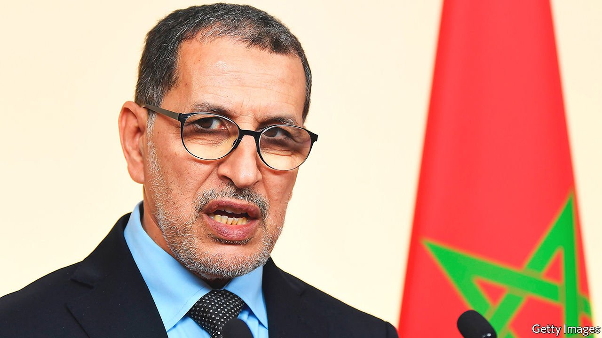

###### Out of power

# What next for Islamists in the Arab world? 

##### Setbacks in Morocco and Tunisia mark the end of a tough decade for Islamists 

 

> Sep 18th 2021 

THE STRICT Islamism of the Taliban may be back in Afghanistan, but peaceful Islamists in the Arab world have struggled of late. Ennahda, which styles itself “Muslim democratic”, had been the biggest party in Tunisia’s parliament—until President Kais Saied suspended the assembly in July. Just over a month later, in Morocco, the Justice and Development Party (PJD), another moderate Islamist outfit that led the ruling coalition, suffered a crushing defeat at the polls, losing 90% of the seats it had held.

A decade ago Islamist parties were on the rise in the Arab world. Often seen as more virtuous than their rivals and adept at providing services, the parties were well placed to take advantage of the democratic revolutions that swept across the region in 2011. In Egypt the Muslim Brotherhood won the country’s first free and fair elections. Ennahda became a force after Tunisia adopted democracy. And the PJD was Morocco’s largest party for ten years.


“Look back to the Arab spring, these parties swept to power promising to bring hope and change,” says Hamza Meddeb of the Carnegie Middle East Centre, a think-tank. “They haven’t delivered that.” Egyptians quickly soured on Muhammad Morsi, the Brotherly president who declared himself immune from judicial oversight and rushed through a flawed constitution. He was pushed out by the army in 2013, amid enormous protests against his rule.

Ennahda and the PJD may have learned from the Brotherhood not to overreach. For example, when large protests pushed Tunisian democracy to the brink in 2013, Ennahda compromised over a new constitution and relinquished power. But its willingness to work with opponents and its concessions led some Tunisians to accuse it of opportunism. “I think there was a failure to explain why that was necessary,” says Ahmed Gaaloul, a party leader.

Even if it wasn’t fully to blame, Ennahda became associated with a decade of economic hardship, endemic corruption and poor governance. “By compromising with economic elites and accepting the status quo, they failed economically,” says Mr Meddeb, referring to Ennahda and the PJD. “By compromising with other parties and on policy, they failed ideologically.”

Like Ennahda, the PJD tried to shed its Islamist image. Nevertheless, it struggled to get its way. It was unable to stop laws authorising the therapeutic use of cannabis, pushing the French language in education (at the expense of Arabic) and reforming the voting system. Last year the PJD prime minister, Saad Eddine El Othmani (pictured), vowed never to deal with Israel. Weeks later Morocco normalised relations with the Jewish state. Critics called the party spineless, weak and incompetent.

Defenders of the PJD say it ran up against Morocco’s most powerful institution, the monarchy. Though King Muhammad VI gave more power to parliament after the Arab spring, most big decisions remained his to make. He directs economic and foreign policy. The agreement with Israel was hashed out by the royal court. Media in thrall to the king give him credit for successes, such as the rollout of covid-19 vaccine, and blame failures on the government. The PJD also accuses rival parties of buying votes.

The party is not alone in feeling that the system is rigged against it. In Egypt the Brotherhood faced opposition from the police and civil servants, who refused to do their jobs, and judges, who dissolved parliament. The intelligence services, aided by foreign governments, worked to bring the group down. Ennahda had a freer go of it, but it eventually butted heads with Mr Saied. His power grab, though clearly undemocratic, has been enormously popular.

The risk is that Islamists in the Arab world learn a dangerous lesson. Why take part in political systems that aren’t free or fair? Why put faith in parties that get nothing done? Better to follow the example of the Taliban, which took up arms and defeated a superpower. Mr Gaaloul, though, is sanguine. He thinks Tunisian activists and civil-society groups will safeguard democracy. “If they show they are really able to make a difference, you’ll no longer even have a need for Islamism,” he says. “You’ll just have a democracy run by Muslims.” ■

