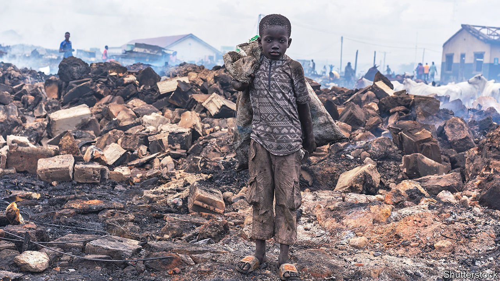

###### All work and no play

# Why the number of children working is rising 

##### And what to do about it 

 

> Sep 18th 2021 

EDWARD BAKA, the headmaster of a school in Kono district next to Sierra Leone’s biggest gold mine, recalls how once he had to sell the school’s books to pay for a roof. Of the 700 children aged 4-13 under his care, 80% are in work, too, he reckons. Most toil in mines or on farms. The working kids are easy to spot. They have less energy. They can’t concentrate. They have health problems. Recently a child from a neighbouring school was killed in a mud slide at a mine. “Everyone knows that mining is not for children,” says Mr Baka.

Most people would agree. But the experience of Mr Baka’s pupils is less unusual than they might hope. A recent report by Unicef, the UN’s agency for children, and the International Labour Organisation (ILO) found that between 2016 and 2020 the number of working children around the world had risen for the first time since 2000, to 160m, with all of the net increase in sub-Saharan Africa. On the continent more than a fifth of children, or some 87m, work. Worryingly the figures do not show the impact of covid-19, which has almost certainly pushed more children into work owing to school closures and growing poverty. In the Central African Republic, a survey of 102 diamond mines found that between 2019 and 2020 the number of workers under 15 increased by 50%.


At a stone quarry on the outskirts of Freetown, Sierra Leone’s capital, Osman’s frame is muscled beyond a typical 12-year-old’s. He wants to be a doctor, but now spends four hours a day breaking rocks into gravel. The work has given him scars and welts. The ILO reckons that some 39m African children are involved in similarly dangerous work, such as fishing or mining.

Sometimes the work is even more exploitative. Children from the countryside are often sent by their parents to cities to get education, only to be put to work by relatives, acquaintances or criminal gangs. From there it can be a “slippery slope” to child-trafficking and other forms of abuse, says James Riak, who works in Freetown for GOAL, an Irish NGO. From Zambia to Nigeria, millions of children as young as five toil as domestic servants. In Nairobi, where “house helps” are common, child labour is one of the most common problems cited by people calling Kenya’s national child helpline.

Yet sometimes work benefits children, argue some academics. Consider a child who works for an hour before school on his parents’ farm, says Jim Sumberg of the Institute of Development Studies at the University of Sussex. This is typical, given that 70% of child labourers work on farms. It might tire him and he might use a hoe, which the ILO considers dangerous and thus lumps under its definition of the “worst form of child labour”, a category that includes child soldiering and prostitution. Yet were he not working, the whole family might go hungry.

Other experts worry that well-meaning interventions can make things worse for children. They point to the fervent international campaign to eradicate child labour in the cocoa industry, even though 94% of children in the industry work for their parents or relatives. Criminalising child labour has led to raids on communities and incidents of NGOs removing children from cocoa farms or remote fishing villages, as has often happened in Ghana. “Snatching the child from their family or indeed stopping the child from working isn’t a solution at all,” argues Samuel Okyere of Bristol University. “You can’t put all working children in orphanages.”

The African Movement of Working Children and Youth, a sort of child-labourers’ union which is active in 27 countries, says its members have no choice but to work. Instead of outlawing labour, it calls for better protection for child workers.

Such views have been strongly criticised by governments and international organisations. The idea that there should be two standards of rights—one for richer children and one for poorer children—is “a bit bizarre” says Benjamin Smith, a child-labour expert at the ILO. Others balk at the prospect of undermining the huge strides made in the provision of free education to children across the continent. Even if the quality is poor, it still gives children a chance to improve their lot, says Sabelo Mbokazi of the African Union.

There is little disagreement on what is driving the increase in child labour. “It's not a big mystery, poverty is the main root cause,” says Mr Smith. Studies cited by the ILO suggest that a percentage-point rise in poverty in a country leads to at least a 0.7 percentage-point increase in child labour.

In Ecuador cash transfers have been effective at keeping children in school and out of the fields. Investing in schools, teachers and resources will make schools worth attending in the eyes of students and parents. Opportunities for mothers will make a difference, too. “I didn’t choose this for my children,” says Mabinty Dukuray, who works at a quarry with her six children. She and other women say that money to start their own business, such as a market stall or a hairdressing salon, would allow their children to stop working. Some women might be better off farming vegetables, says Mohamed Jalloh, who is developing such a scheme in Kono.

For now, though, few poor children or their parents have access to such schemes. Hawa and her ten-year-old daughter are among dozens of people sifting through pools of red clay in Kono in the hope of striking gold. Hawa has four older children, but her daughter is the only one who agrees to help at the mine. Their family name is Baka. Even the headmaster’s daughter is working at the mine. ■

