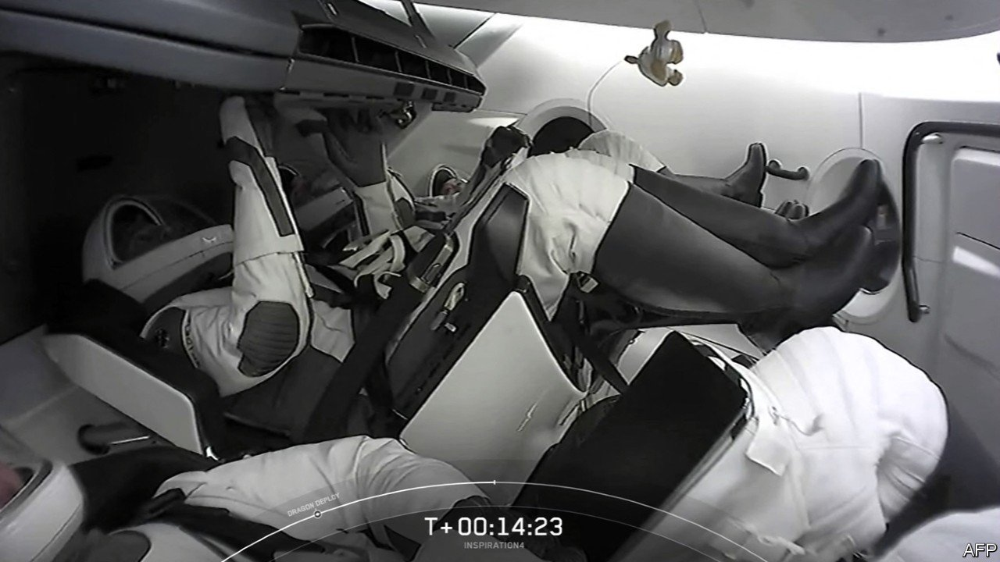

###### Lights, camera, lift-off

# SpaceX sends the first-ever civilian crew into Earth orbit 

##### This latest billionaire space mission is the most ambitious yet 

 

> Sep 16th 2021 

REALITY TELEVISION loves small, enclosed worlds; space travel requires them. That these two facts would, some day, come together has long seemed inevitable. The launch of four civilian astronauts from the Kennedy Space Center in Florida in the early hours (in Greenwich Mean Time) of September 16th sealed the deal. It is normal, these days, for space launches to be streamed on the YouTube channel of the space agencies and companies involved. An East Coast prime-time livestream on Netflix’s YouTube channel for the launch of a mission which is the subject of an ongoing documentary series on the streaming service, “Countdown: Inspiration4 Mission to Space” is something else. Footage from the mission will be used in a feature-length final episode to the series which will stream later this month.

The Inspiration4 mission was conceived and paid for by Jared Isaacman, the founder of Shift4 Payments. Very rich entrepreneurs going into space has been something of a trend in recent months, with Richard Branson being flown to 85km in a rocketplane built by Virgin Galactic, a company he founded, and Jeff Bezos reaching 107km in a capsule launched by New Shepard, a rocket built by his company, Blue Origin.


Mr Isaacman’s trip is different. It is being undertaken not to show off his own wares but to enjoy the possibilities afforded by someone else’s—specifically those of SpaceX, a company founded and run by Elon Musk—while at the same time raising money for St Jude Children’s Research Hospital in Memphis, Tennessee.

The trip is also far more ambitious. Rather than plopping straight back down to Earth a few minutes after crossing a largely arbitrary line in the upper atmosphere which defines “space”, as Sir Richard and Mr Bezos did, Mr Isaacman and his three companions have gone all the way to orbit, propelled by a SpaceX Falcon 9 launcher. Within hours their Dragon2 spacecraft had raised their orbital altitude to around 575km, some 150km higher than that of the International Space Station (ISS). As Netflix will delightedly demonstrate, they will be able to look out at space and down at Earth through a transparent cupola specially fitted to their Dragon2 to enhance the experience. On September 19th, after more than 40 orbits—40 sunrises, 40 sunsets—they will re-enter the atmosphere and splash down in the Atlantic. Their three-day progress will be visible in clear night skies around the world, for those who know where to look.

The launch, like all big rocket launches, was spectacular. Like almost all such launches it was also routine. The trajectory on which it arced out over and above the Atlantic was pretty much indistinguishable from that of the flights SpaceX provides as part of its contract with NASA to take astronauts to and from the ISS. Fulfilling that contract was what got SpaceX into human spaceflight; tourism is a sideline it is exploring now that that main business is up and running.

The resemblance goes all the way down to the flight hardware. The capsule that Inspiration4 is using, called Resilience, was used for a trip to the ISS last year. The first stage of the mission’s Falcon 9—which landed back on Just Read The Instructions, one of SpaceX’s drone ships, nine minutes after take off—was making its third flight. It is a measure of SpaceX’s pioneering success in developing reusable hardware that its customers have no qualms about launching their satellites—or even themselves—on a refurbished booster or in a refurbished capsule (even the Pentagon, which was cagey for a while, is now happy with the idea of a previously used launcher). Another measure of the company’s pre-eminence is that Resilience is one of three Dragons in orbit at the moment; her sister ship Endeavour has been docked at the ISS since April, and an unnamed cargo-carrying version of the capsule arrived there at the end of August.

Mr Isaacman—described in a review of “Countdown” in the Guardian, a British newspaper, as “that rarest of beasts, a genuinely personable billionaire”—is listed in the Inspiration4 manifest as “commander and benefactor”. He is accompanied by Hayley Arceneaux, a physician assistant at St Jude who was also, when a child, a patient there; Sian Proctor, a community-college professor from Tempe, Arizona—who will be the mission’s pilot—and Chris Sembroski, an engineer who works at Lockheed Martin, another aerospace company.

Though the quartet had been chosen before the show began—Mr Sembroski’s seat was won in a raffle to benefit St Jude; Dr Proctor’s in a competition run by Shift4—they are a telegenic bunch. That, along with the novelty of the situation they now find themselves in, may be enough to keep viewers entranced. It is worth noting, though, that although reality television and space exploration stand as one on the need for confined spaces, they are completely at odds in their attitudes to conflict and the unexpected. Television producers crave them. Mission controllers want none.

For real-time adversity and interpersonal rivalries, the astronaut-selection process may prove more fruitful than subsequent flights. Axiom Space, a company that aspires, in time, to build a private space station of its own, is in the meantime selling to private citizens SpaceX trips to the ISS as part of a deal made with NASA. These will mostly be perquisites of the very wealthy. But last May the Discovery Channel announced that one of Axiom’s passengers would be the winner of a new reality-show competition it was developing, “Who Wants to be an Astronaut?”.

There will doubtless be further opportunities. A Japanese entrepreneur, Yusaku Maezawa, has signed a contract for a trip around the Moon with SpaceX. This venture, called #dearMoon, may not take place for a few years, as it requires the services of an ambitious new rocket Mr Musk’s company is building, called Starship, which has yet to make its first orbital flight, and its exact scope is unclear. But the chances that it will have a reality-television element, and even a competition, are pretty good.

Some will be inspired by all this, just as Mr Isaacman and others want them to be. Others will undoubtedly be more cynical; it is hard to take journeys made by billionaires, lottery winners and game-show contestants all that seriously as a “democratisation of space”.

Their disquiet will not be entirely new. The idea that broadcasting makes space travel inherently inauthentic dates back to the Apollo era. After the first Moon landing Robert Lewis Shayon, an American journalist and radio producer, wrote in the Saturday Review that “wherever explorers go in the future accompanied by television cameras, they will be actors, making their nebulous exits and entrances for the benefit of multi-planetary audiences. Nowhere will there ever again be pure events (if ever there were); everything hereafter will be stage-managed for cosmic Nielsens.”

