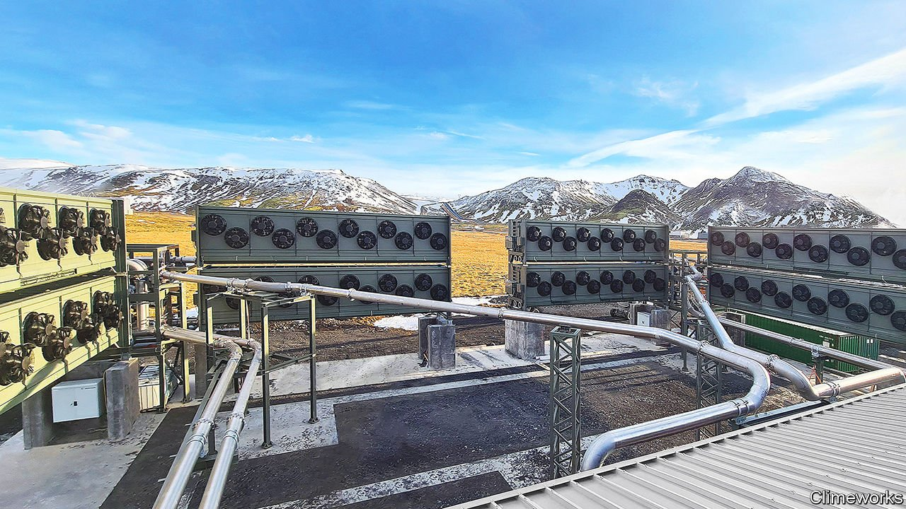

###### Removing carbon dioxide from the air

# The world’s biggest carbon-removal plant switches on 

##### Despite high prices, customers are lining up 

 

> Sep 18th 2021 

SHORTLY AFTER 6pm on September 9th, the Orca carbon-capture plant, just outside Reykjavik in Iceland, switched on its fans and began sucking carbon dioxide from the air. The sound was subtle—a bit like a gurgling stream. But the plant’s creators hope it will mark a big shift in humanity’s interaction with the climate.

Orca is, for now, the largest installation in the infant “direct air capture” industry, which aims to remove CO from the atmosphere. When sealed underground such CO counts as “negative emissions”—an essential but underdeveloped method for tackling global warming. To stop temperatures rising by 1.5°C or even 2°C above pre-industrial averages, as per the Paris climate agreement, hundreds or thousands of billions of tonnes of CO will have to be removed from the atmosphere in the second half of the century.


Currently, the only means of doing that is planting trees, an option that is not entirely without drawbacks. Trees burn in wildfires and can be cut down. When this happens, much of the carbon they store escapes. The Orca plant shows another way. Climeworks, the company that owns it, has developed chemical filters which snag CO when air passes through them. When heated they release the COagain, generating a stream of gas that is handed to another firm called Carbfix.

Carbfix pipes the gas to nearby wells, mixes it with water and pumps the resulting carbonated water into the bedrock. In Iceland that consists almost entirely of volcanic basalts, which contain minerals that react with carbon dioxide to form calcium carbonate, a white crystal that is the main ingredient in limestone. Thus, the full operation extracts CO from air and turns it to rock. Trials have shown that Icelandic basalts can sequester CO in solid rock within two years. Power comes from a nearby geothermal power station.

One catch is volume. Orca will capture 4,000 tonnes of carbon dioxide a year, out of around 35bn tonnes produced by burning fossil fuels. Climeworks is “confident” it can reach millions of tonnes before the decade is out. (A previous, eye-popping ambition to grab 1% of emissions by 2025 is no longer on the cards.)

Another is cost. It costs Orca somewhere between $600-800 to sequester one tonne of carbon dioxide, and the firm sells offset packages online for around $1,200 per tonne. The company thinks it can cut costs ten-fold through economies of scale. But there appears to be no shortage of customers willing to pay the current, elevated price. Even as Orca’s fans revved up, roughly two-thirds of its lifetime offering of carbon removals had already been sold. Clients include corporations seeking to offset a portion of their emissions, such as Microsoft, Swiss Re (and The Economist), as well as over 8,000 private individuals.

Climeworks is not alone in having spotted the opportunity. Using different chemistry, Carbon Engineering, a Canadian company, is gearing up to switch on its own carbon-scrubbing facilities. It will take more than these pioneer engineers and financiers to build a gigatonne-sized industry. But the fans are turning. ■

For more coverage of climate change, register for The Climate Issue, our fortnightly , or visit our 

