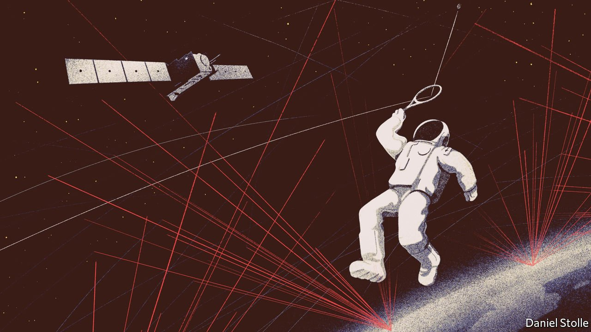

###### Orbital housekeeping

# Tracking space debris is a growing business 

##### Private companies are joining government efforts 

 

> Sep 16th 2021 

AT ORBITAL SPEEDS a tennis-ball-sized piece of space junk packs enough energy to obliterate a satellite. It makes good sense, then, to track orbiting debris, the better to steer spacecraft away from danger. That this is hard was underscored on April 23rd, as a SpaceX capsule sped toward the International Space Station (ISS). The crew were preparing to sleep when ground control hastily announced they had just 20 minutes to complete a safety procedure before a potential impact. The object, probably a piece of defunct spacecraft, later whizzed past harmlessly.

At the moment, space-going junk is mapped mostly by radar. But of an estimated 34,000 orbiting objects ten or more centimetres across, only about 29,000 are being tracked with reasonable accuracy. Smaller pieces are more numerous, and harder to follow. Those between one and ten centimetres across number more than 900,000; those at least a millimetre across, perhaps 128m. Even tiny bits of debris can do damage. In May the Canadian Space Agency said an untracked piece of junk had punched a hole 5mm across in Canadarm2, a robotic limb attached to the ISS.


As orbiting objects multiply, the danger grows. Roughly a dozen sizeable pieces of space debris break up every year as a result of collisions, exploding rocket fuel, or the rupturing of pressurised tanks or old batteries. Solar radiation chips off bits of paint and metal. And the number of launches is increasing. According to BryceTech, a consultancy in Virginia, at the end of 2001 there were 771 active satellites orbiting Earth. Ten years later that population had grown to 965. Since then, it has nearly quintupled, to roughly 4,500—and this does not include defunct satellites. And small, cheap satellites are a booming business. Maciej Konacki, an astronomer at the Polish Academy of Sciences, in Warsaw, who has studied the matter on behalf of the European Union, reckons there could be 100,000 active satellites in orbit by the end of the decade.

One sign of this crowding is that forecasts of potential impacts have roughly doubled in the past few years, says the Space Data Association, an industry group based in the Isle of Man which calculates collision risks for its members. But the rise conceals some good news. Part of the reason for more predicted impacts is better forecasting. As the quality and quantity of information grows, many potential collisions which would have gone unnoticed in the past are now foreseen.

Collision warning

Radars operated by America’s Department of Defence have long been the biggest providers of “space situational awareness”. Little more than ten years ago, position fixes were generally accurate only to within a few hundred metres. Since then, says François Laporte, an expert at CNES, France’s space agency, the accuracy of America’s debris tracking has improved by an “extraordinary, marvellous” order of magnitude, to a few tens of metres.

One big advance has been “Space Fence”. This is a system built in the Marshall Islands for America’s air force. It is billed (admittedly by its maker, Lockheed Martin, an arms firm) as the world’s most advanced radar. It went into service in March 2020 and now makes 2m observations a day, many of closely spaced objects just 5cm across. In time, that level of scrutiny should more than triple the number of items which have their orbits regularly updated in a catalogue maintained by the 18th Space Control Squadron, at Vandenberg Space Force Base in California.

Since 2014 the EU has been chipping in too. Seven of its members pool their space-surveillance and tracking assets in an arrangement called the EU SST Consortium. Europeans worry that American data on debris may not remain forever free and freely available. Pride also plays a role. Mr Laporte says Europe’s spacefarers want to see debris for themselves, “not just through the Americans”. The consortium has yet to increase meaningfully the number of catalogued objects—“We’re not even in the same league” as America, says Mr Laporte. But satellite operators welcome the effort nonetheless.

One problem is that there is no consensus on the best way to predict an object’s future orbit. To do this its position must be recorded several times, to observe how its path is being altered by the gravitational pulls of the Earth, Moon and sun, the pressure imposed on it by solar radiation and, in low orbits, the drag caused by wayward wisps of air from the upper atmosphere, and so on. Different teams often come up with different results, says Dr Konacki, who was once a delegate to the EU SST Consortium. Any extra data should help make the process more accurate.

The private sector is gearing up its efforts, too. In April LeoLabs, a firm in Silicon Valley, switched on its fourth debris-tracking radar station. This facility, in Costa Rica, joins others in Alaska, New Zealand and Texas. A fifth is being built in the Azores. LeoLabs can currently track objects slightly bigger than tennis balls. The short wavelength and high power of the radars mean it may eventually be able keep tabs on bits of junk just 2cm across.

LeoLabs sells data to satellite operators, space agencies, America’s armed forces and insurers keen to calculate better actuarial tables for spacecraft. Dan Ceperley, the firm’s boss, notes that government agencies often take several “hand-wringing” hours to answer requests for a satellite’s probability of collision. His firm’s website lets customers see within seconds whether a proposed manoeuvre will lead, over the next week, to danger from any of the objects in LeoLabs’ catalogue.

Besides using radar, debris can also be tracked optically. In collaboration with Curtin University, in Perth, Lockheed Martin runs FireOPAL, a system of 20 cheap cameras aimed at the sky from various parts of Australia. For several hours at dawn and dusk, when these cameras are in the dark but sunlight still illuminates debris orbiting above, the cameras take pictures every ten seconds. The closer an object, the more it appears to move relative to the stars, allowing triangulation of its position. For items at an altitude of 400km, says Phil Bland, who is in charge of Curtin’s side of the project, the system is accurate to within 30 metres.

FireOPAL’s greatest success so far was locating a satellite half a metre across, 26,000km up. The smallest objects the lenses capture in low orbits are about 30cm across. Rod Drury, Dr Bland’s counterpart at Lockheed, says the firm now plans to expand FireOPAL around the world.

Lasers are another option. Around 40 outfits, including some belonging to the members of the EU SST Consortium, are shooting laser pulses at “retro-reflectors” fitted to many satellites. Clocking the return time allows positions to be calculated with an accuracy of a few millimetres. Seven laser stations also use a more powerful pulse that can spot debris without retro-reflectors, to within around a metre.

For finding stuff in high orbits, though, neither lasers nor radars are much help. But telescopes work. ExoAnalytic Solutions, a Californian firm, tracks junk up to 170,000km away—nearly halfway to the Moon—using instruments “just laying on the shelves” at astronomy shops, according to Clint Clark, the firm’s “Vice President of First Impressions” (as some marketing bosses like to be known in California). As for debris in geosynchronous orbit, a mere 36,000km up, ExoAnalytic’s 300 telescopes, scattered in 35 clusters over five continents and Hawaii, track grapefruit-sized objects to within an accuracy of about ten metres. The company is adding a couple of sites a year, to improve the degree of precision. Customers include insurers keen to see if policyholders fly their satellites as safely as they claim to.

These efforts are impressive. Even so, back at LeoLabs Dr Ceperley reckons that ten times more tracking capability is needed than is available today. Such demand has allowed Northstar Earth &amp; Space, a new firm in Montreal, to raise money to build, at $25m a pop, three 100kg satellites that will use telescopic cameras to track junk from orbit. The plan, according to Northstar’s boss, Stewart Bain, is to launch the satellites in 2023, into an orbit with an altitude of 575km—the celestial equivalent, he quips, of “riviera or beach-front property”. If this goes well, another nine will join them in subsequent years, to create a panopticon a dozen strong.

Where there’s muck there’s brass

For customers, none of this comes cheap. Northstar, for example, plans to charge annual subscriptions of between $10m and $100m. But that will buy more than just a degree of collision-proofing. It will also permit the manoeuvres made to avoid such collisions to be fine-tuned, or even deemed unnecessary. That will save fuel, extending a satellite’s useful life. And it will also reduce pauses in service, which are almost inevitable when a satellite’s orbit is being adjusted.

Naturally, this orbital-tracking technology has military value as well. Knowing objects’ orbits can reveal much about an adversary’s capabilities—including, perhaps, orbital combat. Movements that represent any deviation from normal patterns are most telling, says Scott Norr, an expert at Lockheed in the use of Space Fence for military intelligence. To illustrate why, he points to an object that had been considered to be just a piece of debris from a Russian military launch. In May 2014 the “debris” sprang to life. Its movements since then have fuelled fears that it could be an anti-satellite weapon. Whether other such “sleepers” are hidden in plain sight among the clouds of rubbish orbiting Earth remains to be seen. ■

An early version of this article was published online on September 13th 2021

