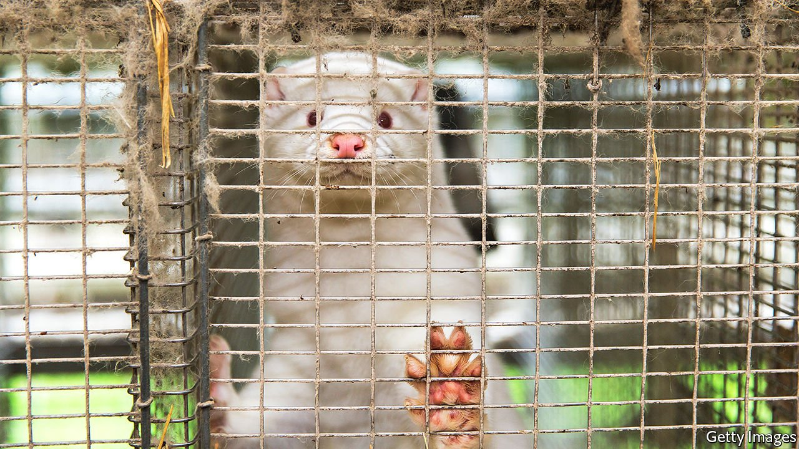

###### Zoonotic diseases

# Why carnivores host diseases that jump to humans 

##### Meat-eating seems to make animals more likely to incubate human diseases 

 

> Sep 15th 2021 

IN NOVEMBER 2020, at the height of the second covid-19 wave in Europe, the Danish government revealed that a new strain of the virus had been found in farmed mink. Officials worried that the new strain could become widespread in humans, where it might prove deadlier or more resistant to vaccines. For Clare Bryant, a veterinary scientist at the University of Cambridge, this was exactly what she feared might happen. “I thought holy moly, there you go,” she says.

At the time, she and her team were investigating the biology of Carnivora, an order of meat-eating mammals that includes cats, dogs, bears and mink, among others. Carnivora is a potent source of “zoonotic” diseases—those that have jumped to humans from their original animal hosts. Almost half of its members carry one or more unique zoonotic pathogens. Biologists have long wondered why that should be. Dr Bryant’s paper, published in Cell Reports, suggests an answer.


Diseases jump from animals to humans when a pathogen stumbles upon a mutation that allows it to infect human cells as well as animal ones. Since mutation is a random process that mostly happens when pathogens reproduce, a bug is most likely to hit the jackpot when it has plenty of time to survive in its host unmolested.

Healthy animals do not usually allow pathogens such leisure time. Infection triggers an immune response aimed at wiping out the invader. One part of that response relies on proteins governed by chemicals called receptors, adaptors and effectors. Receptors sound the alarm when a pathogen is spotted. They cause adaptors to trigger the release of effectors, which are enzymes that produce proteins capable of destroying the invader.

Dr Bryant found that, in Carnivora, some of this machinery is broken. Immunological pathways in the gut, in particular, seem not to work properly. Genes for receptors are missing or disabled, allowing pathogens to go unseen. Two effector genes are fused, compromising any response that is mounted. After spotting these anomalies in dogs, the researchers edited the fused effector genes into mice. Sure enough, the animals’ immune response was hampered.

While Dr Bryant’s team looked only at dogs, the mutations resemble those found in other sorts of carnivorous mammal, including cats, ferrets and bears. All share the fusion in the effector genes, though the specific faults with their receptors differ. That suggests similar defects have evolved several times in different lineages.

But that is only half the story. For an animal to act as a useful carrier from a pathogen’s point of view, it not only has to let the pathogen survive but also stay alive itself in order to infect others. One possibility is that carnivores have alternative lines of defence that partially compensate for their defective immune systems. These extra defences might be potent enough to keep animals from getting sick, but not effective enough to wipe out pathogens completely.

Dietary adaptations, says Dr Bryant, may be the culprit. Earlier experiments on caterpillars have shown that animals with protein-rich diets have fewer infections. The meaty diets of Carnivora may grant its members similar protection. The key, says Dr Bryant, is likely to be the microbiome, the ecosystem of bacteria that live in animals’ guts. Her guess is that these bacteria metabolise dietary protein into antimicrobial compounds which suppress pathogens. That imperfect protection may allow other bits of the animals’ immune systems to fall into evolutionary disrepair.

The exact details are still to be worked out. But the pet carnivores with which so many humans share their homes are unlikely to pose much risk. The real danger comes from when such animals are herded together in close quarters, giving pathogens access to a bigger pool of individuals in which to mutate. The upshot of all this, says Dr Bryant, is that farming animals in Carnivora is a bad idea. Indeed, after discovering the mutant version of SARS-CoV-2, the Danish government culled millions of those mink—effectively ending the world’s only large industry that did so. ■

An early version of this article was published online on September 15th 2021

