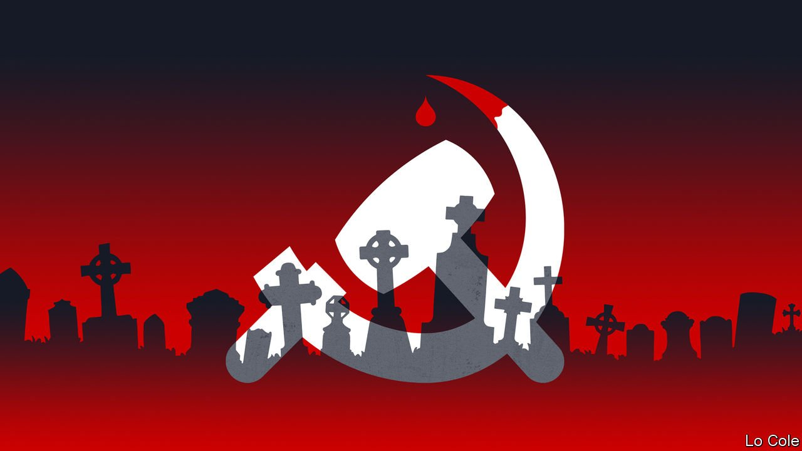

###### Bello

# Abimael Guzmán’s death leaves several questions for Peru 

##### Not least as Pedro Castillo, the new president, has several allies with links to Shining Path 

 

> Sep 18th 2021 

FOR A DOZEN years from 1980 a malign, invisible presence haunted Peru, acquiring ever greater menace. Abimael Guzmán, a Marxist philosopher who created a shadowy terrorist army called Sendero Luminoso (Shining Path), ordered massacres, murders, car bombs and the destruction of police stations. Yet he never appeared in public. His capture in 1992, through old-fashioned detective work, meant he spent the rest of his life in a maximum-security prison. By the time he died, on September 11th, aged 86, many Peruvians had little memory of him. His death leaves several unanswered questions.

Sendero was unlike any other guerrilla movement in Latin America. Mr Guzmán was inspired by Maoist China, which he visited twice during the Cultural Revolution, rather than Cuba. He founded Sendero as a splinter of a splinter of the Peruvian Communist Party in Ayacucho, the capital of an impoverished region in the Andes where he taught at the university. He recruited his students, most of them women; many became teachers who, once qualified, fanned out to schools in towns and villages. Just as Peru was returning to democracy, he launched his Maoist “protracted people’s war to surround the cities from the countryside”. To avoid dependence on outsiders, Sendero’s weapons were machetes, stones and dynamite, until they stole guns from the security forces.


Mr Guzmán, too, was unique. His moral dissonance made him one of the 20th century’s last monsters. He lived in an absolutist ideological bubble, immune from reality, including the cruelty and suffering he ordered. Sendero killed some 38,000 people, according to an investigation by a Truth and Reconciliation Commission. Yet Mr Guzmán was indirectly responsible, too, for more than 30,000 killings by the armed forces and self-defence militias. The majority of the victims were Quechua-speaking villagers in the Andes—those in whose name his war was supposedly being fought.

He erected a preposterous personality cult around himself: he styled himself President Gonzalo, the “fourth sword of Marxism”. Sendero’s ideology became “Marxism-Leninism-Maoism-Gonzalo Thought”. When operations went wrong, those responsible were subject to long, humiliating sessions of self-criticism at party meetings. He told his followers that their deaths were glorious, playing on Andean millenarianism.

His techniques foreshadowed those of jihadist terrorism. But Mr Guzmán ran no physical risks himself. He was no Che Guevara. Throughout the war he lived in safe houses in the posher neighbourhoods of Lima. When the police burst in, he offered no resistance. He immediately called on his followers to give up, turning Sendero into a non-violent political movement (called Movadef) whose purpose was to campaign for his release.

This psychotic narcissism went hand in hand with extraordinary powers of persuasion. Psychiatrists might point to a complicated childhood to explain what turned a theoretician into an indirect mass murderer. Mr Guzmán was the illegitimate son of an estate administrator and a poor mother who later abandoned him. Thanks to his stepmother he acquired a university education—and an uncertain place in the social order.

In explaining Sendero’s bloody appeal sociologists noted Peru’s frailties. Many in the Andes hated abusive officials and police, and initially welcomed the Maoists until their totalitarian demands to restrict crops and recruit children prompted a rebellion. A fragile state, undermined by the debt crisis of the 1980s and hyperinflation, flailed in its response. Brutalised armed forces took far too long to realise that peasant farmers were allies not enemies. Some upper-class Peruvians, racked by guilt about their country’s inequalities, sympathised with Sendero.

“There is a powerful capacity in Peruvian society for hatred and destruction,” Alberto Flores Galindo, a historian, told Bello in Lima in 1989. Three decades later this capacity has revealed itself in a bitterly polarised election and the victory, by a narrow margin, of Pedro Castillo, a far-leftist—a result that Sendero long made unthinkable. The new president is a rural teacher, like many of Mr Guzmán’s recruits, and has several allies with ties either to Sendero or to Movadef. Mr Guzmán took to extremes the belief of many communists that the end justifies the means. That such zealotry still echoes in Peru ought to bring self-criticism from those in power who are equivocating over the history of terror.

