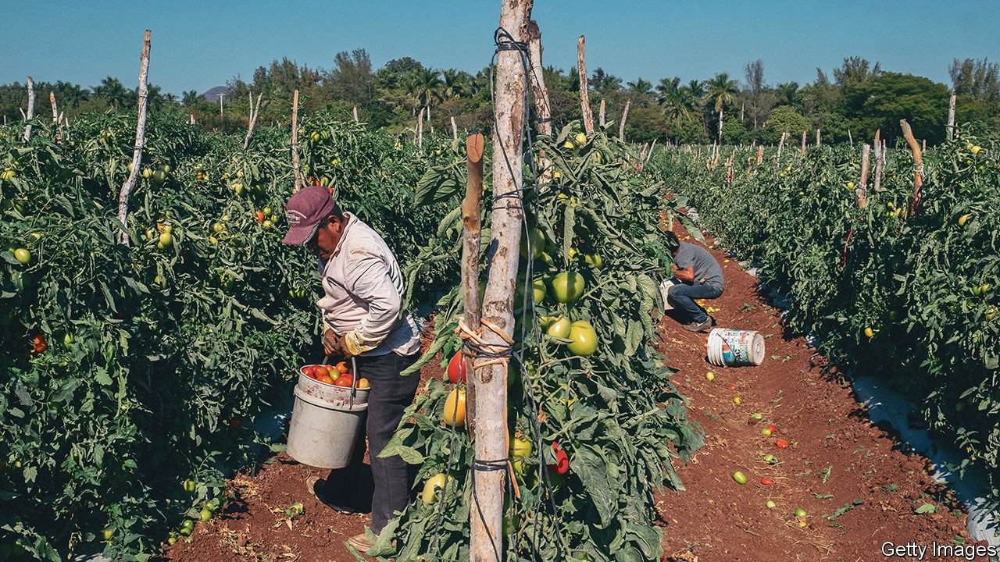

###### Reaping the rewards of trade

# Agriculture is an economic bright spot in Mexico 

##### That is, if President Andrés Manuel López Obrador does not mess it up 

 

> Sep 18th 2021 

ROMÁN JUÁREZ has expanded his tomato farm several times since starting it 15 years ago. It now spans two separate sites in a rural area of the state of Puebla, south-east of Mexico City. In a good season, each one of the 38,000 plants he grows in his large, greenhouse-like tents can produce up to 160 tomatoes. Although farming can be risky, Mr Juárez is prospering, mostly because since 2016 he has exported his produce to the United States. “We do business where there is business,” he says.

This year Mexico is expected to export 1.8m tonnes of tomatoes to its northern neighbour, a record. Last year exports of tomatoes alone were worth around $2.3bn. Tomatoes are the most striking—and the largest—example of a bigger trend. Mexico exported agricultural goods worth $39.5bn last year, around 10% of the country’s total exports. Agriculture, which accounts for 4% of Mexico’s GDP, grew by 2% last year, even as the economy as a whole contracted by 8.5%.


Mexico has exported food for centuries. But the more recent boom has its roots in the North American Free Trade Agreement (NAFTA, now superseded by the United States–Mexico–Canada Agreement, the USMCA), which came into force in 1995. Back then Mexican exports of tomatoes were valued at just $406m. Agriculture used to be “the ugly duckling” of the Mexican economy, says Juan Cortina of the National Agricultural Council, which represents producers.

Two things changed this. For a start, culinary tastes evolved. “Today Americans want [produce] year-round, not just seasonally,” says Philip Martin of the University of California, Davis. Mexico’s warmer climate means it can grow certain produce when the United States cannot, and in bigger quantities than California or Florida. Mexican farmers have also invested in ways to protect their crops, often in partnership with big American companies. Most use tunnels or plastic hoops rather than open fields, which can reduce pests and increase yields.

But it is not all plain sowing. Mexican producers’ exporting prowess has irked American farmers, and generated accusations of unfair government support. As part of USMCA negotiations, American officials under Donald Trump’s administration tried to make it easier to apply defensive tariffs on seasonal fruits and vegetables. They failed, but then asked the United States International Trade Commission to investigate imports of strawberries, bell peppers and squash.

The tomato trade is also embattled. In 1996, before American tariffs on tomatoes were fully phased out under NAFTA, America’s Department of Commerce launched an investigation into whether Mexican tomato-growers were selling their wares too cheaply. That led to a series of “suspension agreements” in which Mexican exporters agreed to minimum prices, the most recent of which was hashed out in 2019.

Beyond maintaining calm trade relations, more could be done to boost agriculture. Farmers would benefit from better technology, such as improved irrigation systems. Aurelio Bastida of the Autonomous University of Chapingo reckons that the government needs to have policies that integrate both agriculture and the environment. Mexican agriculture is vulnerable to climate change. It already suffers from severe water shortages. And whereas farmers whose crops are exported are doing well, many of those who cater to the domestic market are struggling.

If the industry is to expand, Mexico will have to export its food to other countries in addition to the United States. That should be easy: by some counts Mexico is a signatory to more free-trade agreements than any other country.

But the policies of President Andrés Manuel López Obrador, who seems keen to turn the clock back to the 1970s, may stifle that potential. Last year some of the funding for the agency that certifies food as safe—a prerequisite for most exports—was cut. Such counter-productive parsimony could mean that agricultural exports wither, rather than bloom.■

