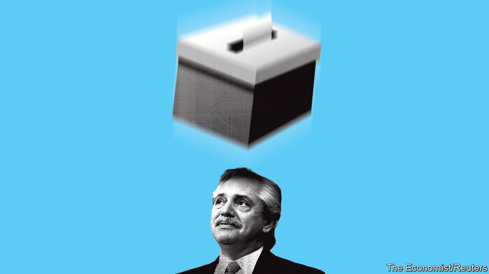
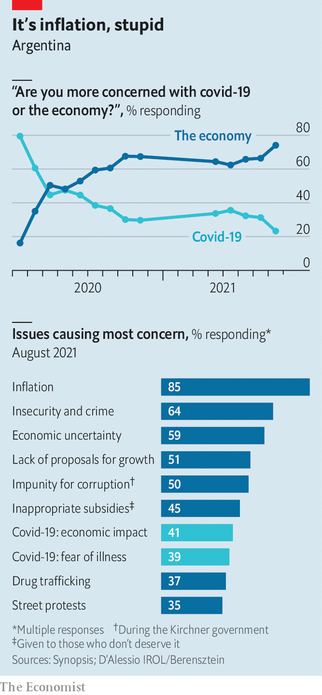

###### Front to back

# Argentine voters deal a blow to the ruling Peronist coalition 

##### The primary elections are both a referendum on the government and an augury for elections in November 

 

> Sep 18th 2021 

“IN PERONISM, YOU always get laid.” When Victoria Tolosa Paz, the Peronist who is the government’s leading candidate for the lower house of Congress in the province of Buenos Aires, said this in an interview she found herself with a viral campaign line. But while Ms Tolosa Paz, an accountant, was happy to talk about sex, she appeared to ignore more serious issues. In a country where annual inflation is over 50% and unemployment is in double digits, voters have other concerns. In a nationwide vote on September 12th, they signalled their disapproval of the ruling coalition, which won fewer votes than the opposition in 17 of 24 districts. Three days later, five ministers offered to resign.

The vote was technically a primary for congressional elections due in November, halfway through the president’s term, when a third of senators and half of the chamber of deputies will be chosen. In Argentina’s unusual electoral system, however, primaries function more like the first round of a two-round election. Voting is compulsory, and voters are presented with lists of candidates from all registered parties. They select one list for each office to go forward to the general election. The lists that win less than 1.5% of the vote in their district are excluded. So in addition to winnowing the field, the primary gives an indication of what the outcome of the general election itself is likely to be.


In this week’s vote even some Peronist strongholds flipped, creating “a sense of a national wave”, says Julio Burdman, director of the Electoral Observatory, a consultancy. If the results are repeated in November, the ruling coalition could lose its majority in the Senate as well as a significant number of seats in the chamber of deputies. A bleary-eyed President Alberto Fernández conceded defeat: “Evidently, we have not done something right.”

A psephological crystal ball

The results also suggest that the opposition has a good chance of seizing the presidency in 2023. Although Horacio Rodríguez Larreta, the mayor of Buenos Aires, was not on the ballot, candidates that played up their connection to him did well. That hints at his strength within his party, Republican Proposal (PRO), and so gives him the upper hand over rivals for its leadership such as Mauricio Macri, a former president, and Patricia Bullrich, a former minister. “Larreta put all his cards on the table,” says Juan Cruz Díaz, the head of Cefeidas Group, a consultancy in Buenos Aires. “And he took the night.”

Other challengers could emerge. Within the opposition coalition another party, the Radical Civic Union, saw an uptick in votes for its candidates. And Javier Milei, a libertarian economist, took 14% of votes in the city of Buenos Aires. That could force the PRO, a centre-right party, to become more right-wing.

 


Investors hope that a victory for the opposition in 2023 could put an end to the current government’s flailing attempts to boost growth through regulation, including foreign-exchange controls, price freezes and export bans. It has also been printing money to spur the economy, but has succeeded only in spurring inflation, which is voters’ main concern (see chart).

At the beginning of the pandemic, Mr Fernández declared: “I’d rather have 10% more poor people than 100,000 dead.” In the end, Argentina got both. Despite imposing one of the longest and strictest lockdowns in the world, the government was unable to prevent the spread of covid-19. Last year GDP contracted by almost 10%, more than any big economy in South America, aside from Peru and Venezuela. With more than 110,000 dead from the virus, Argentina has one of the highest mortality rates in the world.

Mr Fernández has also been battered by several scandals. In February the health minister resigned after it emerged that government cronies had enjoyed priority access to vaccines (he stated that “confusion” in his office was to blame). In August pictures were leaked that showed Mr Fernández hosting an illegal birthday party for Fabiola Yañez, his girlfriend, during lockdown. A third of voters said that the birthday-party scandal would “change or influence” their vote in the mid-terms. The president’s approval ratings are hovering at around 30%.

After such dismal results Mr Fernández is likely to find it harder to govern. That may boost the influence of the radical wing of the coalition led by Cristina Fernández de Kirchner, the vice-president and former president (no relation to Mr Fernández). In March, after a series of diatribes against the judiciary, which is investigating Ms Fernández on various counts of corruption (all of which she denies), the moderate justice minister was replaced by a kirchnerista. Ms Fernández has spoken of “public servants who don’t serve” and told the president to “put [things in] order” after the party scandal. The ministers who offered to resign on September 15th are all loyal to her; their departure could make life harder for the president. Some fear more changes to the cabinet, including the departure of Martin Guzmán, the economy minister.

Such antics could complicate talks with the IMF, to which Argentina owes around $45bn. This year, several factors meant the government could delay reaching a deal with the fund. It relied on a one-off wealth tax and rising commodity prices, among other windfalls, to boost state coffers and repay some of what it owes. The results of the primaries may also tempt Mr Fernández to use populist tricks to gain votes in November. This year the government expanded gas subsidies and extended limits on beef exports to keep prices down.

“The main risk is that additional interventionist policies could make an agreement with the IMF more challenging,” says Martin Castellano of the Institute of International Finance, a trade association in Washington, DC. That would not be in the interest of the government, which needs a deal. High commodity prices have not made life much better for ordinary folk. Meanwhile, even on the government’s rosy projections, the economy is not expected to regain its pre-covid size until next year. And Ms Tolosa Paz seems to have inadvertently but conclusively proved that voters want substance from the government, not gimmicks and slogans.■

