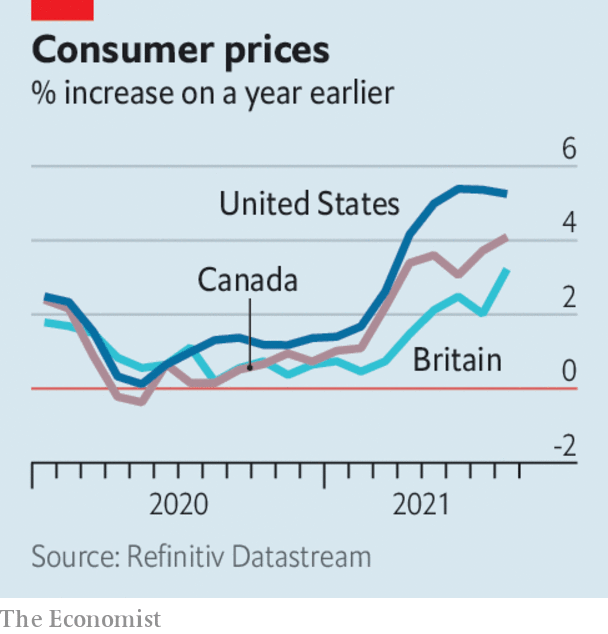

###### 

# Business this week 

#####  

 

> Sep 18th 2021 

 


 stood at 5.3% in August, down slightly from the 13-year highs of the previous two months. There was some evidence that inflationary pressures may be levelling off, such as an easing of prices for used cars, which have driven some of this year’s inflation because of supply-chain problems in new-vehicle production. Britain’s inflation rate, meanwhile, surged from 2% to 3.2%, partly because of a jump in the cost of eating out, which was artificially lowered a year ago by a government pandemic scheme that subsidised restaurant meals. In Canada inflation rose to 4.1%, an 18-year high.

Soaring energy prices are a factor pushing up inflation. Prices for natural gas have hit new highs in Europe for a variety of reasons, including a supply shortage ahead of the coming winter. In Spain, where consumers’ energy costs have soared, the government wants to seize what it describes as “excess profits” from utility companies to reduce household bills.


The controversial Nord Stream 2 pipeline was completed, allowing Russia to bypass Ukraine and pump more gas to Europe. Russia says it can start delivering gas once the “remaining formalities” are completed.

CMA CGM, one of the world’s biggest  firms, took the industry by surprise when it announced a five-month cap on spot rates for ocean freight. The cost of shipping a standard large container is four times higher than it was a year ago for a number of reasons, including congestion at ports. CMA CGM describes this as an “unprecedented situation” and is capping prices to keep its customers happy.

Back on track

The long-running battle to take over Kansas City Southern appeared to have reached the end of the line when the rail-freight company, which operates in America and Mexico, agreed to a $31bn bid from Canadian Pacific. It had struck an agreement with Canadian National, CP’s rival, but America’s Surface Transportation Board didn’t like the structure of the deal.

A federal judge in California gave her verdict in the closely watched legal battle between . It was mostly, but not entirely, good news for Apple. The judge said Epic had failed to prove its central claim that Apple was abusing its market dominance by charging developers commissions of up to 30%. But she ruled that Apple had broken Californian law, and ordered it to allow app developers to offer customers alternative payment options outside Apple’s ecosystem. Epic is appealing against the ruling.

Goldman Sachs expanded its consumer-focused business by agreeing to buy GreenSky, a platform that focuses on providing loans for home improvements, for $2.2bn.

There was more evidence of the recent slowdown in China’s economy, caused in part by outbreaks of covid-19. Retail sales rose by 2.5% in August, year on year, well below economists’ average forecast of 7%. Industrial production grew by 5.3% on the same basis, which was also short of expectations.

The crisis deepened at , one of China’s biggest property developers, which has warned that it may default on its debt. Its recent sales have fallen by half, which it blamed on speculative media reports about its future; it has employed specialists to assess its liquidity. Protesters took up residence outside Evergrande’s headquarters in Shenzhen.

The share prices of big casino operators in Macau plunged, after the Chinese territory began a consultation process on revising gaming laws. Macau is the only place in China where gambling is legal. Casino concessions are up for renewal and the industry fears that the consultation will result in government restrictions, similar to the crackdown that has beset tech companies.

A diversity problem

PwC UK, one of the Big Four firms providing professional and accounting services, published data on the class background of its employees for the first time, which showed that only 14% come from a lower socioeconomic household. The firm’s median pay gap for this group, at 12.1%, is wider than for women, 10.1%, and black people, 1.1%.

SpaceX launched one of its Dragon capsules from Florida into space, sending . The Inspiration4 mission, funded by a fintech entrepreneur, is the most ambitious of this year’s adventures in space tourism, flying farther into space and circling the planet for three days.

In an unrelated but also ambitious effort at advancing technology, German researchers have found a way to  in the hope of reducing their greenhouse-gas emissions. The bovines were taught to micturate in a designated pen, where their urine could be easily treated.

