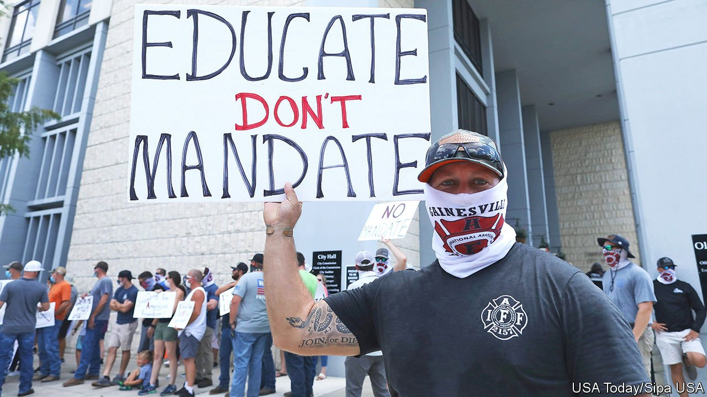
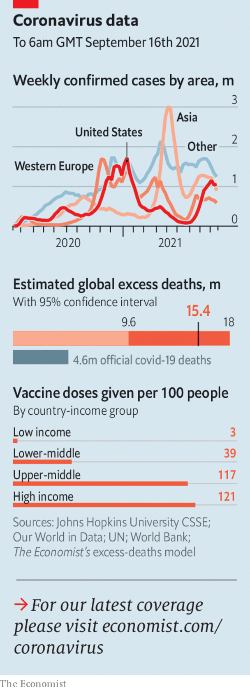

###### 

# Politics this week 

#####  

 

> Sep 18th 2021 

The Biden administration defended its decision to introduce , after more Republican governors said they would fight them in court. Asa Hutchinson, the governor of Arkansas and an advocate of vaccines, said the government’s order “disrupts and divides” America. With only 54% of the population fully vaccinated, Joe Biden thinks mandates are essential. Companies will have to ensure their employees are either jabbed or tested weekly. All federal workers as well as staff in health facilities that receive government money will have to be vaccinated.

 the government reversed course and said that vaccine passports for large events would not go ahead. The roll-out of vaccine boosters for over-50s will start, however, to help reduce pressure on the health service. Jabs will also be offered to 12- to 15-year-olds, a controversial move; the official vaccine committee has said the benefit from a health perspective is too small, but the government insists that inoculations will limit disruption to schools.


Gavin Newsom easily defeated a statewide ballot, bankrolled by conservative groups, to boot him out of office as governor of California. The Democrat said his victory represented a “yes to science” and to vaccines.

Australia looks likely to become the world’s seventh country to operate  as part of AUKUS, a new security partnership between America, Australia and Britain that reflects their worries about China’s growing power in Asia.

 by testing short-range ballistic missiles, and for the first time used a train to launch the weapons. South Korea also conducted its own missile test, launching its weapons from a submarine for the first time.

The International Criminal Court approved a full investigation into whether crimes against humanity have been committed in the Philippines' war on drugs, the signature policy of Rodrigo Duterte, the president.

International donors stumped up $1bn in aid for Afghanistan at a UN-organised conference in Geneva. Most funding was cut off after the Taliban takeover. Around 90% of Afghan households have insufficient food, according to the UN.

Nine people in Hong Kong received jail sentences of between six and ten months for taking part in a vigil last year commemorating the Tiananmen Square massacre. Authorities had banned the annual event, saying it risked spreading covid-19.

In Argentina the ruling Peronist coalition won fewer votes than the opposition in 17 of 24 districts in . The polls, which may hint at the outcome of the presidential race in 2023, are a blow for Alberto Fernández, the president. Several ministers close to his vice-president, who leads a hard-left faction in Congress, offered to resign.

Haiti’s prime minister, Ariel Henry, fired the chief public prosecutor, Bed-Ford Claude. Mr Claude had accused Mr Henry of involvement in the murder of President Jovenel Moïse, and asked that a judge investigate him. It is not clear whether the prosecutor had the authority to make such a request, or whether Mr Henry had the power to sack him. He also fired the justice minister.

The UN warned of an alarming increase in violence in the east of the Democratic Republic of Congo. It has recorded 1,200 deaths and 1,100 rapes this year by militias in the provinces of North Kivu and Ituri.

Mali’s government is close to reaching a deal to hire 1,000 Russian mercenaries to train its army and protect senior officials. France, which has a large counter-terrorism mission in the country, has suggested it will withdraw its troops if the deal goes ahead.

After 13 months of political paralysis, Lebanon got a new government. It is headed by Najib Mikati, a billionaire businessman who has been prime minister twice before. He inherits a severe economic crisis. The president, Michel Aoun, called on the government to resume talks with the IMF over a bail-out.

Experts in America said Iran’s enrichment of uranium to near weapons-grade left it in a position to produce enough fuel for a single bomb within a month or so. Making a warhead would take much longer.

Three former American intelligence operatives admitted conducting hacking operations on behalf of the United Arab Emirates. According to American prosecutors, the men have agreed to pay $1.7m to resolve the charges.

Naftali Bennett became the first Israeli prime minister to visit Egypt officially in over a decade. Mr Bennett met President Abdel-Fattah al-Sisi in the resort of Sharm el-Sheikh.

Norway’s conservative prime minister, Erna Solberg, lost an election and conceded defeat after eight years in office. It is now expected that the Labour Party will put together a ruling coalition with the help of two other parties.

Germany’s election campaign headed into its final stages, with another televised debate won by Olaf Scholz, the Social Democratic Party’s candidate for chancellor.

 


, with three days of voting due to start on September 17th in parliamentary elections. The result, a victory for the Kremlin-backed United Russia party, is not in doubt; the only questions are how much trickery there will be and whether there will be big protests after the vote, as happened in 2011.

Russia began a vast , which could involve as many as 200,000 troops, making it the largest such event seen in Europe since the end of the second world war. It has raised hackles in NATO and Ukraine, as the exercises are taking place close to the Polish and Ukrainian borders.

 removed  Dominic Raab as Britain’s foreign secretary, following the poor timing of Mr Raab’s Greek paddle-boarding holiday, as Afghanistan fell to the Taliban. He now heads the Ministry of Justice. The new foreign secretary is Liz Truss, a rising star in the Tory party.

