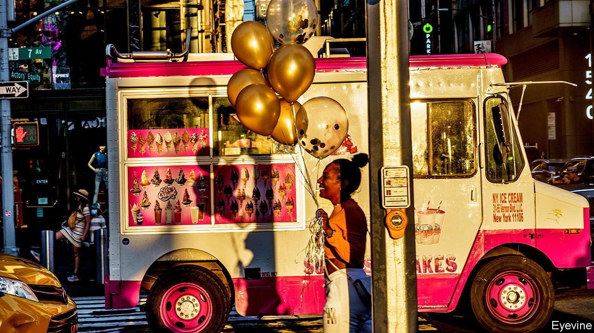
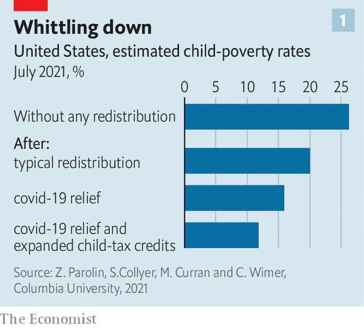
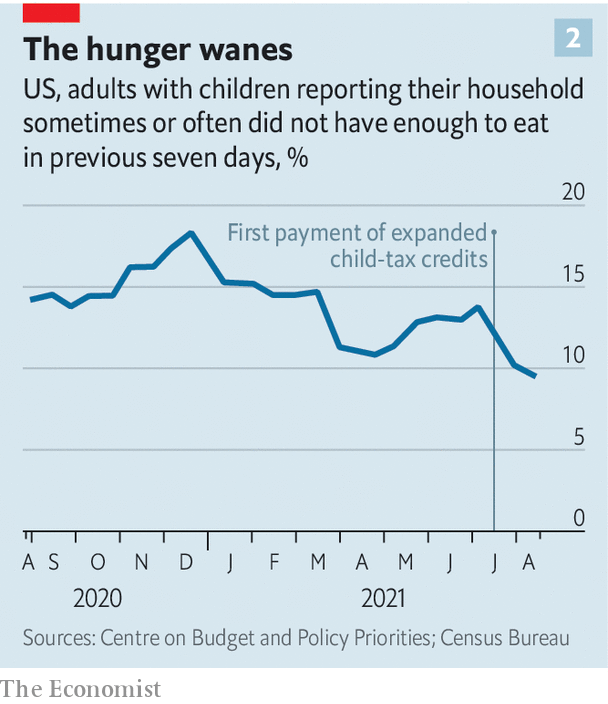

###### When policy works

# America is substantially reducing poverty among children 

##### The Biden administration’s biggest success has not received enough attention 

 

> Sep 14th 2021 

IT SEEMED LIKE a blustery overpromise when President Joe Biden pledged in July to oversee “the largest ever one-year decrease in child poverty in the history of the United States”. By the end of the year, however, he will probably turn out to have been correct. Recent modelling by scholars at Columbia University estimates that in July child poverty was 41% lower than normal.

America has long tolerated an anomalously high rate of poverty among children relative to other advanced countries—depending on how it is measured, somewhere between one in six or one in five children counted as poor. The reason why is not mysterious. The safety-net has always been thinnest for the country’s youngest: America spends a modest 0.6% of GDP on child and family benefits compared with the OECD average of 2.1%. What would happen if this were to change? The rush of cash Congress made available to cushion the economic fallout of covid-19 provided an experiment.

 


Under the status quo, the researchers—Zachary Parolin, Sophie Collyer, Megan Curran and Christopher Wimer—calculate that the child-poverty rate would have been 20% in July. Because of some new relief policies like the business bail-outs, the stimulus cheques issued to most families and more generous unemployment benefits, this rate declined to around 16%. But the most significant dent was placed by a more generous child tax credit, which has been retooled to look a lot more like the child-allowance schemes used in other countries. For one, the credits are being paid out monthly rather than when families file their annual taxes (as is the case for the earned-income tax credit that subsidises wages for working-class Americans, or the mortgage-interest deduction which subsidises the suburban lifestyle of the upper-middle class). The credits lessen in value as family income increases, but those earning up to $240,000 qualify for some amount.


The cheques are also more generous than before: parents of young children receive $300 per month while those with children above the age of six receive $250. Those payments, passed as part of Mr Biden’s $1.9trn stimulus, began only in July. But in just one month they had a big effect. The child-poverty rate dropped from 15.8% in June to 11.9%, representing a decline of 3m American children living in poverty.

 


That is an encouraging start to the roll-out of perhaps the most important anti-poverty policy in a generation. And there are early indications that the money is being spent on necessities, not simply saved. Surveys from the Census Bureau show that most families say they are spending the new funds on clothing, food, housing and utilities rather than paying down debts or bolstering savings. There also seem to be some measurable effects on hardship. The number of households with children that reported not having enough food in the past week dropped substantially after the first payment began—going from 13.7% to 9.5% (see chart 2).

That does not mean that the roll-out has been flawless. To reduce administrative barriers, the credits are supposed to flow automatically from the Internal Revenue Service (IRS) to family bank accounts. However, a significant minority of American families have not filed tax returns in the past two years—meaning that eligible children are missing out. “The outreach has been fairly limited from our perspective,” says Tyler Hall of GiveDirectly, a charity. He notes that one attempt—a video message from Mr Biden posted on Twitter—is unlikely to reach many of the missing families. Approximately half of Americans who make too little to file federal tax returns do not own a computer; and a fifth lack the bank accounts needed to receive payments in the first place.

The Treasury Department set up an online portal to allow such families to register for the benefits. To begin with this was a clunky website that could not be read in Spanish or easily navigated on mobile phones. No dedicated funds were set aside for “navigators” to find these hard-to-reach families and sign them up.

One senior White House official acknowledges these criticisms but points out that the IRS only had a few months after Congress enacted the policy to set up payments, and that the coverage rate for most anti-poverty programmes is below 100%. About 67.6m children are thought to be eligible. In the month of August, though, the Treasury Department estimated that it made payments for 61m children. This was still an increase of some 1.6m from the July payments—a suggestion that the outreach thus far has been modestly successful. A jazzier website made by Code for America, a good-government group, has since been launched. The future strategy will be threefold, the official says: encourage families to file taxes, if possible; try to cross-enroll them when registering for other federal programmes, if not; and request Congress to appropriate more funds for navigators to assist in signing people up.

Private organisations and philanthropists that have tried to spread the word note some intractable difficulties. Mixed-status families—undocumented parents with citizen children who qualify—are especially reluctant. Elizabeth Gonzalez, who has knocked on doors in south-west Detroit to spread word about the credit, notes that many such families fear that taking the funds will jeopardise their chances of obtaining residency papers.

The coverage gap attenuates the anti-poverty potential of the programme. If the plan managed to achieve something close to full coverage, the Columbia researchers estimate that the share of children living in poverty could drop even further, to below 10% (and less than half the status-quo rate). Those reductions would accumulate disproportionately among black and Hispanic children—who are more likely to be eligible for the payments but not receiving them. At full coverage, poverty for black children would drop from its present estimate of 18.4% to 13.6%; for Hispanic children from 16.8% to 14.1%. An ostensibly race-neutral programme would have big effects on racial disparities if implemented more robustly.

All this progress is currently slated to be time-limited, though. Democrats in Congress agreed to implement the enhanced payments only for one year. All of Mr Biden’s legislative priorities are in the process of being rolled up by Congress into a mega-package costing trillions. The future of the expanded credit will rest on these delicate negotiations. The White House proposal is to continue the payments until 2025, but not make them permanent. The cost of doing so would be $100bn a year, or 0.45% of GDP, which is less than the amount spent by allowing capital gains to be taxed at preferential rates, or the amount spent to subsidise private health-insurance plans.

That the president might split hairs on perhaps his biggest success is the result of a self-imposed bind. Mr Biden is keen to present his plan as completely paid for, without raising taxes on families making less than $400,000 a year.

Michael Bennet, a Democratic senator from Colorado who has been championing the policy for years, is arguing for immediate permanence. “Having a safety-net for kids in the country and lifting a bunch of kids out of poverty is an important step forward. And it’s a recognition that the United States of America does not have to accept one of the highest childhood-poverty rates in the industrialised world as a permanent feature of our democracy and our economy,” he says. The chances that things revert to the old normal will soon become unthinkable, Mr Bennet reckons. “I would be very surprised if the child tax credit is not ultimately made permanent…I think it’s going to be extremely popular with the American people.”■

An early version of this article was published online on September 14th 2021

For more coverage of Joe Biden’s presidency, visit our dedicated 

