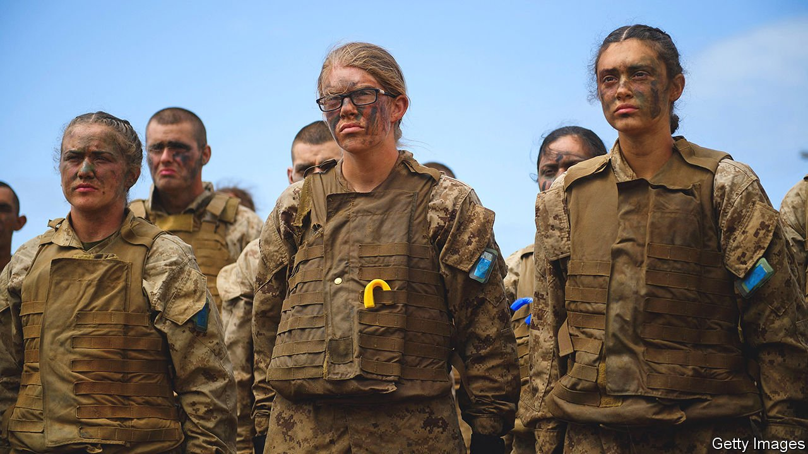

###### XX-rated

# American women will soon become eligible (in theory) for the draft 

##### The prospect of this actually happening is remote, but a bipartisan consensus is about to become law 

 

> Sep 18th 2021 

MASS CONSCRIPTION in wartime is a remote prospect in America. But were a draft called, the country’s conscripts might soon look very different. An amendment to the annual defence policy bill winding its way through Congress would make women eligible for the military draft for the first time. On September 2nd it passed the House Armed Services Committee. “It’s past time,” declared Congresswoman Chrissy Houlahan, a former Air Force officer and lead sponsor of the amendment. Coupled with the success of a similar provision in the Senate, the change is now almost certain to become law when the final bill comes to a vote.

Though the compulsory military draft ended in 1973, controversy over who could be called to serve did not. Conscription was so unpopular in the wake of the Vietnam war that after 1975 men were not even required to register for the Selective Service, the directory of those eligible to be drafted. The Soviet invasion of Afghanistan in 1979 prompted President Jimmy Carter to reinstate the requirement for men, but Congress balked at the potential inclusion of women. The 1981 Supreme Court decision in Rostker v Goldberg found that, because women were not allowed to serve in combat roles, they could be excluded from the Selective Service. This argument began to look thin even before Leigh Ann Hester became the first woman to receive the silver star for direct combat action in 2005, after her convoy was ambushed in Iraq.


When President Barack Obama opened combat roles to women in 2015, the legal logic barring women from the draft came undone. Putting women in combat was initially met with resistance. Republicans argued it would undermine the cohesiveness of America’s armed forces and former generals voiced concerns. But President Donald Trump left the reform untouched, and the controversy faded. Katherine Kuzminski of the Centre for American Security, a think-tank, suggests women’s battlefield experience during the “war on terror” did much to convince America’s military brass that women were essential. With the decision in Rostker a dead letter, lawsuits advanced to overturn women’s exclusion. In April, President Joe Biden asked the Supreme Court to allow Congress to resolve the issue.

Lawmakers on Capitol Hill are now deploying several progressive arguments in favour of drafting women. Standing in for fellow Democrats, Ms Houlahan introduced the amendment by saying that, “as the selective service system is currently written, it is unconstitutional and discriminates based on sex.” Republican proponents like Congressman Mike Waltz, also a sponsor of the amendment, make a practical case. They echo America’s generals in arguing that women are needed should a draft ever be called—a necessity when less than a third of the adult population is considered fit for service. Opposition comes from a handful of social conservatives, who believe that including women in the draft would undermine traditional gender roles.

Yet this bipartisan consensus is notable for how little support it has in public opinion, particularly among women. While a little more than half of men endorse drafting women, just 36% of women do so. Kara Vuic, a historian at Texas Christian University, notes that the first push for women in the draft in the early 1970s was paired with feminist promotion of the Equal Rights Amendment, a proposed constitutional amendment guaranteeing women’s rights. Conscription was viewed as an obligation of full citizenship. Today, she observes, the change is not being led by women alone. “The nature of war in the 21st century is very different, and the military needs women.” For Ms Vuic, the Pentagon’s increasingly vocal support is decisive.

Expanding the draft would mean that almost no legal restrictions remain for women in the armed forces. But a broader debate over the future of the military draft continues. Senators Ron Wyden and Rand Paul have proposed abolishing the Selective Service entirely. Others bemoan the increasing cultural gap between soldiers and civilians, calling for a revival of compulsory national service. Such differences are less easily bridged.■

