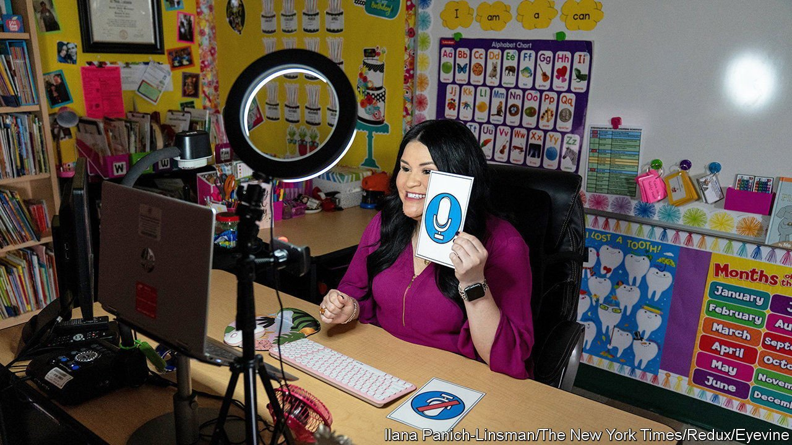

###### Robot masters

# Edtech that helps teachers beats edtech that replaces them 

##### As children go back to in-person lessons in America some innovations will stay 

 

> Sep 18th 2021 

COVID-19 FORCED ten years of digital transformation in schools to take place in a month, says John Martin, the former leader of Sanoma Learning, an education technology (edtech) company. Teachers suddenly became more willing to use technology because the alternative was not to teach. Much of this technology will remain as pupils head back to the classroom this term. But the experience has refined what edtech is really for.

School closures also forced entrepreneurs to grapple with a stark truth: few are interested in completely disrupting the classroom. For decades innovators imagined a future without traditional learning. MOOCs (massive open online courses), like Udacity and Coursera, were supposed to replace in-person learning. Teachers and school administrators feared that technologists were aiming to replace them. Before the pandemic, most American schools were hesitant to adopt technology, says Jean Hammond, co-founder of LearnLaunch Accelerator, a startup programme. “Lots of cool, amazing little things would come along. But because…schools hadn't been trained in how to adopt new technology, change was very slow.”


Tech entrepreneurs “put the tech before the ed” before the pandemic, explains Mr Martin. Innovators have since grasped that their technology must support teachers in the classroom rather than attempt to remove them, he explains. Much of the $2.2bn in venture and private-equity capital raised in 2020 is being invested with this in mind.

Teacher training is one example of what this means in practice. Traditional teacher training is limited. “When teachers learn, they listen to people talk about teaching, and they talk with each other about teaching. They very rarely teach things,” explains Justin Reich of the Teaching Systems Lab at the Massachusetts Institute of Technology. “If you look at how nurses are trained, how therapists are trained, how clergy members are trained, they practise what they're doing all the time.”

This is starting to change. Researchers at the University of Virginia (UVA) are training their education students using virtual reality simulators created by Mursion, a tech company. The teacher trainees experience several virtual practice scenarios such as a parent-teacher conference, small-group instruction, and large-group instruction. A digital puppet master plays the role of the parent and pupils behind the scenes, but the developers plan for the programme to eventually become automated. The technology is currently being used in over 50 American colleges.

Sarah Kiscaden, a teacher trainee at UVA, is pleased with the experience. “If we didn't have this simulator, we would be learning everything in classes every day, and then be expected to just keep it all in our brain and apply it all at the same time, the next day in our schools. And I think that is a lot less realistic of an expectation than if you're taught a skill, and you get to practice it and internalise it.” The simulators also relieve the pressure of teaching in front of children for the first time.

Artificial intelligence could also play a role in teacher training. Researchers at UVA and Worcester Polytechnic Institute are using machine learning, a process by which a computer learns to perform a task by analysing examples, to evaluate videos of teachers in action. Currently teachers get feedback from fellow humans, often administrators, who come to the classroom, observe a lesson and score the teacher. The researchers hope eventually to use machine learning to automatically score teachers, making the current feedback process more frequent, more accurate and less time intensive.

Barriers remain for edtech, despite the path cleared by the pandemic. Ms Hammond explains that outdated regulations can limit classroom innovation. Some state standards are rigid, even specifying the number of hours that must be spent in a classroom. Edtech is also unusual in that the end users are not often the buyers.

The buyer might be the school district, the user might be the teacher, and the real user is the learner. “It’s very hard to get the learner voice into the mix of things,” explains Ms Hammond. And the purchasing usually occurs only once per academic year. Tyler Borek, co-founder of Literably, an edtech startup, says that this provides fewer opportunities to iterate. Still, much of the technology used during the pandemic—classroom devices, apps for parents to follow their child’s progress and so on—is here to stay.■

