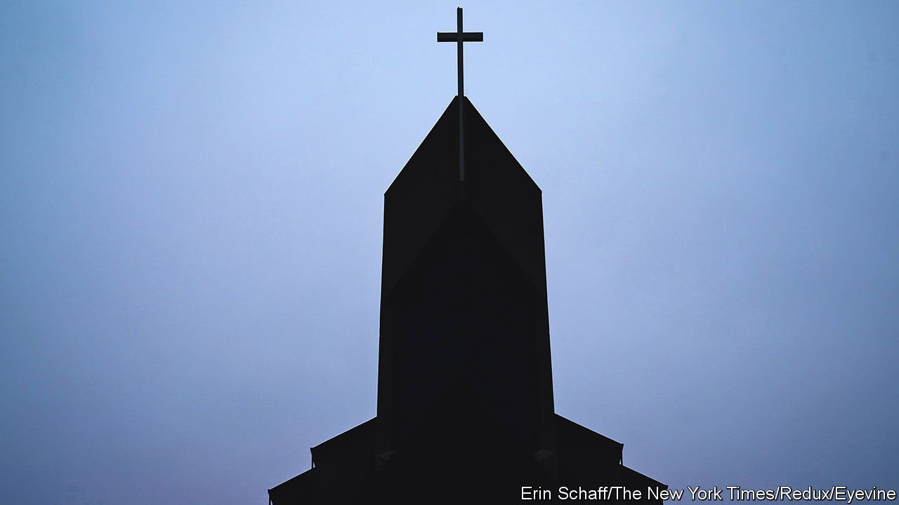

###### Bodies and temples

# Expect a surge of religious objections to vaccine mandates in America 

##### Anti-vaxxers are likely to make use of the law’s sensitivity towards the faithful 

 

> Sep 16th 2021 

PATRONS OF natural-juice bars and yoga studios are all too familiar with the phrase “my body is a temple”. They may not know its biblical provenance: “Your body is a temple of the Holy Spirit within you,” says the New Testament. Elsewhere it warns: “If anyone destroys God’s temple, God will destroy him.”

People who resist the covid-19 vaccine on religious grounds often cite those lines from scripture. They see jabs as pollutants. Others think God alone will protect them from the virus. When New York state denied health-care workers an opt-out from the vaccine for religious reasons, they sued. On September 14th a judge temporarily barred the state from withholding such exemptions.


The constitution gives protections to people to exercise their faith freely, and Title VII of the Civil Rights Act ensures those exist in most workplaces. If employees’ beliefs are “sincerely held,” then companies must “reasonably accommodate” them. Firms can accommodate vaccine-objectors by, for example, asking them to work remotely, or to test regularly (as the federal mandate allows for employees at private firms). That is easier at an ad agency or in a shop than at a hospital or care home, where jab-nots can endanger patients.

The rub is determining what beliefs count as “sincere”. They need not accord with an organised religion (and in fact, the big denominations support the covid-19 vaccine). They can be idiosyncratic. Under the law firms cannot challenge the substance of objectors’ religious beliefs, but they can question someone’s sincerity and ask their reasons. When disputes between firms and workers have reached the courts, the question at issue is normally whether the accommodations offered were reasonable—not about the underlying beliefs: courts do not want to police those.

Advice on asking for exemptions is easy to find online. One manual circulated by Rita Palma, an anti-vax activist, advises people to include key words such as sacred, holy and blessed. Emphasising a personal understanding of God’s message and providing a cleric’s letter of support also helps. Some people whose objections have little to do with religion can probably fudge a religious excuse.

Dig deeper

All our stories relating to the pandemic and the vaccines can be found on our . You can also find trackers showing ,  and the virus’s spread across .

