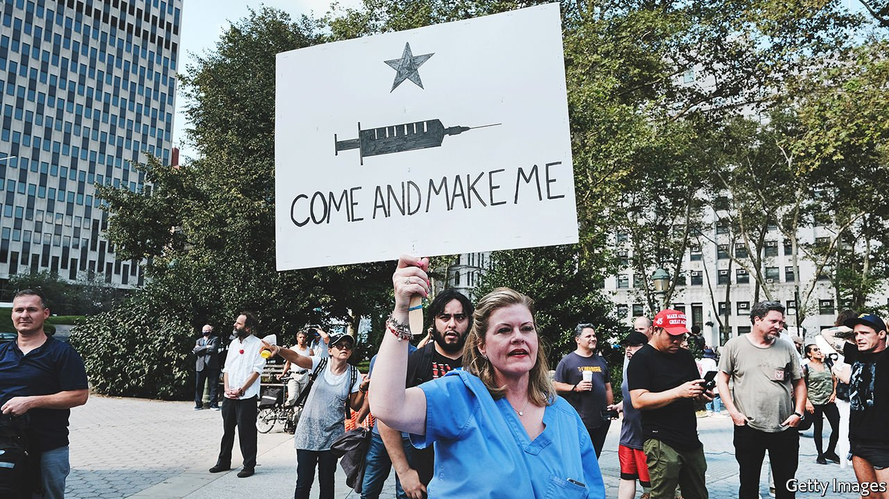

###### Biden’s bidding

# President Joe Biden’s vaccine mandate is ordinary yet controversial 

##### The requirements will probably increase vaccination rates as long as they are found to be legal 

 

> Sep 18th 2021 

AFTER MONTHS of begging Americans to get themselves vaccinated, President Joe Biden has stopped asking nicely. On September 9th the Biden administration announced a requirement to be vaccinated or tested regularly that will affect everyone who works for a private company with more than 100 employees plus the federal workforce, broadly defined. That is about 100m Americans in all, 25m of whom are not vaccinated. Will it work?

There are clear reasons for taking this unusual step. Only 54% of Americans are fully vaccinated, meaning the nation is lagging behind its peers. In Canada and Britain, 69% and 65% of people are fully vaccinated respectively, according to Oxford University. Japan initially experienced a disastrous rollout. One month before the start of the Olympics in July, only 18% of Japan’s population received the jab. But Japan has now surpassed America in first doses administered (65% compared with 63%). With 663,325 deaths from covid-19, America will shortly exceed the number of fatalities resulting from the 1918 influenza pandemic (675,000).


According to Goldman Sachs, an investment bank, the new federal requirements could result in 12m more Americans becoming vaccinated by mid-2022, increasing the proportion of adults who have had at least one dose to 90%. Critics of the requirements warn of a potential backlash, however. As many as 7m workers report that they will not get vaccinated. More than 150 hospital workers were fired or resigned over a covid-19 vaccination mandate at a hospital in Houston, Texas. A hospital in Lowville, a town of about 3,000 people in northern New York, is pausing maternity services because several workers resigned over covid-19 vaccination mandates.

Other covid-19 vaccine requirements had some success, though. The mandate for health-care workers in New York to get vaccinated seems to have pushed up the vaccination rate for that group from 75% to 80%. The Department of Veterans Affairs, where a mandate for health-care workers went into effect in July, saw vaccination rates increase by five percentage points, to 82%. Testing requirements have also been successful. New York City’s vaccination rate has improved since the mayor announced a vaccination or testing requirement for access for restaurant diners. And for all the focus on disgruntled workers forced to get vaccinated, there is also a group who are not going back to work because they are fearful. Goldman Sachs estimates that the requirements could encourage 3m to return to work.

The mandate will only work if it remains in effect, though. The armed forces have required vaccinations for over 200 years. Public school children are required to be vaccinated against childhood diseases, and about 95% have the required jabs. Many hospitals require workers to be vaccinated for several diseases. Yet such are the politics of masks and vaccines that this one is more vulnerable. Ken Paxton, Texas’s attorney-general, wrote that “the Federal Government is trying to dictate everything...Not on my watch in Texas.” Henry McMaster, South Carolina’s governor, declared he would “fight them to the gates of hell to protect the liberty and livelihood of every South Carolinian.”

The testing and vaccination requirement for companies will be enforced through the Occupational Safety and Health Administration (OSHA), a federal agency. It typically covers workplace hazards, for example requiring protective eye goggles. Vaccination and testing requirements could count, so long as they protect employees from “grave danger.”

But OSHA has faced legal challenges before, explains Walter Olson of the Cato Institute, a libertarian think-tank. OSHA has used its emergency authority nine times before the pandemic. Six of the instances went to court and only one was fully upheld. Over the longer-term, an agency that few Americans have heard of risks becoming caught-up in a Republican messaging war. Already some House Republicans have threatened to introduce legislation gutting the OHSA as a response to the White House’s move. That matters little while they are in the minority. Yet that will not always be the case. Messaging bills have a habit of eventually becoming laws. ■

Dig deeper

All our stories relating to the pandemic and the vaccines can be found on our . You can also find trackers showing ,  and the virus’s spread across .

