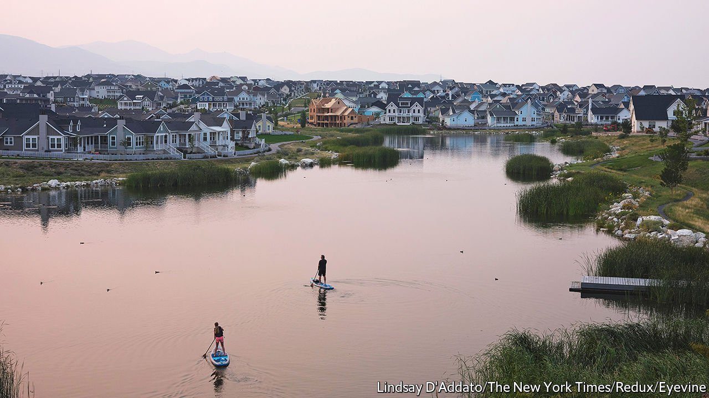

###### Not your father’s Utah

# Salt Lake City is one of the biggest winners of the past decade 

##### The Beehive State is booming. Three things will challenge its future growth 

 

> Sep 18th 2021 

“IT LIES PROTECTED behind its rampart mountains, insulated from the stormy physical and intellectual weather of both coasts,” Wallace Stegner wrote of Salt Lake City. The novelist associated his adopted hometown, where he spent much of the 1920s and 30s, with an “isolationism” and “provincialism” afforded by its Mormon heritage and its snug seat between the Wasatch Range and the Great Salt Lake. These features remain; but gaze upon the city’s bustling downtown today from a perch in the nearby foothills and Salt Lake looks far from provincial. There are few places in America that can crow louder about their successes in the past decade than the City of the Saints.

Utah’s population grew faster than that of any other state between 2010 and 2020. Salt Lake City has the lowest jobless rate among all big cities, at 2.8%, compared with a national rate of 5.2%. That the state has rebounded so well from the downturn caused by the covid-19 pandemic is thanks to the Wasatch Front, an urban corridor that includes Salt Lake and Provo, home to Brigham Young University. The four counties that make up the Wasatch Front account for at least 80% of Utah’s economic activity, reckons Juliette Tennert, an economist at the University of Utah.


In many ways Salt Lake’s success mirrors what is happening in other , such as Boise, Idaho, and Denver, Colorado. What makes Utah so exceptional? For starters it has the most diverse economy of any state, according to the Hachman Index, which measures each state’s mix of industries against that of the nation. In fact, Utah has ranked in the top two for the majority of the past two decades, says Ms Tennert. The Wasatch Front boasts a blossoming tech sector—christened “Silicon Slopes”—several research universities and an international airport.

Utah’s ability to attract new businesses is helped by its Republican zeal for low corporate taxes and little regulation. But putting Salt Lake City on the map also required some myth-busting. Gary Herbert, the former governor, points to 2002 when Salt Lake hosted the Winter Olympics, as a pivotal moment. “That was kind of our coming­ out party,” he says. People realised that, “we are not the Wild West here in Utah.”

Researchers also note Utah’s relative homogeneity as a reason for its success. It may be easier for people to get along when they share a religious and cultural background. But the state is changing fast. Although about 61% of Utah’s population is Mormon, that number is shrinking all the time. About 48% of Salt Lake County residents identify as Mormon; the city itself—which is more diverse—probably has fewer still. Utah is the youngest state in the country, but its fertility rate is decreasing faster than the national average, says Emily Harris, a demographer. Attracting and retaining new Utahns will become ever-more important as births decline.

Three things threaten Salt Lake City’s ability to entice and keep new residents. The first is environmental problems. Americans may move to Salt Lake for its proximity to hiking trails and posh ski resorts, but the Wasatch Front is plagued by pollution. Wildfire smoke, heavy traffic and dust from the drying lake bed dirty the air. Utah is also reckoning with shrinking reservoirs due to  that has dehydrated most of the West.

Second, Salt Lake City is becoming unaffordable for many long-time residents. House prices have surged by nearly 25% since August of 2020, according to Zillow, an online-listings platform. (Across the country home values increased by nearly 18% on average.) Erin Mendenhall, the Democratic mayor of Salt Lake, offers high housing costs as proof that rapid growth doesn’t benefit everyone.

Third, Utah consistently ranks among the worst states in the country for gender equality. An annual index from WalletHub, a consumer website, found that Utah’s gender-pay gap was larger than most other states’. Women in Utah are also less likely to graduate from college or be elected to political office. That Utah is such a laggard is probably down to the lasting influence of the Mormon church and believers’ tendency to marry young and have large families. Yet the future looks brighter: as the state diversifies, and begins to look more like America, women should benefit.

Utahns are not at all surprised that their state is booming. “Salt Lakers generally love to fly under the radar,” says Ms Mendenhall. “Part of the personality of our city is knowing that we’re the best kept secret.” That may historically be true, but the ever-expanding Wasatch Front suggests that the secret is out. ■

