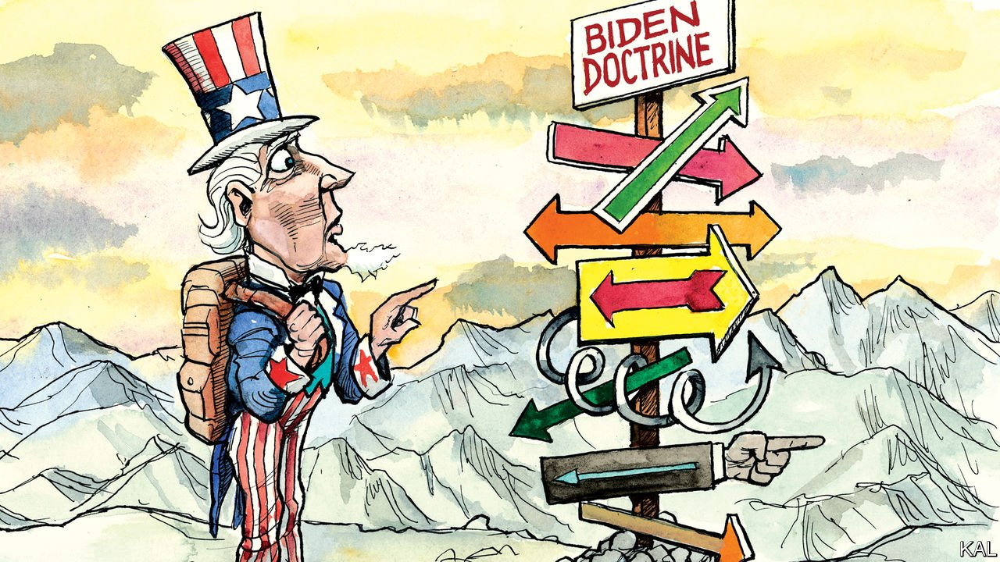

###### Lexington

# The Biden Doctrine has yet to emerge. Beware those who claim otherwise 

##### Managing America’s complicated relations with China is an aspiration in search of a strategy 

 

> Sep 18th 2021 

ANDREI GROMYKO, the Soviet Union’s pre-eminent America-watcher, remarked that the object of his study had so “many doctrines and concepts proclaimed at different times” that it was unable to pursue “a solid, coherent and consistent policy”. And that was during the cold war, a period of relatively cool-headed American policy analysis. How much more applicable does Gromyko’s observation seem to the first eight months of Joe Biden’s presidency. Half a dozen different versions of the Biden Doctrine had been outlined by foreign-policy commentators before the president had even given a major foreign-policy speech.

Parsing the president’s campaign statements, some suggested the alleged doctrine was a return to the pre-Trump status quo, with a warm embrace of allies and the international order. Other prognosticators, focusing on Mr Biden’s scepticism of military intervention and his party’s protectionism, foresaw a more diplomatic version of Donald Trump’s scattergun nativism. Some pinpointed the president’s interest in shoring up democracy; or his rhetoric about prioritising policies beneficial to American workers. How to make sense of all this? “Biden’s everything doctrine” was the verdict of an essay in Foreign Affairs.


An alternative response might be to question the utility, as Gromyko did, of the competitive scramble to codify foreign policy in this way. Airing that sceptical view around Washington, DC, this week has been awkward at times; several of the foreign-policy experts Lexington consulted turned out to have written at least one Biden Doctrine column, if not three. Yet much of what they have described will not only inevitably turn out to be wrong; it is not really doctrine at all.

Experts in strategy, a rare species in the Washington menagerie, set a high bar for the word. To them it describes a statement of national interests so fundamental that it is liable to survive multiple administrations and events. Only three foreign-policy doctrines are considered to have risen to that level. The first was the Monroe Doctrine of 1823, a declaration of American primacy in the western hemisphere that arguably still pertains. The second was the Truman Doctrine, whereby America shouldered responsibility for containing the Soviet Union. The third, less boldly articulated, was the post-cold-war belief in American hegemony that underpinned the foreign policies of the 1990s and 2000s.

This has not deterred rampant doctrine inflation over many decades. Most presidents since Truman have been credited with a unique doctrine, including all the recent ones. Though what the doctrines of Barack Obama and Donald Trump amounted to is still in dispute. (A proponent of the alleged Trump Doctrine, Michael Anton, suggests it is encapsulated by a line from the Wizard of Oz: “There’s no place like home.”) Most of these presidential doctrines cannot be usefully compared to the three foundational ones, or even to each other.

They mostly represent relatively minor amendments to the foreign-policy status quo; or else new methods to sustain it. The Eisenhower Doctrine extended containment to the Middle East; the Carter Doctrine decreed that America would use military power there if necessary. Many so-called doctrines also mistake presidential aspirations for outcomes. Mr Obama was mostly concerned with avoiding the mistakes of his predecessor. Mr Trump’s nativism was less of a guide to his foreign policy than his zeal to undo whatever Mr Obama had done. It is hard to detect the strategic undergirding that purists insist upon in recent additions to the canon, such as the Bush Doctrine of preventive war or the Clinton Doctrine, a commitment to expanding the realm of democracy and human rights.

Whether Gromyko was right to consider Washington’s obsessive doctrine-spotting an impediment to good policy is debatable. But it has clearly propagated a misleading notion of presidential power. Far from being the untrammelled “decider-in-chief” that George W. Bush briefly was after 9/11, presidents tend to be almost as bound by public opinion in foreign affairs as they are at home. Thus, Franklin Roosevelt moved from isolationism towards engagement as his majorities increased. But “of course voters prefer not to take responsibility for their influence on foreign policy,” harrumphs the foreign-policy scholar Robert Kagan. “Hence the focus on the president.”

Another weakness of the Washington foreign-policy babble is that, by elevating the mundane, it makes the momentous moments in American and world affairs harder to identify. And (at the risk of contributing to the bloviating) now may be such a time.

American hegemony is over; China’s bid for supremacy in the Asia-Pacific region is unignorable. The failed “war on terror”, whose aftershocks distracted both Mr Bush’s immediate successors, is no longer a priority. It therefore falls to Mr Biden, a longtime foreign-policy bungler yet arguably the first grown-up president of the post-unipolar age, to construct an appropriately weighty response. Containment cannot be his guide. Climate change and economic integration call for much more co-operation between the rival powers than occurred during the cold war. Meanwhile the impulse to strengthen alliances leads to arming Australia with nuclear submarines, partly as a counterweight to China. And Mr Biden’s ability to shape public opinion is limited.

The Truman show

Strategy experts are awed by the intellectual and political challenge this represents. “It’s Truman-level stuff,” says Andrew Krepinevich, a veteran strategist of the Pentagon and elsewhere. There is little doubt that grappling with it is the administration’s priority; senior Biden officials discuss the two-track China challenge all the time. But again, noble aspirations do not predict successful outcomes. A Biden Doctrine worthy of the name may yet emerge. It hasn’t yet. ■

For more coverage of Joe Biden’s presidency, visit our dedicated 

