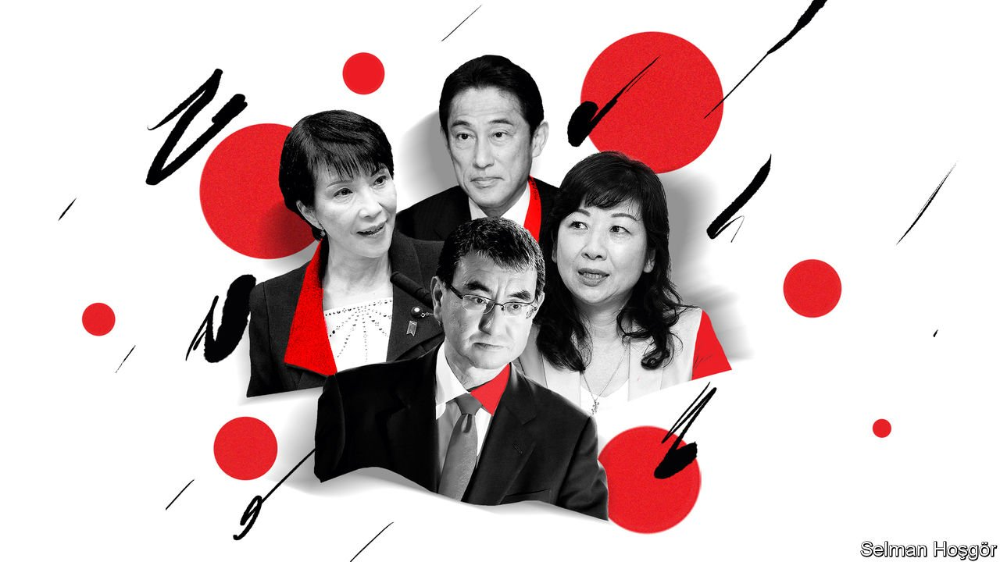
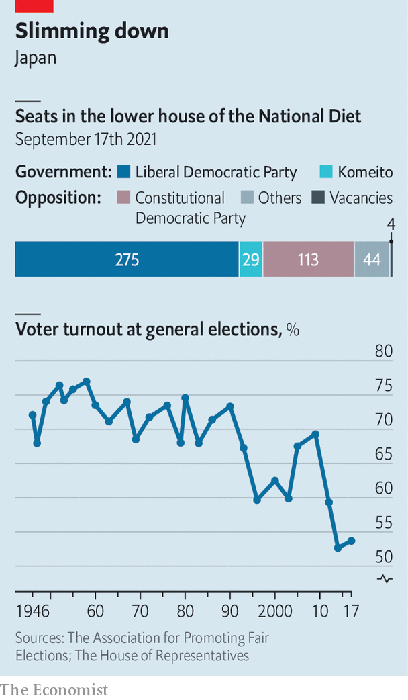

###### Going round in circles

# Japan readies itself for an unpredictable ballot 

##### The ruling party’s leadership contest may matter more than the next national election 

 

> Sep 23rd 2021 

THE FOUR candidates for the presidency of Japan’s ruling Liberal Democratic Party (LDP) come from different corners of the party’s big tent. Takaichi Sanae (pictured, left) is a nationalist who wants to become the first female prime minister, but opposes allowing married couples to keep separate surnames. Kono Taro (pictured, bottom) is the American-educated scion of a political family; he supports gay marriage and renewable energy. Kishida Fumio is a Hiroshima native who pines for a new form of capitalism. Noda Seiko is the mother of a disabled son. She has promised to be a champion for the vulnerable.

It is an unusually eclectic cast for the staid old party. It is also an unusually unpredictable contest: facing a revolt from younger members, most of the party’s faction bosses have promised to allow their members to vote as they wish. The outcome will remain unknown until the votes are counted on September 29th, unlike last year’s election when faction heads closed ranks beforehand and marshalled support for Suga Yoshihide, the current party leader and prime minister.


Yet the exciting—by the standards of Japanese politics—leadership contest is also a distraction from a deeper malaise in the country’s democracy. Japan has avoided the populism and paralysis that have beset many Western ones. But its stability is not the result of widespread support for the status quo. “Our democracy is facing a crisis, as people’s trust in politics is broken,” said Mr Kishida, a former foreign minister, upon entering the LDP race.

Apathy has become endemic. Voter turnout has plummeted (see chart). The Pew Research Centre, a pollster, found in 2018 that 62% of Japanese believe elections do not change things. At the start of this year, more voters supported no party (41%), than supported the LDP (38%) or the Constitutional Democratic Party of Japan (CDP), the main opposition party (7%). The opposition’s fundamental weakness means that, as Sone Yasunori of Keio University in Tokyo, puts it, “The LDP presidential election is the real game, not the general election,” which will come and go some time in November.

 


The LDP has dominated Japanese politics since its founding in 1955. It ruled uninterrupted for decades, leading scholars to refer to Japan as an “uncommon democracy”. The reality was more complicated than a one-party state: factional groupings functioned as parties within the LDP. And for years, the Japanese left was sufficiently powerful to check the government.

In 1993 a group of LDP defectors helped form a coalition that unseated the party for the first time; they reformed the electoral system to facilitate more inter-party competition. The coalition quickly fell apart, but in the ensuing years, a new party, the Democratic Party of Japan (DPJ), grew into a competitive centre-left force, eventually unseating the LDP in 2009. It seemed to augur the emergence of a two-party system with more debate over policy.

Yet the DPJ faltered in office, alienating voters, infuriating bureaucrats and upsetting Japan’s chief ally, America. It had the bad luck to be in power when an earthquake struck north-east Japan in 2011, triggering a deadly tsunami and a nuclear meltdown in Fukushima. Its unsteady handling of the crisis made voters wary of power changing hands.

After losing to the LDP in 2012, the DPJ fractured. Along with its coalition partner, Komeito, the LDP has won the past six national elections and established firm control over both houses of Japan’s Diet. The remains of the DPJ coalesced into the CDP in 2017, but the new party has proved unable to mount a serious challenge. It currently holds 113 seats in the lower house to the LDP’s 275.

The LDP’s ham-fisted handling of the pandemic seemed to open a window, however small, for more serious political competition. Japanese voters have a history of showing up in droves when their frustration spills over. They did so repeatedly in local contests this year, most recently in August when they elected an opposition candidate as mayor of Yokohama over one backed by Mr Suga. Over the summer, some LDP members fretted they might go from their current supermajority to having to expand their coalition to stay in power. “It’s scary,” one admitted.

When the unpopular Mr Suga resigned last month, the LDP hoped it would help to placate the public, which, despite its frustration, remains wary of radical change. It appears to be working. The opposition parties, which had been somewhat hopeful of making advances before his resignation, are now clamouring to get noticed in the media. Support for the LDP has risen nearly 10% in some polls since the resignation; the Tokyo stock market has been rising in anticipation of a new leader.

Mr Kono, a former foreign and defence minister who now serves as the government’s vaccine tsar, seems to represent the best prospect for a meaningful shift in style, if not in substance. He leads the polls among the general public. He has built a reputation as a maverick willing to challenge the LDP’s entrenched ways. The party’s younger members tend to support him.

Yet even Mr Kono has been forced to confront the realities of LDP politics. In a press conference announcing his candidacy, he softened his opposition to nuclear power and played down his openness to allowing female heirs in the imperial family, two issues that had been symbols of his free thinking. Party elders nonetheless remain wary of him and are said to prefer the more pliable Mr Kishida.

Mr Kono’s best chance lies in winning an outright majority in the first round of the LDP election, where parliamentarians and the party’s rank-and-file are given equal weight. If he fails to do so, he will have to prevail in a run-off where Diet members’ votes have far more weight. There, the result will probably hinge on power struggles and internal party rivalries. Mr Kishida, the likely second-place finisher, could yet prevail. (Ms Takaichi is seen as having an outside chance at advancing; Ms Noda has virtually none.)

The first task for the eventual winner will be to lead the party in the lower-house elections. While the LDP may lose some seats, the defeats are likely to be smaller than many in the party expected with Mr Suga at the helm. But unless the LDP’s next leader can connect with the public, he or she may last no longer than Mr Suga did. Voters will have a chance to issue another verdict in upper-house elections which loom next summer.■

