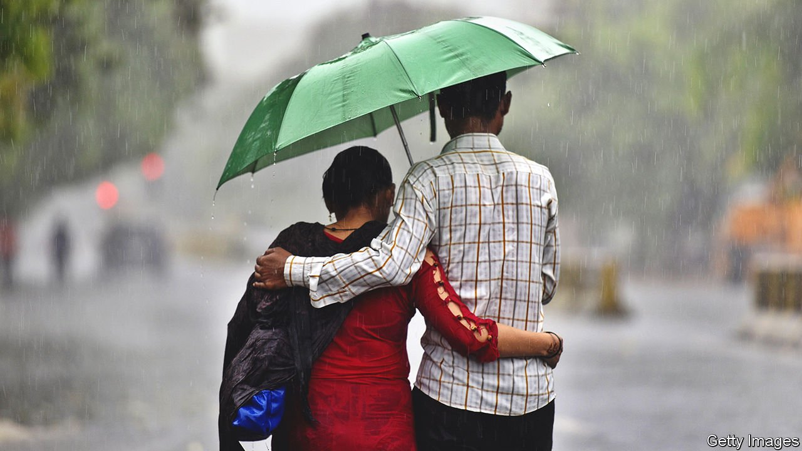

###### Room for improvement

# Love hotels are blossoming in India 

##### Canny companies are creating capacity for couples to canoodle in a conservative country 

 

> Sep 23rd 2021 

LOCALS CALL it “lover’s paradise”. Upvan, a picturesque lake in Thane, a satellite city of Mumbai, attracts its share of joggers, cyclists and pot-smoking college students. But mostly the lane surrounding the lake is filled with young couples getting cosy under umbrellas. Every Indian city has such spots, where skittish lovebirds find privacy out in the open. A socially conservative culture, small flats, joint families, pricey hotels and uptight hotel-owners mean that there is often nowhere else to go.

That is starting to change. “Love hotels”, which offer (very) short-stay rooms to unmarried couples, are a well-established concept in other Asian countries. But they have been a hard sell in India, says Prateek Singh, a co-founder of Brevistay, an app for hourly bookings at some 1,500 hotels. “The challenge was not convincing hotel owners of the business model, but changing their mindset.”


What couples need is a room, not judgment, says Amit Sharma of StayUncle, a similar service that offers rooms, including gay-friendly ones, in some 1,800 hotels. That is not a popular opinion in a country where moral policing is common. For years couples celebrating Valentine’s Day in Mumbai would be harassed and sometimes rounded up by the police. In March the chief minister of Uttarakhand, in northern India, bemoaned the state of the country after encountering women “showing their knees” in ripped jeans. Last month a state-run park in Hyderabad erected a notice announcing that “unmarried couples are not allowed inside the park”. It was taken down after a public uproar. “We need to be mature about the whole thing,” says an exasperated Amit Chakrabarty, who works at a hotel in Kolkata.

As in any other business, pleasing customers is the key, says Sikender Yadav, whose hotels in Delhi are listed on StayUncle. About one in ten bookings involve extra services, such as room decoration packages. Errant lovers sometimes ask management to spell out “sorry” with flower petals on the bed.

Apps do their bit to spice things up too. “We are all clean for you to get dirty,” runs a StayUncle slogan. The outfit supplies some rooms with a free “love kit” that includes chocolates and condoms. Mr Sharma says he intends to elevate the “in-room experience” by providing smart speakers and Spotify accounts. More ambitious plans include trying to convince hotels to soundproof their rooms. “We are not in the hotel business,” he says, “but in the freedom-of-expression business.”

