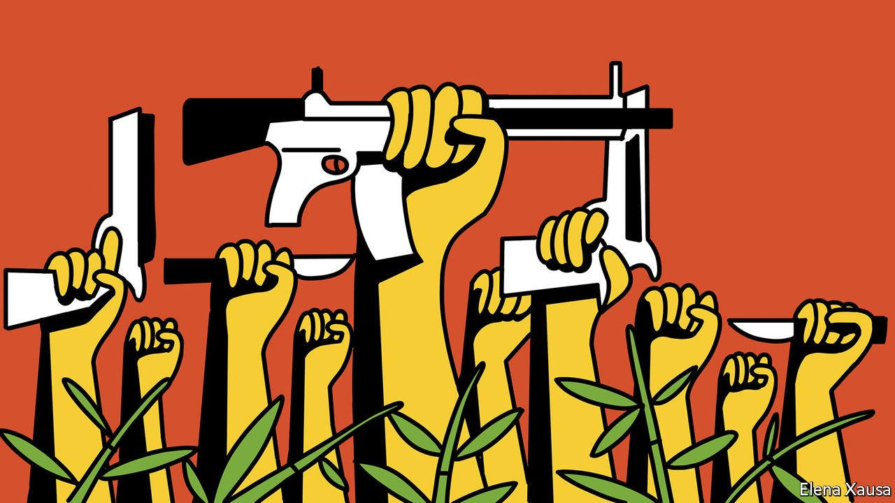

###### Banyan

# Myanmar’s resistance movement is turning violent 

##### The country’s many wars are becoming enmeshed 

 

> Sep 25th 2021 

UNTIL FEBRUARY 1ST, when General Min Aung Hlaing mugged his country by ousting the civilian government, Zaw Maung Myint (not his real name) was just another urban youth with soft hands and a penchant for social media. Not long ago, however, he slipped into the jungles of Myanmar’s borderlands. There he has been receiving military training from one of the country’s powerful ethnic armies that have long waged war against the Tatmadaw, as the Burmese army is known, and even from defectors from the Tatmadaw itself. Living on bamboo-shoots and fish paste, Zaw Maung Myint is training to be a sniper. “If someone asked me what I wanted most, I would say: ‘Guns!’”

As with Zaw Maung Myint, so with Myanmar: the country is descending further into violence. After arresting Aung San Suu Kyi and other leaders of the ruling National League for Democracy, the army began an orgy of bloodletting. Security forces have already killed over 1,000 civilians in their attempt to snuff out defiance of the junta. Ms Suu Kyi has disappeared from view, apart from the odd photograph from court as she answers a raft of absurd charges, such as possession of walkie-talkies.


Gone, too, is her doctrine of non-violent opposition that was at the heart of the pro-democracy movement she spearheaded during years of house arrest, and which helped bring an elected government to office in 2015 after decades of military rule. On September 7th the National Unity Government or NUG, which, though underground, claims to be the legitimate government of the land, declared a “people’s defensive war”.

Zaw Maung Myint is a member of one of several hundred “people’s defence forces” (PDFs) that have sprouted in recent months. There is a David-and-Goliath flavour to the contest, notes Gwen Robinson, a longtime chronicler of Myanmar, in Nikkei Asia, a magazine. The Tatmadaw controls a budget of billions, whereas the PDF volunteers rely on a covert lottery organised by the NUG. Still, a lethal dynamic of violence is unspooling.

The Tatmadaw acknowledges over 800 deaths from PDF “terrorists”, both in the cities and in the rural heartlands. PDFs have blown up so many telecoms towers belonging to the army-owned Mytel (more than 80 at the last count) that the Tatmadaw has taken to laying mines around them. Tatmadaw soldiers, brutalised by decades of fighting what Anthony Davis, a security analyst, calls Myanmar’s “forever insurgencies”, do not shy from reprisals. The regime is training its own civilian militia of vigilantes to counter the PDFs.

Most ominously, this dark struggle is leaching into Myanmar’s long-standing ethnic conflicts. Mr Davis argues in the Asia Times that PDF resistance to the Tatmadaw along the western flank of central Myanmar is “fundamentally changing Myanmar’s larger conflict map”. The PDFs have made possible a broad corridor linking big insurgent groups in the north of the country, notably the Kachin Independence Army (KIA), with its ally the Arakan Army in Chin and Rakhine states in the west. The Arakan Army has agreed to a tactical ceasefire with the Tatmadaw, the better to regroup. Huge caches of arms are flowing down the corridor into its territories.

To secure support from Myanmar’s various ethnic groups and their associated militias, the NUG has recruited leaders and politicians from such backgrounds. Around half of the cabinet comprises ethnic minorities, in deliberate contrast to Ms Suu Kyi’s, which was dominated by the Bamar majority. The NUG has been lobbying hard for the right to take up Myanmar’s seat at the UN General Assembly (a decision was put off).

Though ethnic armies such as the Karen National Liberation Army and the KIA are training a new wave of pro-democracy fighters, it would be wrong to imagine the NUG and various ethnic groups morphing into a united front capable of taking on the Tatmadaw. As Min Zin of Myanmar’s Institute of Strategy and Policy points out, no ethnic army has said it will answer the NUG’s call to coalesce into a “federal army”. The leaders of some ethnic groups want to preserve the hard-won peace agreements they have with the Tatmadaw—along with their drugs, timber and jade rackets.

Others either harbour the suspicion that the NUG remains a Bamar-centric project or, like the Arakan Army, think they can carve out more territory as the Tatmadaw tries to stamp out pro-democratic resistance in the heartlands. More confusion, more murk as a benighted country tips further into mayhem.

