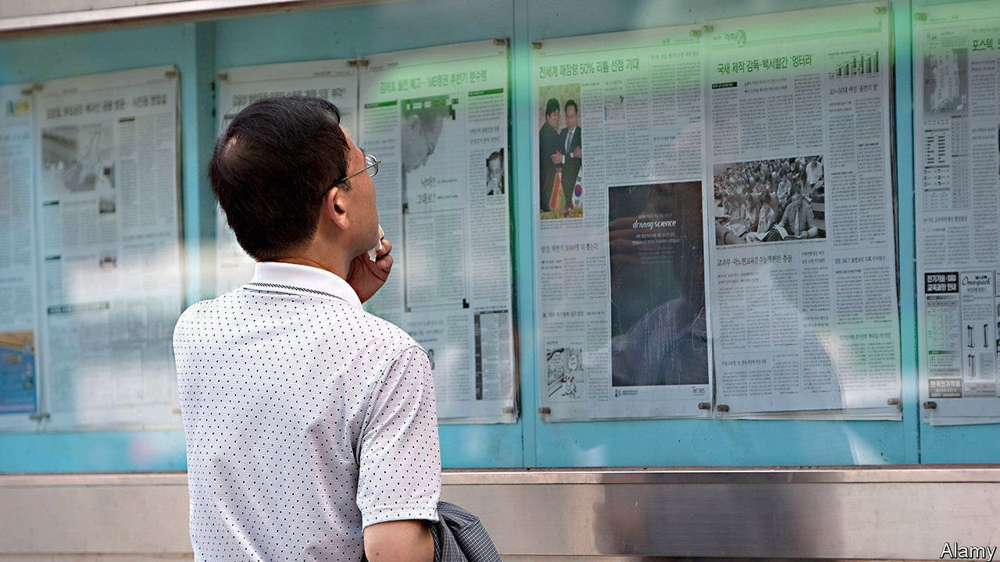

###### Off-target

# South Korea’s plan to fight fake news could hobble real journalism 

##### The ruling party wants to make it easier for people to sue the media for “emotional distress” 

 

> Sep 23rd 2021 

WHEN LAWMAKERS from South Korea’s ruling Minjoo party discuss their plan to impose tougher penalties on the media for reporting “fake news”, they stress that they merely want to safeguard vulnerable citizens. “It’s the least we can do to protect the people from fake news,” one legislator told reporters earlier this month. “We have to remember that our people’s basic rights and freedoms are more important than the freedom of the press,” said another. The proposed changes to the Press Arbitration Act of 2011, the party argues, would improve the quality of reporting and increase the public’s trust in it.

Hogwash, says the conservative opposition, which quashed a first attempt to pass the bill last month by threatening a filibuster. The proposal, it argues, is an attempt by the government to shield itself from criticism. Other observers appear to agree. Last week, a coalition of activist groups including Human Rights Watch called on legislators from all parties to reject the bill when it is put to another vote in the National Assembly on September 27th.


The bill introduces new provisions allowing individuals and small businesses to go after reporters and media organisations for, among other things, causing “emotional distress” by spreading false information either intentionally or as a result of “gross negligence”, for instance without fact-checking. Critics worry the vague wording of some of the clauses would give the authorities too much discretion to decide which reports qualify for corrections or damages. A letter from the UN’s special rapporteur on freedom of expression, sent to the government in August, warned that the law could be used to limit ordinary news reporting and criticism of the government, and could see writers held liable for parody and satire or simply for expressing unpopular opinions.

The ruling party’s concerns are not entirely unfounded. Like people everywhere, South Koreans are exposed to mountains of humbug. A noisy minority of mostly elderly right-wingers watch YouTube channels that spread misinformation about vaccines, American politics and President Moon Jae-in’s supposed chumminess with North Korea, the Chinese Communist Party, the devil, or all three. Even beyond the radical fringe, most people get their news from online aggregators whose algorithms reward sensationalist clickbait and which take little responsibility for sourcing. The biggest newspapers have long-standing links to big conglomerates; the heads of public broadcasters change with the government. Unsurprisingly, less than a third of South Koreans say they trust the news.

But if legislators are indeed trying to solve these problems and bolster their democracy, they are going about it in a curious way, says Park Kyung-sin, a law professor and free-speech activist at Korea University in Seoul. Most fake news and conspiracy-mongering originates on social media, he notes. But the law only applies to newspapers and broadcasters, leaving the main source of falsehoods untouched. Mr Park suspects the party’s real motive is a feeling of being under siege by the press: they find it hard to accept that, in government, “they’re being criticised by all journalists, not just the right-wing media”.

It is all the more surprising given that press freedom in South Korea has improved significantly since Mr Moon took power in 2017. South Korea climbed 30 places in a global press freedom index compiled by Reporters Without Borders, a watchdog, after his election. And it is an unusual bill for a liberal democracy to propose, carrying as it does elements of similar laws passed in recent years by bossier places such as Singapore.

The many complaints have not fallen on deaf ears. Minjoo legislators have responded by drafting a revised version of the bill. But it still fails to resolve the main worry, that the law would unduly restrict speech. Given the party’s absolute majority, it is likely to pass, unless legislators decide to withdraw it. If it does, South Korea will surely drop a few places in next year’s press-freedom ranking. ■

