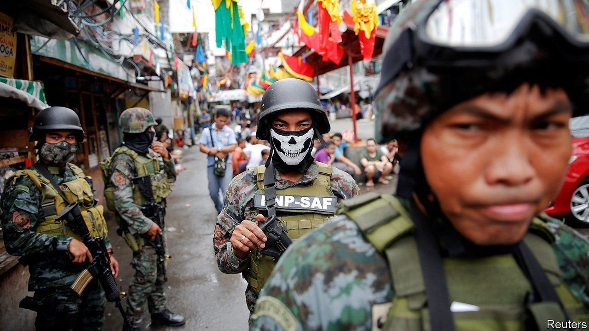

###### Duterte harried

# The International Criminal Court takes on Rodrigo Duterte 

##### The Philippines’ president and his killer cops are beyond the reach of the law—for now 

 

> Sep 25th 2021 

F OR ONCE, Rodrigo Duterte exercised his right to remain silent. The last time the Philippine president crossed swords with the International Criminal Court (ICC) in The Hague was in June, when its prosecutors sought judges’ permission to investigate him. At the time he reacted with dismissal: “Bullshit!” Yet when the court announced on September 15th that it would allow a full investigation into his war on drugs, which has killed untold thousands, Mr Duterte was uncharacteristically civil.

When he did eventually refer to the subject, it was without naming the ICC. On September 21st the president told the UN General Assembly that the Philippine justice system would deal with any excesses in his campaign. The president’s spokesman, Harry Roque, had earlier pointed out various obstacles to the court ever putting Mr Duterte or his law enforcers on trial. Chief among them is the government’s refusal to help investigators with their inquiries. But that argument ignores the possibility that next year’s presidential election may install a new administration that is less keen on shielding the drug warriors from international law.


The killings in question began around the time Mr Duterte became president, in mid-2016. His campaign rhetoric had been full of calls to kill methamphetamine dealers to save the Philippines from narco-statehood. When law enforcers duly began shooting suspects dead, Mr Duterte repeatedly urged them on, promising to protect them from repercussions.

As the corpses piled up, the killings came under the scrutiny of the ICC’s prosecutors. Mr Duterte reacted to the court’s opening of a preliminary inquiry in 2018 by withdrawing the Philippines from the ICC’s jurisdiction, though the country remained within its purview for another year. In announcing its decision this month to allow prosecutors to investigate, the court pointed out that it “retains jurisdiction with respect to alleged crimes” that occurred “up to and including” the date the Philippines officially left, in March 2019.

Most of the killings followed a pattern. Police officers would hunt down suspects and demand their surrender. According to the official version, the armed, drug-crazed traffickers would then open fire, provoking the cops to retaliate and shoot the suspects dead—lawfully, because they would be acting in self-defence.

After the first few hundred retellings of that sort of tale, an alternative version began to seem more probable. In this version, as related by witnesses, the police would burst onto the scene, gun down in cold blood the poverty-stricken addicts or small-time dealers they found there, then plant firearms and packets of methamphetamine on the slain victims to incriminate them. The police and other law-enforcement agencies admit that, by July 31st this year, 6,181 people had been killed in their operations against the drug trade since Mr Duterte became president. Human-rights monitors think the official tally omits thousands more killings.

The constitution limits presidents to a single term, so Mr Duterte must step down when his ends in June. He has said he will run for vice-president instead. But holding that office is unlikely to give him immunity unless he has a sympathetic successor; the two posts are elected separately.

One likely candidate for the leading role is his daughter, Sara Duterte, the mayor of the southern city of Davao, though she says she has no interest in running. Another is an estranged ally of Mr Duterte’s, Senator Manny Pacquiao, a recently retired world-champion boxer, who has announced his candidacy. A potentially less sympathetic contender is Isko Moreno, Manila’s mayor.

Politicians more bitterly opposed to Mr Duterte and his war on drugs have yet to confirm that they will run. If they do, some may try to win votes with campaign promises to bring justice to the families of the dead. Though Mr Duterte has remained consistently and unprecedentedly popular in the polls, Filipinos have misgivings about the scale of the violence in his war on drugs. The freedom of Mr Duterte and his enforcers may be at stake in the election. That promises to make the contest unusually ferocious. The president’s newfound civility is unlikely to last. ■

